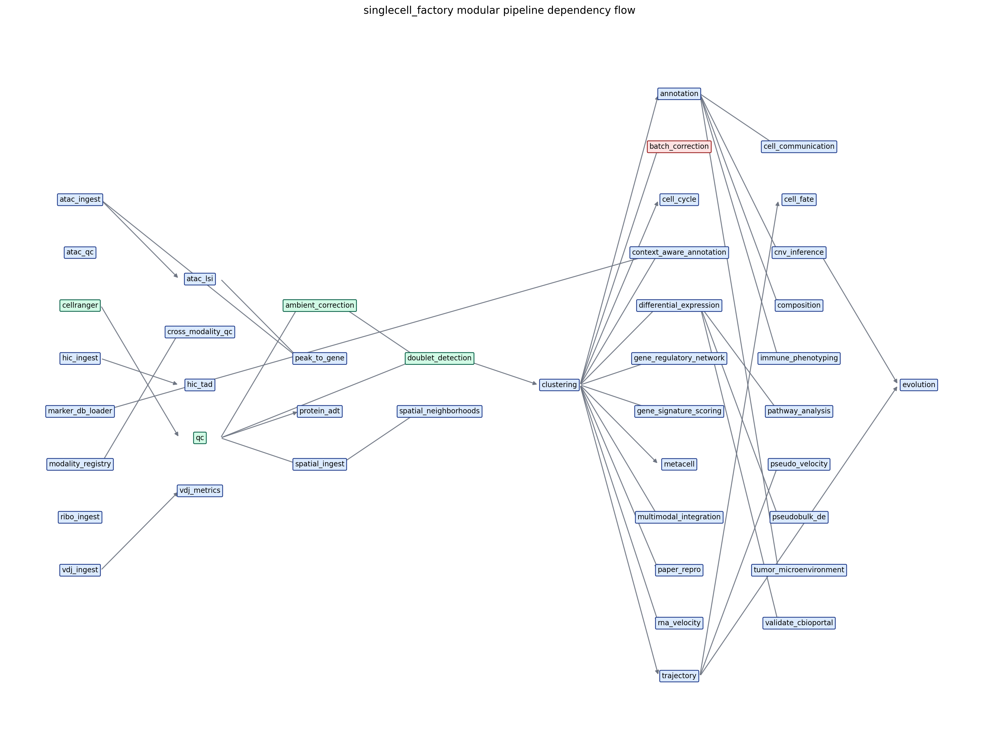

# singlecell_factory v5.0 — Modular scRNA-seq Pipeline

> **NC2024 ABORTED (2026-05-20).** De Zuani 2024 (E-MTAB-13526) reproduction
> was aborted after a +58% cell-calling divergence; 157 GB purged. NC2024
> sections below are historical. Current focus: NG2025 LUAD+LUSC 3D-genome
> reproduction — Yost et al. Nature Genetics 2025
> (`/home/zerlinshen/projects/ng2025-3d-genome/`).
> See: `.claude/projects/-home-zerlinshen/memory/project_nc_de_zuani_2024_aborted_2026-05-20.md`

## Authority / Read This First

AI agents must start with [AI_AGENT_PROTOCOL.md](AI_AGENT_PROTOCOL.md). That
file is the onboarding index; `AGENTS.md` / `CLAUDE.md` remain runtime-specific
authorities, and `PROTOCOL.md` remains the deep operational guide.

Suite startup is centralized in [../QUICKSTART.md](../QUICKSTART.md). When a
repair may affect several gates, collect the complete failure set from this
child checkout with:

```bash
GATE_REPORT_ALL=1 bash ../scripts/run_all_gates.sh
```

## Current Validation Status (2026-05-28)

Current factory readiness is split into structural validation and bounded
real-data proof:

- Round 3 evidence is recorded under
  `/home/zerlinshen/projects/pipeline-validation-20260528/`:
  `SUITE_LEVEL_PIPELINE_OPTIMIZATION_REPORT_R3.md`,
  `ULTRAGOAL_FINAL_QUALITY_GATE_R3.json`, and ledger key
  `round_3_2026_05_29_codex_followup`. It lifts the Liu BEP2D TP63 CUT&Tag
  count-FDR blocker using real GSE272822/SRP521453 SRA data, retained integer
  peak counts, DESeq2 `~ replicate + condition`, paired-label directional
  null, and TP63 motif enrichment. External differential A/B flip scoring and
  LUSC late-stage UICC DE remain blocked by named external data constraints.
- Current integration-biology/multiomics validation evidence:
  `/home/zerlinshen/projects/pipeline-validation-20260527/`
  with durable plan/ledger under `.omx/ultragoal/`.
  - G002 marker retention passed on real LUSC and Trevino data with explicit
    marker label-shuffle negative controls (LUSC 23/23, Trevino 9/9 panels).
  - G003/G004 cell-type mixing and rare-population preservation are validation-complete
    with embedding-shuffle negative controls, but carry purity/rare-population
    review flags; do not summarize them as clean passes.
  - G005 annotation/DE sanity is conditional: LUSC sample-level DE is computed
    only on 71/87 raw-count-compatible samples after excluding 16 fractional-count
    samples, and tested origin/tumor-stage contrasts remain dataset-dominated.
  - G006 real `.hic` bridge passed factory `hic_ingest`, `hic_tad`, v2.2 bundle export,
    R-side `load_hic_extension`, and all 7 technical gates; scientific boundary
    remains H3K27ac HiChIP, not unbiased Hi-C TAD/compartment biology.
  - 2026-05-28 G009/G010/G011 follow-up:
    targeted sensitivity passes for LUSC AT1, LUSC cDC2, Trevino inhibitory
    interneuron, and Trevino intermediate progenitor under conservative Harmony
    settings, but LUSC DC mature remains a purity-vs-mixing review case.
    Dataset-aware LUSC origin DE is now supported as a sanity gate
    (43 matched true-count samples across 5 datasets; permutation q<0.1 = 0;
    12/12 sentinel directions correct), while tumor-stage DE remains
    conditional single-dataset evidence. GM12878 unbiased Hi-C chr19 A/B
    compartments pass against published subcompartments after sparse-tail
    handling fixes (`concordance=0.814`, sign-flipped), but the lightweight
    factory TAD boundary caller still fails B35T1NC Micro-C author TAD
    concordance and must not be used as final TAD biology proof.
  - Current follow-up verdict is
    `PASS_SUPPORTED_NOT_FINAL_WITH_REVIEW_FLAGS`: supported for bounded tested
    claims, not final biological claim readiness.
- Suite gate: `/home/zerlinshen/Bioinformatics Research Pipeline/scripts/run_all_gates.sh`
  runs 10 structure/contract checks across the three factories.
- Real-data handoff proof:
  `/home/zerlinshen/projects/round9-singlecell-comparison/runs/2026-05-24T2347Z-0321773`
  exports a retained Round9 LUSC consensus AnnData through the current bundle
  exporter and renders it with `r_multiomics_factory`/`plotting_factory`.
- Failed exploratory raw-input attempt:
  `/home/zerlinshen/projects/hgmm-smoke/runs/2026-05-24T1930Z-0321773`
  hung after scaffold creation and is not scientific validation evidence.

Do not summarize the current suite as fully scientifically validated. The
restored real-data harness and curated figure-parity gate remain open debt.

## Bioinformatics Research Pipeline suite

Physical suite layout: this repository now lives at `/home/zerlinshen/Bioinformatics Research Pipeline/singlecell_factory/`. The historical path `/home/zerlinshen/singlecell_factory` is retired; validators, project manifests, and bridge contracts must use canonical suite paths or repo-relative discovery.

**Bioinformatics Research Pipeline** is the umbrella suite name for the three
governed repositories under `/home/zerlinshen/Bioinformatics Research Pipeline/`: `singlecell_factory`,
`r_multiomics_factory`, and `plotting_factory`. This repo remains the default
global control plane: Python-heavy upstream single-cell processing, AnnData
truth, bundle export, cross-factory validation, and governance records. The
suite name does not physically merge git histories; GitHub publication should
keep each repository's history unless an explicit monorepo migration is planned.

A comprehensive, production-ready single-cell RNA-seq analysis framework with **mandatory QC + 22 optional analysis modules + automatic dependency resolution + GPU acceleration + categorized output**.

Designed for 10X Genomics datasets. Tested on lung squamous cell carcinoma (LUSC) 3K cells and the NC2024 NSCLC E-MTAB-13526 cohort at full 828k-cell scale.

### Wave 5 v5.1 small-real validation (2026-04-26)

Layer-3 small-real validation outputs: `results/small_real_validate_20260426/`.
File governance authority: `docs/LINUX_FILE_GOVERNANCE.md`.

### Wave 4 reproducibility evidence (2026-05-16)

NC2024 NSCLC full cohort run on the verified GPU stack:

| Metric | Value |
|---|---|
| Cells × Genes | **828,537 × 30,368** |
| Wall time | **5 min 14 sec** |
| Peak host RSS | 91.86 GB |
| Pipeline status | 8/9 modules ok (batch_correction GPU bug → Wave 5 P0) |
| `cell_type` ARI vs Wave 1 baseline | **0.846** (≥ 0.85 acceptance threshold) |
| Shared cells with baseline | 803,784 (100% baseline coverage) |
| Final h5ad | 28 GB |

Full report: `.omc/research/wave4/nc2024/reproducibility_evidence.md`.

### Canonical GPU environment

`sc_gpu_stable` conda env (frozen at `environments/sc_gpu_stable.lock.{txt,conda}`):

| Component | Version |
|---|---|
| RAPIDS | 25.10 |
| CUDA runtime / driver | 12.9 / 13.x |
| rapids-singlecell | 0.13.4 |
| scanpy / anndata | 1.11.5 / current |
| Python | 3.11 |

GPU stack: clustering (PCA + neighbors + UMAP + leiden) via `rapids_singlecell`; batch correction via `rsc.pp.harmony_integrate` (ARI=1.000 parity vs harmonypy); doublet detection via `rsc.pp.scrublet` (99.94% agreement, 5.9× speedup). DE remains CPU-bound (rsc 0.13.4 lacks `tl.rank_genes_groups`; Python 3.12 + RAPIDS 26+ migration is Wave 5).

Verified hardware: NVIDIA GeForce RTX 5090 D v2 (Blackwell sm_120, 24 GB VRAM).

Beginner entrypoint: see [PROTOCOL.md](PROTOCOL.md) for a complete step-by-step guide.

### Large-run DE and checkpoint behavior (2026-05-19)

RAPIDS acceleration is module-specific. In the current `sc_gpu_stable`
environment, GPU clustering and GPU batch post-processing are available, but
marker differential expression is not: `rapids-singlecell 0.13.4` does not
provide `rapids_singlecell.tl.rank_genes_groups`. The DE module therefore checks
the runtime RAPIDS API before calling it, records
`de_rapids_singlecell_version` and `de_gpu_fallback_reason`, and falls back to
CPU when `--gpu-mode auto` is used. `--gpu-mode force` still raises if GPU DE is
not available.

For `--scale-mode massive` with sparse matrices, CPU DE uses the sparse Welch
fallback instead of forcing Scanpy's dense path. It records
`de_backend=cpu_sparse`, `de_test_actually_used=sparse_welch_fallback`, and
`de_correction_actually_used`. The fallback honors both supported correction
methods: `benjamini-hochberg` and `bonferroni`.

Checkpoint policy is controlled by `--checkpoint-policy` and can be overridden
by `SC_CHECKPOINT_POLICY`; the legacy `SCF_MASSIVE_CHECKPOINT_POLICY` is still
accepted. `metadata`, `metadata_only`, `metadata-only`, `sidecar`, `json`,
`json-only`, `none`, and `skip-adata` mean "write JSON sidecar/provenance only,
do not write AnnData". Sidecar-only checkpoints are evidence records, not
resumable AnnData checkpoints. If AnnData refuses to write a lazy `Dataset2D`
object, the pipeline removes any partial `.zarr`/`.h5ad`, records a
`checkpoint_warnings` metadata entry, and still writes the JSON sidecar.

## Architecture (2026-05+): Factory-Project Separation

As of 2026-05, the working tree follows a three-way split. Full plan:
`/home/zerlinshen/.omc/plans/factory-project-separation.md`.

**Factories are tools, projects are data.** This repo holds only code, fixtures,
and contracts. Every scientific dataset and run artifact lives in its own
project directory under `${PROJECTS_ROOT}` (default `/home/zerlinshen/projects/`).

```
/home/zerlinshen/
├── Bioinformatics Research Pipeline/    # canonical suite root; no legacy repo symlinks
│   ├── singlecell_factory/              # TOOL (Python). No output/ subtree after migration.
│   │   └── contracts/                   # CANONICAL: bundle_schema.yaml + figure_bundle_schema.yaml live here
│   ├── r_multiomics_factory/            # TOOL (R-native/spatial/multi-omics analysis).
│   │   └── contracts/                   # VENDORED copies of canonical schemas (byte-identical)
│   └── plotting_factory/                # TOOL (dual-language plotting). python/ + r/ subtrees; theme/schema/contracts.
│       └── contracts/                   # VENDORED copy of figure_bundle_schema.yaml (byte-identical)
├── projects-bootstrap/                  # Standalone bootstrap tool (outside all factories)
│   └── omc-new-project                  # Creates new projects under PROJECTS_ROOT
└── projects/                            # ${PROJECTS_ROOT} — all scientific artifacts live here
    └── <project-id>/
        ├── project.yaml       # factory pins (sha, dirty, diff_sha256)
        ├── inputs/            # symlinks to /data/raw/ — do not copy large files
        ├── runs/
        │   └── <run-id>/
        │       ├── python/    # singlecell_factory outputs (h5ad, bundle/)
        │       ├── r/         # r_multiomics_factory outputs (figures, reports)
        │       ├── logs/
        │       └── manifest.json
        ├── configs/
        └── notebooks/
```

### Creating a new project

```bash
/home/zerlinshen/projects-bootstrap/omc-new-project <project-id>
# or with a custom root:
/home/zerlinshen/projects-bootstrap/omc-new-project <project-id> --projects-root /path/to/projects
```

Project ID format: lowercase-with-dashes, regex `^[a-z0-9][a-z0-9-]*$`.

### --project-root contract

All pipeline entry points accept `--project-root <path>` and optional `--run-id <id>`.

```bash
python -m workflow.modular.cli \
  --project-root /home/zerlinshen/projects/nc2025-lung \
  --project nc2025-lung --sample-root <path>
```

Run-id is auto-generated as `<UTC-timestamp>-<short-py-sha>` if omitted, e.g.
`2026-05-14T1530Z-a3f4c2b`. Regex: `^[0-9]{4}-[0-9]{2}-[0-9]{2}T[0-9]{4}Z-[0-9a-f]{7}$`.

Legacy invocations without `--project-root` remain a governed compatibility
path. Each real launch emits a `DeprecationWarning` and appends a privacy-bounded
JSONL access event to `$SC_LEGACY_OUTPUT_ACCESS_LOG` or, by default,
`${XDG_STATE_HOME:-~/.local/state}/singlecell_factory/legacy_output_access.jsonl`.
`contracts/legacy_factory_output_deprecation.yaml` forbids removal until the
documented monitoring window has elapsed with zero access, project-root migration
is complete, and owner approval is recorded. Telemetry write failure blocks the
legacy launch; it cannot create an unobserved access.

### Dirty-tree gate

The pipeline refuses to start when the factory git tree is dirty unless
`--allow-dirty` is passed. With `--allow-dirty`, `diff_sha256` is recorded
in `manifest.json` for forensics.

### Gene-axis safety

Prepared atlas files may legitimately keep `adata.raw.var_names` in Ensembl space after
the live `adata.var_names` axis is normalized to symbols. Modules that read a possibly
raw matrix must call `workflow.modular._gene_symbols.resolve_expression_axis()`, which
returns the selected expression object together with its own immutable, unique gene
index and verifies matrix/observation alignment. Never select `.raw` and independently
read gene names from `adata.var`.

Positional recovery of `var["ensembl_id"]` is fail-closed: every composite witness key
must be unique. Even one tied symbol group permits an invisible within-group permutation
and therefore cannot certify positional stable-ID assignment. The suite-level static
guard is an additional bounded review aid; it does not replace the runtime accessor.

### Contracts vendoring

The Python-R bundle schema lives canonically at `contracts/bundle_schema.yaml`
in this repo. It is vendored byte-identically into
`r_multiomics_factory/contracts/bundle_schema.yaml`. To update:

```bash
# Edit the canonical file, then sync:
tools/sync-contracts.sh
```

**Never edit the vendored copy in `r_multiomics_factory/` directly.**

### Migration status (2026-05)

CLI plumbing has landed. Actual data migration from `output/` to
`projects/<id>/runs/<run-id>/` is **STAGED** — deferred to a future explicit
user-approved step after dry-run review. Migration scripts live at
`scripts/migration_inventory.py` and `scripts/migration_apply.py` (default
dry-run; see `scripts/migration_README.md` for the operator runbook).

Sibling repo: `/home/zerlinshen/Bioinformatics Research Pipeline/r_multiomics_factory/`


### Scratch run note (2026-05-20)

`results/test_20260520_223221/` and `results/test_20260519_031254/` are empty
local smoke-test scratch directories and are not governance evidence artifacts.
Current validated project-root evidence remains under
`/home/zerlinshen/projects/...` and the governance record listed below.

### Two-real-dataset bridge validation (historical, 2026-05-18)

> NC2024 portion ABORTED 2026-05-20. The validator script
> `validate_two_realdata_final.py` was deleted. The governance record remains
> for Cell/Trevino evidence only.

- Governance report: `ops/governance_records/2026-05-18-two-real-dataset-final-validation/REPORT.md`
- Cell/Trevino linked pipeline run: `/home/zerlinshen/projects/wave5-trevino/runs/2026-05-17T2004Z-13c2c88/` (`55653 x 25519`, bridge-validation scope)
- Cell/Trevino human-facing reproduction evidence run: `/home/zerlinshen/projects/wave5-trevino/runs/20260517T1436Z-13c2c88/` (`conditional` public-resource scientific gate)

### Owner-by-primary-output governance

The three-factory governance rule is **owner-by-primary-output**.
`singlecell_factory` remains the default global control plane for Python-heavy
single-cell upstream work and cross-factory validation. `r_multiomics_factory`
owns R-heavy/spatial primary scientific truth when R workflows produce the
primary data objects, statistics, and biological interpretation.
`plotting_factory` is a presentation-only plotting surface: it owns color,
layout, theme, rendering helpers, and figure schema, but `plotting_factory` must
not own biological conclusions. See
`docs/OWNER_BY_PRIMARY_OUTPUT_GOVERNANCE.md`.

### Hardening gates (current)

> NOTE (2026-05-20): The NC2024-specific hardening gates
> (`validate_ci_governance.py`, `validate_figure_parity_gate.py`,
> `run_cleanroom_minimal_realdata.py`, `test_pipeline_hardening_gates.py`,
> `test_two_realdata_final_validator.py`, `test_nc2024_architecture_contract.py`)
> were deleted as part of the NC2024 abort cleanup. The suite gate harness
> (`scripts/run_all_gates.sh`) has been updated accordingly.

Current focused verification:

```bash
bash /home/zerlinshen/Bioinformatics\ Research\ Pipeline/scripts/run_all_gates.sh
```

### Figure output QA gate

Use `scripts/validate_figure_outputs.py` as the first mechanical figure gate for
project-run artifacts before promoting a run to manuscript/report review. It
scans a run directory for PNG/PDF/SVG outputs, rejects missing/corrupt/empty
files, records dimensions and PNG dpi when available, and emits a JSON/Markdown
inventory. This is a control-plane check only: final publication readiness still
requires visual review for biological correctness, label overlap, palette,
clipping, and panel hierarchy.

```bash
python scripts/validate_figure_outputs.py \
  --run-dir /home/zerlinshen/projects/<project-id>/runs/<run-id>/python/<project-stamp> \
  --json-out /home/zerlinshen/.omx/state/<run-id>.figure_validation.json \
  --md-out /home/zerlinshen/.omx/state/<run-id>.figure_validation.md
```

For candidate manuscript figure sets, add `--require-vector` so a PNG-only
debug figure set cannot pass as final publication artwork.

Round-9 comparison/figure closure uses two post-run helpers:

```bash
python scripts/compare_singlecell_runs.py \
  --run baseline=/path/to/baseline/run \
  --run scdblfinder=/path/to/scdblfinder/run \
  --run consensus=/path/to/consensus/run \
  --json-out /home/zerlinshen/projects/<project-id>/reports/comparison.json \
  --md-out /home/zerlinshen/projects/<project-id>/reports/comparison.md

python scripts/build_singlecell_comparison_figures.py \
  --comparison-json /home/zerlinshen/projects/<project-id>/reports/comparison.json \
  --out-dir /home/zerlinshen/projects/<project-id>/reports/figures/<bundle-id>
```

These scripts are project-root report builders. They do not mutate source run
directories, and their vector outputs still require the mechanical gate above
plus manual visual review before publication use.

### Remote Governance Control Plane

Phase-1 factory/project governance is remote-first. The factory defines the
contract and validators; project roots remain the scientific truth surface.
Factory-side validation reports under `ops/governance_records/` or
`docs/` are control-plane artifacts, not scientific outputs.

Key files:
- `docs/REMOTE_FACTORY_PROJECT_GOVERNANCE.md`
- `contracts/project_run_contract.yaml`
- `scripts/validate_project_governance.py`

The validator distinguishes run-root `manifest.json` as the cross-factory
envelope from producer-native Python/R/bundle provenance such as
`python/run_manifest.json`, `module_status.csv`, and bundle `provenance.json`.
Legacy or partial runs may produce warnings without blocking governance
acceptance when substitute provenance exists. Local Reproduction Trail sync is
downstream and out of scope for remote phase-1 governance.

### Human Conclusion Log Requirement

When a run discussion changes scientific interpretation, final-run strategy,
claim support, benchmark lane choice, source-of-truth status, or human-facing
next actions, write a human-readable conclusion log in addition to operational
manifests and `ops/before_every_run/` notes.

Required locations:

- `/home/zerlinshen/projects/<project-id>/ledger/human_review/<date>-<topic>.md`
- `/home/zerlinshen/projects/<project-id>/runs/<run-id>/evidence/<topic>.md`
  when tied to a concrete run
- `ops/before_every_run/LATEST.md` plus a matching
  `ops/before_every_run/journal/<date>-<topic>.md` entry

The log must state observed facts, interpretation, decisions, rejected or
downgraded routes, next actions, and artifact classification (`canonical`,
`evidence-only`, `superseded`, or `failed exploratory`). Do not leave
scientific decisions only in chat history.

### Project Run Retention And Final Backup Policy

The global storage rule is: keep only the latest validated run result as the
active scientific output for each project. Older run directories can be deleted
after their command/provenance, manifest/status availability, inventory, and
replacement source of truth are captured in a factory governance cleanup record.

Each project must also define its own retention and final-backup rule. Before
old runs are deleted, the project-level record must preserve:

- project purpose: reproduction, real biological analysis, smoke test, benchmark,
  or exploratory method development;
- analysis type and method family, for example public-matrix reproduction,
  cohort atlas annotation, trajectory, multiomics integration, 3D genome, or
  pseudobulk DE;
- selected/best parameters, including module list, batch keys, filtering/QC
  thresholds, clustering/integration settings, sketch/metacell settings, random
  seed, and any paper-specific target choices;
- latest retained source-of-truth run id and path;
- final backup contents: root `manifest.json`, producer-native manifests,
  `module_status.csv`, launch command/log, parameter file, environment pins,
  final labeled object or compact atlas, human-facing figures/reports, and
  conclusion summary.

Do not delete raw data, prepared canonical inputs, launch scripts, source code,
environments, governance records, or currently cited report assets. If a project
needs stricter retention than latest-run-only, its project rule wins.

### Paper Reproduction And Context Optimization Policy

Paper reproduction follows a faithful-first ladder before any factory-specific optimization:

1. Clone or stage the upstream paper repository, scripts, and supplementary methods when available.
2. Pin repository URL, commit/tag, DOI, data accessions, license, environment files, and raw/processed input boundaries.
3. Reproduce from raw data first when public raw data exists and host capacity allows it.
4. If raw data is missing or impractical, use the earliest public computable input and label the boundary explicitly.
5. Reproduce both data objects and figures: final objects/tables first, then figure panels, then figure-level and claim-level evidence.
6. Compare against the paper with explicit outcomes: exact, approximate, proxy, unsupported, or resource gap.
7. Map paper methods to the current factory: existing module, parameter change, new module, or paper-specific script that should remain outside the factory.
8. Add or update modules only when the method should become reusable across projects, and keep paper-faithful parameters separate from context-optimized defaults.
9. After faithful reproduction, optimize for our context: wet-lab decision, cohort scale, memory limits, available modalities, downstream hypotheses, and project-specific best parameters.

Project policies for reproduction work must record `upstream_repository`, `raw_data_reproduction`, `data_object_reproduction`, `figure_reproduction`, `module_gap_decisions`, and `context_optimization_decisions` in addition to the standard retention/final-backup fields.

### Multi-Cohort Processing Policy

For multi-patient or multi-cohort datasets, do not annotate each patient in
isolation and then treat those labels as article-level truth. That loses
cross-patient comparability, weakens rare-state discovery, and can turn donor
or batch effects into cell-type calls.

Use this default structure instead:

1. Run per-sample or per-patient QC/filtering first. Remove low-quality cells,
   obvious doublets, and broken samples while preserving sparse/lazy storage.
2. Merge the cleaned cells, or build a balanced sketch/metacell atlas when the
   full object is too large for memory.
3. Model the cohort in one shared feature space and correct batch effects with
   an explicit `sample`, `patient`, `donor`, chemistry, or lane key.
4. Perform cohort-level clustering and annotation on the integrated atlas.
5. Transfer labels back to all cells, then compute patient-level composition,
   pseudobulk, DE, and figure summaries.

Single-patient runs are acceptable for smoke tests, QC, module-contract checks,
and structure validation. They must not be promoted to final multi-cohort
annotation evidence unless a later cohort-level atlas or label-transfer step
confirms them.

### Environment Switches

Round-1a governance switches (plan: `/home/zerlinshen/.omc/plans/factories-optimization-round1.md`):

| Variable | Unset (default) | `=1` |
|---|---|---|
| `SC_REQUIRE_PROJECT_ROOT` | Contracted `DeprecationWarning`, external JSONL access event, then legacy `results/` fallback | Hard error, `sys.exit(2)`. Pass `--project-root` or unset the var. |

Warning and hard-error are mutually exclusive (no double-fire). The compatibility
route is governed by `contracts/legacy_factory_output_deprecation.yaml`. Events
default to `$XDG_STATE_HOME/singlecell_factory/legacy_output_access.jsonl` (or
`~/.local/state/...`) and may be redirected with
`SC_LEGACY_OUTPUT_ACCESS_LOG`. Telemetry failure blocks the legacy launch.
Removal remains forbidden until migration and owner approval are recorded and
the complete 14-day access window is silent; silence alone is insufficient.

#### Wave 3 — GPU-failure policy

`SC_GPU_FAILURE_POLICY` (or `cfg.gpu_failure_policy`) controls behavior when GPU clustering fails post-host-mutation. Plan: `.omc/plans/wave3-hotspot1-site1-elimination.md`.

| Value | Behavior | When to use |
|---|---|---|
| `raise` (default) | Poisons adata (`X = None`, `uns["__corrupted__"] = True`) and raises `ClusteringContractViolation`. Pipeline orchestrator's module-entry guard aborts any subsequent module that receives a poisoned adata. | Default for all runs; surfaces GPU instability deterministically. |
| `restore-cpu` | Restores adata from preserved `adata.raw` via `to_adata()`, then routes to `_run_hybrid_gpu_graph` / `_run_cpu` fallback. | When GPU-failure → CPU-fallback graceful recovery is desired and `adata.raw` is preserved (M2 mechanism active). |
| `reload-checkpoint` | Reloads adata from the last on-disk h5ad checkpoint (requires `--checkpoint`), then routes to CPU fallback. | For long-running 800k jobs where transient GPU faults shouldn't restart from scratch. |

**Breaking change vs Wave 2+:** the default `raise` policy no longer silently degrades to CPU on GPU failure. Operators who relied on the old behavior must opt into `restore-cpu` or `reload-checkpoint`. `ClusteringContractViolation` is an `Exception` subclass (not `BaseException`) — finally cleanup still runs, but plain `except Exception` clauses will catch it. The orchestrator guard at module entry (`pipeline._run_module` → `_contract_violation.assert_not_corrupted`) is the layered enforcement: even if a caller swallows the exception, the next module invocation aborts with a fresh `ClusteringContractViolation`.

Example — long-running job with graceful checkpoint-reload fallback:
```bash
SC_GPU_FAILURE_POLICY=reload-checkpoint python -m workflow.modular.cli \
  --project-root /home/zerlinshen/projects/<id> --project <name> \
  --sample-root <path> --checkpoint --optional-modules clustering,...
```

#### Wave 4 — checkpoint schema version + dispatch freeze

`SC_CHECKPOINT_SCHEMA_VERSION = 2` is the current schema marker written into every `after_<module>.json` sidecar at `<run>/.checkpoints/`. Wave 3 / Wave 4 checkpoints (post-`_index` source fix, post-`adata.obs.index.name = "cell_barcode"`) carry `schema_version=2`. Older checkpoints lack the field — treated as v1 and **rejected with `CheckpointSchemaMismatch`** by `context.load_checkpoint`. Migration: regenerate the prepared zarr via `scripts/dev/regenerate_prepared_zarr.py`, then re-run from `cellranger`.

Dispatch freeze (Wave 4 US-W4-11): for long 800k runs, `scripts/ci/wave4_dispatch_freeze.sh start <run_id>` writes a sentinel at `.omc/state/wave4_800k_dispatch.lock`. While present, `scripts/ci/check_freeze.sh` refuses commits touching `workflow/`, `pyproject.toml`, or `environments/` (docs / tests / bridges remain allowed). End the freeze with `wave4_dispatch_freeze.sh end <run_id>`.

Example — fail-fast on missing `--project-root`:
```bash
SC_REQUIRE_PROJECT_ROOT=1 python -m workflow.modular.cli \
  --project-root /home/zerlinshen/projects/<id> \
  --project <name> --sample-root <path> --optional-modules <modules>
```

The same gate is mirrored in `scripts/export_singlecell_r_bundle.py` and `scripts/pack_run_for_mac.sh`.

### R-factory SHA fields

Two provenance fields track the `r_multiomics_factory` git SHA at two points in time (plan: `/home/zerlinshen/.omc/plans/factories-optimization-round1.md`):

| Field | Location | Resolved at |
|---|---|---|
| `r_factory_sha_at_manifest_write` | `run_manifest.json` (top level) | Pipeline manifest write (end of Python run) |
| `r_factory_sha_at_export` | `<run-id>/python/bundle/provenance.json` | R bundle export time |

The two SHAs may differ if a `git pull` occurred between the pipeline run and the bundle export. The R bundle loader (`r_multiomics_factory/R_bundle/io_bundle.R`) compares the two fields and logs a `WARNING` (not an error) on mismatch, surfacing both values. The figure footer helper (`R/theme_config.R::compose_provenance_footer`) prints both SHAs when they differ and one when they match.

## Generated overview

Self-contained technical PDF + Markdown source covering both `singlecell_factory`
and `r_multiomics_factory`: see [docs/FACTORIES_OVERVIEW.pdf](docs/FACTORIES_OVERVIEW.pdf)
(rendered) and [docs/FACTORIES_OVERVIEW.md](docs/FACTORIES_OVERVIEW.md) (diff-friendly source).
Regenerate with `python scripts/generate_factories_report.py`.

## Publication & Reproducibility Documentation

> **NC2024 ABORTED (2026-05-20).** The `ops/nc2024_methodology_audit/` directory
> and `results/nc2024_*_v2/` run directories were deleted. Run ledger archives
> remain at `ops/run_ledger/nc2024_*_v2_*.json`. The NC2024 docs table has been
> removed. See memory file:
> `.claude/projects/-home-zerlinshen/memory/project_nc_de_zuani_2024_aborted_2026-05-20.md`

| Document | Purpose |
|---|---|
| [ops/MAC_PULL_RECIPE_2026-04-26.md](ops/MAC_PULL_RECIPE_2026-04-26.md) | Tailscale scp command + R load command for downstream plotting on Mac |
| [docs/PAPER_REPRODUCTION_SOP.md](docs/PAPER_REPRODUCTION_SOP.md) | Standard operating procedure for paper reproduction: faithful-first ladder, gate criteria, and agent protocol |
| [docs/PUBLICATION_READY.md](docs/PUBLICATION_READY.md) | Methods section template and citation patterns for manuscript drafting |
| [docs/NEXT_ROUND_PIPELINE_REVIEW_AND_MODULE_INTEGRATION_README.md](docs/NEXT_ROUND_PIPELINE_REVIEW_AND_MODULE_INTEGRATION_README.md) | Next-session plan for GitHub method intake, upstream/downstream comparison, figure QA, and default-change gates |
| [docs/SINGLECELL_PREPROCESSING_DECISION_GATES_2026-05-22.md](docs/SINGLECELL_PREPROCESSING_DECISION_GATES_2026-05-22.md) | QC, normalization, resolution, batch, annotation, and CNV decision gates |

### Engineering Disciplines (Phase 7+)

**Resource and scientific settings are separate.** `--scale-mode` is now a
resource-only strategy: it may change lazy I/O and checkpoint behavior, but it
does not change optional modules, HVGs, PCs, neighbors, Leiden resolution, DE
limits, doublet strategy, or clustering engine. Non-canonical method changes
belong to `--scientific-profile legacy-large|legacy-massive|paper-15pc` and require
`--acknowledge-scientific-non-equivalence`; the resolved scientific diff is
recorded in run metadata.

The canonical profile is the single source of truth for scientific defaults. The
`config.py` dataclass defaults, the argparse defaults, and
`cli._CANONICAL_SCIENTIFIC_PARAMETERS` all resolve to the same values, so a
programmatic `PipelineConfig()` caller runs the same science as the equivalent
CLI invocation. (Before 2026-07-28 the dataclasses carried `n_pcs=15` /
`leiden_resolution=1.0` while the CLI resolved `40` / `0.8`, so the two
entrypoints silently disagreed.) `paper-15pc` selects the NC2024 reproduction's
clustering geometry — Leiden at resolution 1.0 on a 15-PC Harmony embedding.

Explicit capability flags remain available:

- `--lazy-read {auto,true,false}` (auto = file > 5GB)
- `--doublet-strategy {auto,grouped,whole,skip}` (auto = grouped when n_obs ≥ 100k and a `sample` column is present)
- `--clustering-engine {auto,sparse_exact,css,gpu}`
- `--checkpoint-policy {full}`
- `--annotation-strategy {cluster_voting,cell_argmax}` (default `cluster_voting`; `cell_argmax` retained as a fallback only — it drifts on >100k cohorts)

**Staircase test discipline** — all pipeline changes must be validated at increasing scale before being considered production-ready:

| Tier | Dataset | Cells (approx) | Marker |
|---|---|---|---|
| nano | synthetic CSR (conftest fixture) | ~5k | `pytest -m nano` |
| small_real | real data subset (10 samples) | ~100k | `pytest -m small_real` |
| medium_real | real data subset (50 samples) | ~500k | `pytest -m medium_real` |
| full_real | real data full cohort | ~884k | `pytest -m full_real` |

A change that passes only nano/small_real is not cleared for full_real runs. Build fixtures with `scripts/build_staircase_fixtures.py`.

Prepared-input validation inspects local Zarr v2/v3 CSR metadata synchronously
before opening AnnData. Missing or malformed `X/{data,indices,indptr}` storage
therefore fails diagnostically without entering Zarr's asynchronous I/O bridge.

**Densify policy** — the pipeline enforces a grep-ban on unmarked `toarray()` / `todense()` calls in CI (`tests/test_densify_audit.py`). Any deliberate densification must carry a `# densify-allowed: <reason>` annotation on the same line, or route through `workflow/modular/_densify_policy.py:plan_densify()` which returns a `{GO, CHUNK, ABORT}` decision based on free memory and configured caps. This prevents silent memory explosions at 884k-cell scale. The Phase C modality modules (`protein_adt`, `spatial_neighborhoods`, `multimodal_integration`) carry `# densify-allowed: <reason>` annotations at every dense intermediate (protein panels are O(100) features, WNN UMAP is O(n_cells x 2), spatial neighborhood means are O(n_genes)).

**MemoryEnforcer cooperative abort** — `workflow/modular/_mem_guard.py` replaces the earlier observational MemoryGuard. A pre-flight RSS budget check + watchdog Event signals modules to abort at the next chunk boundary (raising `SkipModule`), rather than letting the kernel SIGKILL Python at the OOM threshold. Enable with `SC_MEM_GUARD=on SC_MEM_WATCHDOG=on`. Modules must not catch this exception.

**Shutdown cleanup** — `workflow/modular/_shutdown.py` runs explicit cupy / torch / zarr cleanup at interpreter exit, eliminating the post-completion C-extension teardown segfault that previously affected exit codes (run outputs were intact but `set -e` propagated exit 139 and skipped downstream stages).

**Latest scientific audit** — `docs/SCIENTIFIC_AUDIT_2026-05-15.md` is the current scientific-audit
record (includes the 2026-05-27 W11-W14 hardening ledger notes: scVI ambient-aware counts contract,
integration cache key + version-pin, batch-correction fail-loud post-processing).

**Pre-commit doc-sync gate** — `.githooks/pre-commit` (activated via `git config core.hooksPath .githooks`) runs two stages before every commit: (1) the existing reference manager that keeps the README citation list in sync with module-level `__references__` blocks, then (2) the global `repo-doc-sync` drift detector that validates README + `AGENTS.md` + `AI_AGENT_PROTOCOL.md` against the current canonical state (latest run dir, latest ledger, latest audit doc, missing DOIs, stale `Current State (YYYY-MM-DD)` blocks, missing v1 do-not-cite when v2 exists). The hook blocks commits when drift is found. The detector is installed globally at `~/.claude/skills/repo-doc-sync/` (also symlinked into `~/.codex/skills/` and `~/.kimi/skills/`). Bypass with `git commit --no-verify` only when drift is intentional and documented.

**Module catalog contract** — `workflow/modular/module_catalog.py` is the
single source for module dependency, architectural layer, modality, owner, and
R-bridge readiness metadata. `workflow/modular/pipeline.py` still exposes the
legacy `MODULE_DEPENDENCIES` shape for compatibility, but it is derived from the
catalog. CLI help also reads the catalog, so adding a module now requires one
catalog edit plus the normal implementation/registry/tests instead of scattered
README/CLI/DAG string updates.

**Singlecell → multiomics bridge contract** — compact bundle exports keep
`singlecell_factory` as the upstream truth and `r_multiomics_factory/R_bundle/`
as the downstream reader. v2 bundles now require manifest-backed file records
for parquet payloads and, when marker expression is exported as `mtx.gz`, the
barcode/gene sidecars are recorded with byte sizes and SHA256 values. This keeps
large R plotting/reporting handoff separate from full-object computation and
prevents sidecar drift.

**Architecture validation** — for module hierarchy or bridge contract changes,
run focused catalog and bundle tests. The NC2024-specific architecture contract
validator (`validate_nc2024_architecture_contract.py`) was deleted 2026-05-20
as part of the NC2024 abort cleanup.

## Historical: NC2024-Style Full-Cohort Run Defaults (ABORTED 2026-05-20)

> NC2024 reproduction was ABORTED 2026-05-20. This section is retained as
> historical context for pipeline capacity/scale guidance. NC2024-specific
> paths and scale-mode guidance no longer apply to active work.

- Read run memory first:
  - `/home/zerlinshen/Bioinformatics Research Pipeline/singlecell_factory/ops/before_every_run/LATEST.md`
- Both operating modes are valid:
  - operate directly in this remote repo for compute, pipeline execution,
    run triage, and remote R/reporting work
  - orchestrate from the Mac over SSH when the task is coordination, review,
    handoff, or report-packaging oriented
- In both modes, this remote repo remains the run-truth surface. Prefer
  `run_manifest.json`, `module_status.csv`, `ops/before_every_run/LATEST.md`,
  and `ops/run_ledger/` over local summaries when deciding canonical state.
- Historical stage-1 direct/controller success runs from `2026-04-23` were
  superseded for storage governance and then deleted after metadata archival:
  - archive:
    `/home/zerlinshen/Bioinformatics Research Pipeline/singlecell_factory/ops/cleanup_records/nc2024_pre_extended_real_run_20260424T051809Z`
  - deleted direct success:
    `/home/zerlinshen/Bioinformatics Research Pipeline/singlecell_factory/results/NC2024_NSCLC_FULL_COHORT_STAGE1_MASSIVE_CLUSTER_FIX_AUTO_20260423_031222`
  - deleted controller-fallback success:
    `/home/zerlinshen/Bioinformatics Research Pipeline/singlecell_factory/results/NC2024_NSCLC_FULL_COHORT_STAGE1_MASSIVE_AUTO_20260423_035552`
- The retained fresh stage-1 evidence run is:
  - `/home/zerlinshen/Bioinformatics Research Pipeline/singlecell_factory/results/NC2024_NSCLC_FULL_COHORT_STAGE1_MASSIVE_FRESH_RERUN_AUTO_20260424_020329`
- The current clean full-cohort rerun source of truth is:
  - `/home/zerlinshen/Bioinformatics Research Pipeline/singlecell_factory/results/NC2024_NSCLC_FULL_COHORT_RERUN_ALL_ELIGIBLE_AUTO_20260424_193652`
  - launch log:
    `/home/zerlinshen/Bioinformatics Research Pipeline/singlecell_factory/results/NC2024_NSCLC_FULL_COHORT_RERUN_ALL_ELIGIBLE_AUTO.launch.log`
  - result summary: `810218 x 30374`, `33G` final H5AD, all requested
    modules `ok`, and pipeline-native `pseudobulk_de = ok/completed`
  - row-level reconciliation:
    `/home/zerlinshen/Bioinformatics Research Pipeline/singlecell_factory/results/NC2024_NSCLC_FULL_COHORT_RERUN_ALL_ELIGIBLE_AUTO_20260424_193652/module_reconciliation.tsv`
  - remote R report bundle:
    `/home/zerlinshen/Bioinformatics Research Pipeline/singlecell_factory/results/NC2024_NSCLC_FULL_COHORT_RERUN_ALL_ELIGIBLE_AUTO_20260424_193652/r_plots/phase5_readable_20260424`
- The earlier extended full-cohort real-run is retained as predecessor
  evidence, not the current source of truth:
  - `/home/zerlinshen/Bioinformatics Research Pipeline/singlecell_factory/results/NC2024_NSCLC_FULL_COHORT_EXTENDED_MASSIVE_REAL_AUTO_20260424_132003`
  - launch log:
    `/home/zerlinshen/Bioinformatics Research Pipeline/singlecell_factory/results/NC2024_NSCLC_FULL_COHORT_EXTENDED_MASSIVE_REAL_AUTO.launch.log`
  - final object:
    `/home/zerlinshen/Bioinformatics Research Pipeline/singlecell_factory/results/NC2024_NSCLC_FULL_COHORT_EXTENDED_MASSIVE_REAL_AUTO_20260424_132003/final_adata.h5ad`
  - result summary: `810218 x 30374`, `33G` final H5AD, `20 ok` modules plus
    one original `pseudobulk_de` failure row recovered post-run from
    `final_adata.h5ad`
  - recovery outputs:
    `/home/zerlinshen/Bioinformatics Research Pipeline/singlecell_factory/results/NC2024_NSCLC_FULL_COHORT_EXTENDED_MASSIVE_REAL_AUTO_20260424_132003/pseudobulk_de_recovery`
  - remote R report bundle:
    `/home/zerlinshen/Bioinformatics Research Pipeline/singlecell_factory/results/NC2024_NSCLC_FULL_COHORT_EXTENDED_MASSIVE_REAL_AUTO_20260424_132003/r_plots/extended_real_run_main_20260424`
- `2026-04-25` methodology / optimization status:
  - authoritative audit: `ops/nc2024_methodology_audit/AUDIT_2026-04-25.md`
    (deleted 2026-05-20 with NC2024 abort cleanup)
  - paper-aligned launcher:
    `/home/zerlinshen/Bioinformatics Research Pipeline/singlecell_factory/scripts/run_nc2024_paper_aligned_20260425.sh`
  - sparse-exact exploratory launcher:
    `/home/zerlinshen/Bioinformatics Research Pipeline/singlecell_factory/scripts/run_nc2024_full_cohort_sparse_exact_20260425.sh`
  - important changes: `sparse_exact` clustering path, densify guards,
    paper-aligned Scrublet/Harmony/Leiden/DE defaults, tumor-vs-background /
    healthy `--cohort-subset`, R bundle v2 subprocess contract tests, and
    staircase real-data fixtures
  - observed `NC2024_NSCLC_FULL_COHORT_SPARSE_EXACT_REAL_AUTO_*` result
    directories from `2026-04-25` are not canonical successful runs unless a
    later audit finds `final_adata.h5ad`, `run_manifest.json`, and
    `module_status.csv`; the current inspection saw only early mandatory
    outputs/checkpoints and a zero-byte sparse-exact launch log
- The local machine is now treated as an organization/review surface for processed outputs, not as a maintained local R pipeline.
- For reproduce-stage NC2024 full-cohort work, interpret "all modules" as
  "all eligible modules", not "every imaginable module regardless of modality
  or contrast contract".
- Current eligibility guardrails:
  - `rna_velocity` is eligible only when true splicing modality is available
    (`spliced/unspliced` layers, loom, or BAM+GTF).
  - `pseudobulk_de` is eligible only when raw counts exist and either:
    - an explicit confirmatory contrast contract is provided, or
    - exploratory `group_vs_rest` is explicitly enabled.
- Plotting boundary:
  - Python still emits module-native QC, diagnostic, and exact pipeline figures.
  - R is preferred for publication-style large-cohort figures where it is
    better: rasterized UMAPs, dot plots, heatmaps, composition panels, and
    presentation-ready figure boards.
- R plotting/reporting for large NC2024 outputs is remote-side:
  - R runtime: `/home/zerlinshen/conda/envs/r_multiomics_arrow/bin/Rscript`
  - legacy R runtime retained for rollback: `/home/zerlinshen/conda/envs/r_multiomics/bin/Rscript`
  - bridge scripts: `/home/zerlinshen/Bioinformatics Research Pipeline/singlecell_factory/bridges/local_r_pipeline_macbook/scripts/`
  - historical note: the bridge folder name still says `local_r_pipeline_macbook`, but current operation is remote-first.
  - preferred command:
    ```bash
    bash bridges/local_r_pipeline_macbook/scripts/run_remote_bundle_plot.sh \
      /home/zerlinshen/Bioinformatics Research Pipeline/singlecell_factory/results/<run> \
      /home/zerlinshen/Bioinformatics Research Pipeline/singlecell_factory/results/<run>/r_plots/main \
      cell_type leiden
    ```
  - bridge controls for prettier/high-throughput remote plots:
    ```bash
    R_PLOT_THREADS=8 \
    R_BUNDLE_MARKERS=ELF3,EPCAM,KRT8,KRT18,PTPRC,CD3E,LYZ,MS4A1,NKG7 \
    bash bridges/local_r_pipeline_macbook/scripts/run_remote_bundle_plot.sh \
      /home/zerlinshen/Bioinformatics Research Pipeline/singlecell_factory/results/<run> \
      /home/zerlinshen/Bioinformatics Research Pipeline/singlecell_factory/results/<run>/r_plots/main \
      cell_type leiden 200000
    ```
  - reuse guard: the wrapper reuses a bundle only when source paths match,
    `final_adata.h5ad` size/mtime metadata match the manifest, optional
    `R_BUNDLE_MARKERS` / effective `R_BUNDLE_OBS_COLS` / effective
    `R_BUNDLE_OBSM` requests match, and the R validator passes file SHA256
    checks.
  - plotting entry point: `PLOT_SCRIPT` defaults to
    `/home/zerlinshen/Bioinformatics Research Pipeline/r_multiomics_factory/scripts/plot_remote_bundle_large.R`,
    the upstream v1/v2-aware plotting script.
  - parameter contract: `R_BUNDLE_OBS_COLS` and `R_BUNDLE_OBSM` are additive,
    not replacement controls. The wrapper always keeps selected `group_by`,
    selected `cluster_by`, `X_umap`, and `X_pca`; ROI marker-dot plots use every
    numeric marker column exported in the marker-expression payload.
  - plotting guard: R UMAPs use rasterized points through `ggrastr` when
    available, so R can draw publication-style large-cohort figures without
    repeatedly loading the full expression matrix.
- Remote R environment hardening:
  - current v2/v2.1/v2.2 parquet plotting environments:
    `/home/zerlinshen/conda/envs/r_multiomics` and
    `/home/zerlinshen/conda/envs/r_multiomics_arrow`
  - `r_multiomics_arrow` was validated on `2026-04-30` against both NC2024 v2
    bundles through `read_bundle()` and `scripts/plot_remote_bundle_large.R`.
  - `r_multiomics` was upgraded on `2026-05-29` with `r-arrow 24.0.0` /
    `libarrow 24.0.0` and verified by a parquet write/read roundtrip. Use
    `r_multiomics_arrow` when the full renv-pinned reference environment is
    required; otherwise either env is valid for current compact-bundle parquet
    reading.
  - installed and validated for NC2024 reporting:
    `Seurat 5.4.0`, `SeuratObject 5.4.0`, `readr`, `ggrastr`,
    `scattermore`, `pheatmap`, `ComplexHeatmap`, `circlize`, `hdf5r`,
    `harmony`, `BiocManager`, `R.utils`, `zellkonverter`, `remotes`, and
    `arrow`
  - validation artifact:
    `/home/zerlinshen/Bioinformatics Research Pipeline/singlecell_factory/results/NC2024_NSCLC_FULL_COHORT_STAGE1_MASSIVE_FRESH_RERUN_AUTO_20260424_020329/r_plots/r_env_dependency_smoke_20260424`
  - validation used the existing manifest-backed `r_bundle`, sampled `100000`
    cells for raster UMAP, generated `pheatmap` and `ComplexHeatmap` outputs,
    and opened `final_adata.h5ad` via `hdf5r` without converting the full object
    into Seurat.
  - `SeuratDisk` is intentionally not installed in this environment: the
    conda-forge package currently conflicts with R 4.5 / `zellkonverter`
    through old `spatstat` requirements. Use `zellkonverter`/`hdf5r` for small
    H5AD bridge checks and the compact bundle for NC2024-scale plotting.
  - bridge code-review hardening from `2026-04-24T04:10:07Z` produced:
    `/home/zerlinshen/Bioinformatics Research Pipeline/singlecell_factory/results/NC2024_NSCLC_FULL_COHORT_STAGE1_MASSIVE_FRESH_RERUN_AUTO_20260424_020329/r_plots/bridge_review_pretty_export_20260424`
    and verified reuse at:
    `/home/zerlinshen/Bioinformatics Research Pipeline/singlecell_factory/results/NC2024_NSCLC_FULL_COHORT_STAGE1_MASSIVE_FRESH_RERUN_AUTO_20260424_020329/r_plots/bridge_review_pretty_reuse_20260424`
  - Ralph follow-up at `2026-04-24T04:15:10Z` refreshed the canonical
    `r_bundle` itself with the stricter manifest keys and then verified default
    wrapper reuse:
    `/home/zerlinshen/Bioinformatics Research Pipeline/singlecell_factory/results/NC2024_NSCLC_FULL_COHORT_STAGE1_MASSIVE_FRESH_RERUN_AUTO_20260424_020329/r_plots/bridge_review_canonical_refresh_20260424`
    and
    `/home/zerlinshen/Bioinformatics Research Pipeline/singlecell_factory/results/NC2024_NSCLC_FULL_COHORT_STAGE1_MASSIVE_FRESH_RERUN_AUTO_20260424_020329/r_plots/bridge_review_canonical_reuse_20260424`
- Artifact inventory cleanup from `2026-04-24T04:50:00Z` used
  `execution_mode=verification_cleanup`, not a pipeline rerun:
  - preserved canonical prepared input, prior successful direct/controller
    runs, the fresh `massive` run, fresh `final_adata.h5ad`, fresh `r_bundle`,
    and the fallback proof log
  - deleted only disposable `/tmp` bridge bundles/logs:
    `/tmp/nc2024_bridge_review_bundle_20260424`,
    `/tmp/nc2024_bridge_custom_contract_bundle_20260424`,
    `/tmp/nc2024_bridge_custom_contract_20260424.log`,
    `/tmp/nc2024_bridge_custom_contract_reuse_20260424.log`,
    `/tmp/nc2024_bridge_canonical_reuse_after_contract_fix_20260424.log`, and
    `/tmp/nc2024_remote_parse_after_deslop.log`
  - reclaimed about `226M`
  - no prepare, controller, benchmark, or full-cohort stage-1 run was launched
  - cleanliness alone is not a reason to rerun NC2024 full cohort; require a
    concrete reproducibility gap or acceptance criterion first
- Pre-extended-run cleanup from `2026-04-24T05:18:09Z` used
  `execution_mode=storage_governance_cleanup` before the approved full-cohort
  extended real run:
  - preserved raw/reference data, canonical prepared Zarr, fresh retained
    stage-1 run, cleanup metadata, launch logs, final H5ADs, manifests, and
    local-synced reproduction packages
  - deleted old superseded 2026-04-23 result directories and bulky checkpoint
    AnnData objects whose metadata sidecars had already been archived
  - reclaimed enough disk for the extended run without compromising the run
    ledger
  - deletion of test/reproduction result directories is acceptable only when
    each run is recorded and the current canonical artifacts are explicitly
    named in `ops/before_every_run/LATEST.md`
- Extended real-run execution from `2026-04-24T13:20:03+08:00` used
  `execution_mode=debug_massive`, direct `massive`, and
  `--scale-mode massive` (checkpoint policy now always `full`):
  - no prepare rerun was performed; input was the canonical prepared Zarr
  - `pydeseq2` API drift in `pseudobulk_de` was patched after the original
    pipeline row failed; a synthetic contrast smoke test and post-run recovery
    from `final_adata.h5ad` passed
  - original `module_status.csv` remains unedited and still records
    `pseudobulk_de` as failed; use the recovery directory above for recovered
    pseudobulk evidence
  - known fallbacks are evidence, not hidden failures: `pathway_analysis` used
    fallback when decoupler PROGENy was unavailable, historical `composition`
    output used a non-claimable marginal fallback when pertpy/scCODA was
    unavailable, and `metacell`
    used MiniBatchKMeans fallback when SEACells was unavailable

## NC2024 Targeted Post-Baseline Evidence Lanes

Once the NC2024 full-cohort stage-1 baseline is already proven, prefer targeted evidence lanes over repeating stage-1.

- Do not rerun full-cohort stage-1 just to inspect subtype checkpoint hierarchy.
- Use the existing subtype communication outputs as inputs when the question is:
  - which paper-relevant checkpoint pairs exist in LUAD/LUSC raw subtype LIANA outputs
  - which of those pairs are hidden by the current checkpoint top20 summary surface
- Rerunnable checkpoint audit script:
  - `python scripts/audit_nc2024_subtype_checkpoint_pairs.py --luad-raw-csv ... --lusc-raw-csv ... --luad-top20-csv ... --lusc-top20-csv ... --output-dir ...`
- Higher-level checkpoint hierarchy summary:
  - `python scripts/summarize_nc2024_checkpoint_hierarchy.py --audit-dir <checkpoint-audit-run-dir>`
- One-command verification + regeneration wrapper:
  - `bash scripts/verify_nc2024_subtype_checkpoint_audit.sh`
- Current canonical example inputs:
  - `/home/zerlinshen/Bioinformatics Research Pipeline/singlecell_factory/results/NC2024_NSCLC_SUBTYPE_CELLCOMM_AUTO_20260423_073528/luad/cell_communication/cell_communication_liana.csv`
  - `/home/zerlinshen/Bioinformatics Research Pipeline/singlecell_factory/results/NC2024_NSCLC_SUBTYPE_CELLCOMM_AUTO_20260423_073528/lusc/cell_communication/cell_communication_liana.csv`
  - `/home/zerlinshen/Bioinformatics Research Pipeline/singlecell_factory/results/NC2024_NSCLC_SUBTYPE_LR_FOCUS_AUTO_20260423_073900/lung_adenocarcinoma_checkpoint_top20.csv`
  - `/home/zerlinshen/Bioinformatics Research Pipeline/singlecell_factory/results/NC2024_NSCLC_SUBTYPE_LR_FOCUS_AUTO_20260423_073900/lung_squamous_cell_carcinoma_checkpoint_top20.csv`
- This lane is intended to answer a paper-facing summary question, not to replace the full baseline or to silently upgrade the checkpoint verdict to `matched`.


## Features

- **4 mandatory modules** (cellranger, QC, ambient correction, doublet detection) ensure data quality baseline
- **23 optional analysis modules** covering the full scRNA-seq workflow
- Automatic topological dependency resolution — just list what you want, dependencies are auto-included
- **GPU acceleration** — auto-detected rapids-singlecell backend for clustering, batch post-processing, DE ranking, and evolution clone markers
- **Categorized output** — each module's figures and tables in its own subfolder
- **Checkpoint & resume** — zarr-accelerated checkpoints with h5ad fallback; `--resume-from` reuses the latest checkpointed run for the same project and backtracks to the nearest available checkpoint
- **Checkpoint policy** — use `--checkpoint-policy full` (or `--scale-mode massive`) with `--checkpoint` to save full AnnData checkpoints at every module.
- **Large-dataset modes** — `--scale-mode large|massive` changes resource execution only (lazy I/O/checkpoint behavior); scientific parameters and module selection stay canonical
- **Parallel execution** — thread-safe parallel tiers with cost-aware scheduling, merge-back safety warnings for structural mutations
- **Module contracts** — `requires_keys` / `provides_keys` declarations enable pre-flight validation; missing upstream data skips optional modules gracefully instead of crashing
- **Normalized status tracking** — module results are recorded as `ok` / `skipped` / `failed` in both `run_manifest.json` and `module_status.csv`
- **Truthful aggregate completion** — `run_manifest.json` and the project-root
  `manifest.json` record requested, executed, skipped, and failed module lists
  plus `overall_status`. A requested-module failure exits nonzero by default;
  `--allow-partial-run` is the explicit recovery-only override and does not hide
  the recorded failure.
- **Complete dirty-source provenance** — project-root manifests distinguish
  unstaged tracked and staged diff hashes from the untracked path inventory and
  bounded content hash; the legacy `diff_sha256` field remains available.
- **Module runtime telemetry** — per-module wall-time automatically stored in `run_manifest.json`
- **Raw-count integrity for pseudobulk** — `cellranger` stores raw UMI matrix in `adata.layers["counts"]`; `pseudobulk_de` consumes this layer only
- **Reference-aware annotation (optional)** — KNN label transfer from reference `h5ad` can override low-certainty marker labels
- Multi-backend support: each module auto-detects the best available tool
- Validated against cBioPortal mutation data
- Engineering principle: **accuracy and reproducibility first, performance second**

## Architecture

### Mandatory Modules (always run)

| Module | Function |
|---|---|
| `cellranger` | Load `filtered_feature_bc_matrix`, unified data entry |
| `qc` | Cell/gene filtering (mito/ribo/hemoglobin/n_genes/UMI), QC visualizations |
| `doublet_detection` | Scrublet doublet detection and removal |

### Optional Modules (auto-dependency resolution)

| Module | Function | Depends on |
|---|---|---|
| `clustering` | Normalization, HVG, PCA, UMAP, Leiden clustering | doublet_detection |
| `cell_cycle` | Cell cycle scoring (S/G2M), optional regression | clustering |
| `integration_select` | **Opt-in** per-run discovery integration-selection gate. Scores required baseline/Harmony/scVI/shuffle candidates after clustering and SETS `cfg.batch.method` (routing a Harmony pick to the working `harmonypy`-direct backend) before `batch_correction`. Fails loud on a degraded candidate set or non-firing shuffle control. Expensive scVI seed sweep; cache key includes baseline embedding, batch-label state, scVI config/training params, gate params, and gate code version. Enable with `--select-integration`. | clustering |
| `batch_correction` | Multi-sample batch correction (Harmony/BBKNN/Combat/Scanorama/scVI/MNN/fastMNN-style). `harmony_backend` accepts `auto`/`cpu`/`gpu`/`direct` (`direct` = canonical `harmonypy.run_harmony`, the proven-working path). | clustering |
| `differential_expression` | Cluster marker genes (`wilcoxon` default, configurable), significance filtering | clustering |
| `annotation` | Marker-based cell type annotation with confidence scores | clustering |
| `trajectory` | **Opt-in** PAGA + DPT. Claim-capable pseudotime requires an existing Leiden `--trajectory-root-cluster` and a non-empty `--trajectory-root-justification`; otherwise outputs are explicitly non-claimable. | clustering |
| `pseudo_velocity` | **Opt-in exploratory proxy only.** Neighbour-gradient arrows/streams are labeled `exploratory_proxy` and are never canonical RNA velocity. | trajectory |
| `rna_velocity` | Real RNA velocity (scVelo: stochastic/dynamical) | clustering |
| `cnv_inference` | Expression-based CNV inference (infercnvpy / vectorized sliding window) after annotation gate | annotation |
| `pathway_analysis` | Gene set enrichment (gseapy/decoupler/built-in Hallmark, BH FDR) | differential_expression |
| `cell_communication` | Ligand-receptor interactions (LIANA / manual L-R scoring) | annotation |
| `gene_regulatory_network` | TF activity inference (decoupler+DoRothEA / manual TF-target) | clustering |
| `validate_cbioportal` | Cross-reference DE genes with cBioPortal mutation data | differential_expression |
| `immune_phenotyping` | 15 immune subtypes + exhaustion/cytotoxicity/activation scores | annotation |
| `tumor_microenvironment` | TME scoring (CYT/TIS/IFN-gamma/ESTIMATE) + checkpoint profiling | annotation |
| `gene_signature_scoring` | 10 built-in cancer signatures + custom JSON signatures | clustering |
| `evolution` | CNV-based clonal clustering, phylogenetic dendrogram, pseudotime-ordered evolution | cnv_inference + trajectory |
| `pseudobulk_de` | Replicate-aware pseudobulk DE. Only valid explicit biological-sample contracts completed entirely with pydeseq2 are claimable; rank-test fallback is visibly exploratory/non-claimable. | differential_expression |
| `cell_fate` | Probabilistic cell fate mapping (CellRank / diffusion-based fallback) | trajectory |
| `composition` | Sample-level cell-type proportions; confirmatory pertpy/scCODA only with separate biological-sample and explicit condition contracts. Missing condition = descriptive/non-claimable; marginal fallback = exploratory/non-claimable. | annotation |
| `metacell` | Metacell aggregation (SEACells / MiniBatchKMeans fallback) — noise reduction for large datasets | clustering |
| `paper_repro` | Paper-driven reproduction ledger: track paper/repo/commit/license and validate figure parity against pipeline outputs | clustering |

### Module Dependency DAG

```
cellranger -> qc -> ambient_correction -> doublet_detection -> clustering -+-> differential_expression -+-> pathway_analysis
                                                                            |                            +-> validate_cbioportal
                                                                            |                            +-> pseudobulk_de
                                                                            +-> annotation -+-> cell_communication
                                                                            |               +-> immune_phenotyping
                                                                            |               +-> tumor_microenvironment
                                                                            |               +-> composition
                                                                            |               +-> cnv_inference --+--> evolution
                                                                            +-> trajectory -+-> pseudo_velocity
                                                                            |               +-> cell_fate
                                                                            |                        (requires both trajectory + cnv_inference)
                                                                            +-> cell_cycle
                                                                            +-> integration_select (opt-in; ordering-only runs_after -> batch_correction)
                                                                            +-> batch_correction
                                                                            +-> rna_velocity
                                                                            +-> gene_regulatory_network
                                                                            +-> gene_signature_scoring
                                                                            +-> metacell
                                                                            +-> paper_repro
                                                                            +-> protein_adt
                                                                            +-> spatial_ingest --+--> spatial_neighborhoods
                                                                            +-> multimodal_integration   [EXPERIMENTAL]
```

Standalone flowchart artifact (generated from `workflow/modular/pipeline.py`):

- SVG: `docs/module_dependency_flow.svg`
- PNG: `docs/module_dependency_flow.png`
- Regenerate:
  ```bash
  MPLCONFIGDIR=$PWD/.mplconfig NUMBA_CACHE_DIR=/tmp/numba_cache \
  PYTHONPATH=. python scripts/generate_module_flowchart.py
  ```



## Project Structure

```
singlecell_factory/
├── workflow/modular/
│   ├── cli.py              # CLI entry point
│   ├── config.py           # Dataclass configuration
│   ├── context.py          # Runtime context (per-module output dirs, checkpointing)
│   ├── pipeline.py         # Pipeline orchestration + dependency resolution
│   ├── perf_baseline.py    # Performance baselines
│   └── modules/            # 25 analysis modules
├── data/raw/               # Input datasets
├── results/                # Pipeline output (each run = timestamped folder with analysis subfolders)
├── tests/                  # Test suite
├── reports/                # Analysis reports
├── environment.yml         # Conda environment
└── pyproject.toml          # Python project config
```

## Installation

```bash
cd /home/zerlinshen/Bioinformatics Research Pipeline/singlecell_factory
conda env create -f environment.yml
conda activate sc10x
export MPLCONFIGDIR=$PWD/.mplconfig
export NUMBA_CACHE_DIR=/tmp/numba_cache
```

`MPLCONFIGDIR` and `NUMBA_CACHE_DIR` are strongly recommended for stable `scanpy/scvelo` startup in some Conda environments.

Optional GPU environment (NVIDIA):

```bash
conda env create -f environment_gpu.yml
conda activate sc_gpu
export MPLCONFIGDIR=$PWD/.mplconfig
export NUMBA_CACHE_DIR=/tmp/numba_cache
```

## Dependency Requirements

- Core: `python>=3.10`, `scanpy`, `anndata`, `numpy`, `scipy`, `pandas`, `matplotlib`, `scikit-learn`
- Mandatory-module runtime: `scrublet`
- Optional backends (auto-detected at runtime):
  - `rapids-singlecell`, `cupy` (GPU clustering + batch post-processing + DE + evolution clone-marker ranking)
  - `harmonypy` / `bbknn` / `scanorama` / `scvi-tools` / `mnnpy` (batch correction)
  - `infercnvpy`, `pybiomart` (CNV)
  - `gseapy`, `decoupler` (pathway / TF activity)
  - `liana` (cell-cell communication)
  - `cellrank` (cell fate)
  - `pydeseq2` (pseudobulk DE)
  - `SEACells` (metacell)
  - `scvelo`, `pysam` (RNA velocity)

If a backend is missing, the corresponding module falls back to an implemented alternative whenever possible.

## Data Preparation (LUSC)

The LUSC 3K dataset should be placed at:

```
data/raw/lung_carcinoma_3k_count/outs/filtered_feature_bc_matrix/
├── barcodes.tsv.gz
├── features.tsv.gz
└── matrix.mtx.gz
```

## Quick Start

### User-friendly entrypoint: `scfactory`

`scripts/scfactory.py` is a thin UX wrapper around the canonical
`python -m workflow.modular.cli` invocation. It auto-detects modality
(RNA-only / CITE-seq / spatial / multimodal) from an `.h5ad` file or a
sample-root directory, reads an arbitrarily named `.h5ad` by forwarding its
exact path as `--input-h5ad`, picks optional modules from the canonical module
catalog, and can also dispatch the v2.1 R bundle export. It does **not** change pipeline
behavior — pass `--optional-modules` to override the auto plan, or
`--dry-run` to preview the underlying CLI invocation.

<!-- scfactory-governed-h5ad-quickstart -->
```bash
# executable governed preview for an arbitrarily named .h5ad input
python scripts/scfactory.py run INPUT_H5AD \
    --project scfactory-demo \
    --project-root PROJECT_ROOT \
    --run-id 2026-08-02T1200Z-abcdef0 \
    --dry-run
```

```bash
# run + export an R bundle with modality-aware defaults
python scripts/scfactory.py run data/raw/lung_carcinoma_3k_count \
    --project demo-run \
    --project-root /home/zerlinshen/projects/demo-run \
    --run-id 2026-08-02T1200Z-abcdef0 \
    --bundle

# read-only environment health check (Rscript, bridges, deps, governed last run)
python scripts/scfactory.py doctor          # human-readable
python scripts/scfactory.py doctor --json   # machine-readable, exits non-zero on FAIL
python scripts/scfactory.py doctor --project-root /home/zerlinshen/projects/demo-run
```

For RNA-only inputs, automatic planning is exactly
`clustering,differential_expression,annotation`, the same tuple exported by
`workflow.modular.module_catalog`. Trajectory and pseudo-velocity are opt-in
scientific analyses, not universal defaults. Prefer `--project-root`; `--out`
retains the deprecated factory-local layout only for the documented migration
window. `--run-id` is meaningful only with `--project-root`.

#### Recipes (presets)

Recipes pre-package optional modules + capability-flag env vars + bundle
config for common workflows. Pass `--recipe NAME` to `scfactory run`; precedence is
`--optional-modules` > `--recipe` > auto-detect. Recipe `env` is applied
to the subprocess only (parent env untouched). Requires `pyyaml`
(only when `--recipe` / `--list-recipes` is used).

```bash
python scripts/scfactory.py run --list-recipes        # list all
python scripts/scfactory.py run sample.h5ad --recipe quick_explore --dry-run
```

Starter recipes in `recipes/`:

- `quick_explore` — RNA-only first look: clustering + DE, bundle on (most users start here).
- `nc2024_paper` — NSCLC paper-faithful repro: clustering + DE + annotation + trajectory + paper_repro, `scale-mode=massive`, `SC_CLUSTERING_ENGINE=sparse_exact`, bundle off by default.
- `cite_seq_full` — CITE-seq RNA + ADT (CLR) with bundle protein extension.
- `visium_neighborhoods` — Visium spatial: ingest + neighborhoods (squidpy) + bundle spatial extension.

### Execution Profiles (Human + AI)

Use one of the following copy-paste profiles directly.

Eligibility note:
- Only include `rna_velocity` when true splicing inputs are available.
- `trajectory` and `pseudo_velocity` are not universal defaults. For a
  claim-capable DPT run, pass both `--trajectory-root-cluster` and
  `--trajectory-root-justification`. `pseudo_velocity` remains an
  `exploratory_proxy` even when DPT is claim-capable; use `rna_velocity` for
  spliced/unspliced velocity claims.
- Only include `pseudobulk_de` as a confirmatory module when an explicit
  contrast contract and an explicit biological `--pseudobulk-sample-col` are
  provided. Each biological sample must map to one condition, each contrast
  needs at least two biological replicates per condition, and raw counts must
  exist. Invalid explicit contracts fail the run after recording a non-claimable
  inference payload. Otherwise treat pseudobulk as exploratory and enable it
  intentionally.

1. **Full local analysis (recommended, no external network dependency)**

```bash
python -m workflow.modular.cli \
  --project LUSC_full_local \
  --sample-root data/raw/lung_carcinoma_3k_count \
  --optional-modules clustering,cell_cycle,batch_correction,differential_expression,annotation,trajectory,pseudo_velocity,rna_velocity,cnv_inference,pathway_analysis,cell_communication,gene_regulatory_network,immune_phenotyping,tumor_microenvironment,gene_signature_scoring,evolution,pseudobulk_de,cell_fate,composition,metacell \
  --velocity-bam data/raw/lung_carcinoma_3k_count/outs/possorted_genome_bam.bam \
  --transcriptome-dir ref/reference/refdata-gex-GRCh38-2024-A \
  --pseudobulk-exploratory-group-vs-rest
```

2. **Full analysis with online cancer-cohort validation**

```bash
python -m workflow.modular.cli \
  --project LUSC_full_online \
  --sample-root data/raw/lung_carcinoma_3k_count \
  --optional-modules clustering,cell_cycle,batch_correction,differential_expression,annotation,trajectory,pseudo_velocity,rna_velocity,cnv_inference,pathway_analysis,cell_communication,gene_regulatory_network,validate_cbioportal,immune_phenotyping,tumor_microenvironment,gene_signature_scoring,evolution,pseudobulk_de,cell_fate,composition,metacell \
  --velocity-bam data/raw/lung_carcinoma_3k_count/outs/possorted_genome_bam.bam \
  --transcriptome-dir ref/reference/refdata-gex-GRCh38-2024-A \
  --pseudobulk-exploratory-group-vs-rest
```

3. **Fast baseline (no RNA velocity)**

```bash
python -m workflow.modular.cli \
  --project LUSC_fast \
  --sample-root data/raw/lung_carcinoma_3k_count \
  --optional-modules clustering,differential_expression,annotation,trajectory,pseudo_velocity,cnv_inference,pathway_analysis
```

### Large Dataset Modes

Use `--scale-mode` to select resource execution behavior without silently
changing the scientific analysis:

| Mode | Intended scale | Resource behavior | Scientific behavior |
|---|---|---|---|
| `standard` | up to ~100k cells | `lazy_read=auto`, full checkpoints | canonical parameters and universal defaults |
| `large` | ~100k-300k cells | `lazy_read=auto`, full checkpoints | identical to `standard` |
| `massive` | ~300k to ~1M cells | `lazy_read=true`, full checkpoints | identical to `standard` |

The universal optional-module default is
`clustering,differential_expression,annotation`. Trajectory and
pseudo-velocity require explicit opt-in. If a legacy reduced scientific profile
is intentionally required, select `--scientific-profile legacy-large` or
`legacy-massive`; for the NC2024 paper's clustering geometry select
`paper-15pc`. In every non-canonical case also pass
`--acknowledge-scientific-non-equivalence`; the manifest records the exact
resolved parameter diff.

Examples:

```bash
python -m workflow.modular.cli \
  --project NSCLC_100K_large \
  --sample-root data/raw/my_large_dataset \
  --scale-mode large \
  --checkpoint
```

```bash
python -m workflow.modular.cli \
  --project NSCLC_900K_massive \
  --sample-root data/raw/my_massive_dataset \
  --scale-mode massive \
  --checkpoint
```

Recommended interpretation:
- `~100k cells` is already a large dataset, but it is not an extreme scale for a 96 GB workstation if runs are staged sensibly.
- `300k+ cells` is a very large dataset and should usually start with `--scale-mode massive` or a staged subset-first workflow.
- `~1M cells` is an extreme scale for classic full-object scRNA workflows and should be treated as clustering-first, then subset/refine later.
- `--scale-mode massive` does not select CSS, grouped doublet handling, reduced
  graph parameters, or a smaller module set. Those are scientific/method choices,
  not resource settings.

### Memory Pressure and Swap Guidance

When large runs approach RAM limits:

- Reduce module scope explicitly with `--optional-modules` before changing
  hardware assumptions; `--scale-mode` does not reduce scientific scope.
- A moderate SSD-backed swapfile (for example `30-40 GB`) can help prevent abrupt OOM kills and make checkpoint-heavy runs more forgiving.
- On this workstation, Harmony batch correction is intentionally routed to CPU in normal `auto/off` usage because the current `harmonypy` wrapper path was unstable under the previous GPU route; the core Harmony algorithm itself remains valid and was verified separately on both CPU and CUDA.
- Current GPU reality on this workstation is module-specific rather than globally broken: basic CUDA, PyTorch CUDA, CuPy, and Harmony core all work; the main unstable paths are RAPIDS PCA (`CUSOLVER_STATUS_INTERNAL_ERROR`) and RAPIDS DE (`CUBLAS_STATUS_NOT_INITIALIZED`) on real workloads.
- For clustering, the pipeline now supports a hybrid fallback path: CPU PCA followed by GPU neighbors/UMAP/Leiden when GPU PCA is the failing substep.
- Swap is a safety buffer, not real RAM: it may keep a run alive, but it can become much slower once the workflow starts paging heavily.
- For large but not extreme runs (for example around `100k` cells), swap can be a useful bridge before a RAM upgrade.
- For extreme runs (several hundred thousand to ~1M cells), swap alone is usually not enough; use staged execution, lighter module sets, subset-first refinement, and consider adding RAM.
- Put swap on fast NVMe storage when possible.
- If a run is repeatedly `Killed`, treat that as a sign to lower memory pressure first, then add swap, then consider hardware upgrades.

Practical order of operations for large datasets:
1. Switch to `--scale-mode large` or `--scale-mode massive`.
2. Reduce modules to the minimum biologically necessary first pass.
3. Add `30-40 GB` swap as an OOM safety net if RAM is tight.
4. Split downstream analysis into subset-specific second-stage runs.
5. Upgrade RAM when very large runs become routine rather than exceptional.

## NC2024 Full-Cohort Remote Lane

The NC2024 `E-MTAB-13526` reproduction lane now has a dedicated full-cohort remote path.
Use these owned scripts instead of the older tumor-only launchers:

- `scripts/prepare_emtab13526_full_cohort_zarr.py`
- `scripts/run_emtab13526_full_cohort_stage1.sh`
- `scripts/run_emtab13526_full_cohort_with_fallback.sh`

Behavior contract:
- build one unsplit `full_cohort/prepared_input.zarr` covering all `81` samples
- emit `full_cohort/prepared_input.summary.json` with per-sample retained-barcode accounting
- use zarr parts only, never `h5ad` parts
- validate CSR sparse storage and require `X.shape[0] == retained_barcodes_total` before writing `prepared_input.ready`
- treat stale `prepared_input.zarr` directories without the matching summary JSON as invalid for reuse
- run one `large` stage-1 probe first
- auto-promote once to `massive` only on explicit capacity failures

Primary human entrypoint:

```bash
bash scripts/run_emtab13526_full_cohort_with_fallback.sh
```

The controller owns:
- preflight inventory capture
- cleanup of stale derived artifacts
- prepare-if-missing or validate-only prepare checks
- summary-backed prepared-input reuse checks (directory + ready sentinel + `prepared_input.summary.json`)
- one `large` run
- one optional `massive` retry
- final terminal status logging

Final controller states:
- `FINAL_STATUS=SUCCESS_LARGE`
- `FINAL_STATUS=SUCCESS_MASSIVE`
- `FINAL_STATUS=STOP_NO_FALLBACK`
- `FINAL_STATUS=STOP_AFTER_MASSIVE_FAILURE`

Current verified NC2024 status:
- Frozen prepared input is validated at `884050 x 33538` with `81` samples and `retention_fraction = 0.001642391120829157`.
- A direct solo `massive` stage-1 run now succeeds end-to-end at `results/NC2024_NSCLC_FULL_COHORT_STAGE1_MASSIVE_CLUSTER_FIX_AUTO_20260423_031222`.
- A full controller validation also succeeds truthfully: `large` is capacity-killed after `qc`, controller logs `LARGE_FAILED_CAPACITY_PROMOTING_TO_MASSIVE`, and the promoted `massive` run succeeds at `results/NC2024_NSCLC_FULL_COHORT_STAGE1_MASSIVE_AUTO_20260423_035552` with `FINAL_STATUS=SUCCESS_MASSIVE`.
- Recommended usage now is: direct `massive` for module debugging, controller for production-like orchestration validation.

Success for either mode is defined by both:
- `run_manifest.json`
- `module_status.csv`

Required `module_status.csv == ok` modules:
- `cellranger`
- `qc`
- `doublet_detection`
- `clustering`
- `annotation`
- `composition`
- `immune_phenotyping`
- `tumor_microenvironment`

Required downstream artifacts:
- `annotation/cell_type_annotation.csv`
- `composition/composition_proportions.csv`
- `immune_phenotyping/immune_phenotyping.csv`
- `tumor_microenvironment/tme_scores_per_cell.csv`

Important caveat:
- `large` is only a bounded probe in this lane.
- The protected scale-aware fallback is `massive`, because lazy zarr loading, grouped scrublet, and CSS sparse/SVD protections are `massive`-only in the current codebase.

### Sample-wise / Batch-wise Staging for Massive Cohorts

This is a common and recommended strategy for very large datasets, especially multiplex or cohort-scale studies.

Important distinction:
- The reason to stage by sample/batch is not only to save RAM.
- It also improves data hygiene by applying QC and doublet handling before all cells are merged into one giant object.

Use this strategy when the dataset contains multiple samples, donors, batches, lanes, or multiplexed barcodes. For example, the 900k NSCLC example includes many per-sample entries in its aggregation sheet rather than one biologically homogeneous sample.

Practical note for this pipeline:
- CSS-style integration needs per-cell sample labels in `adata.obs["sample"]`.
- If an aggregated matrix lacks those labels, massive mode will not force CSS blindly; it will fall back to the simpler clustering-first path until sample mapping is restored.
- For public multiplex datasets that expose stable probe-barcode groups but not full per-cell sample assignment, a probe-group proxy can still be used as an engineering-stage CSS approximation for large-data staging. This is useful for RAM-constrained first-pass processing, but it should be described as a proxy strategy rather than a final publication-grade sample assignment.

Recommended workflow:
1. Run the same QC logic per sample or per multiplexed sample group.
2. Remove low-quality cells and doublets before full aggregation when possible.
3. Build a first-pass clustering or reference on a reduced representative object.
4. Integrate or map the remaining cells back onto that reference.
5. Run heavier downstream modules on biologically relevant subsets rather than the full giant object.

How this relates to batch effects:
- Batch effects are not created by QC itself.
- Batch effects usually come from differences in donor, library prep, lane, chemistry, run, or processing time.
- Applying the same QC standard across samples helps reduce technical noise and makes later integration more consistent, but it does not by itself remove batch effects.
- Proper integration or batch-aware modeling is still needed when multiple samples are combined.

Practical guidance for a 96 GB workstation:
- Around `100k` cells: often manageable with staged execution.
- Several hundred thousand cells: strongly prefer sample-wise staging plus `--scale-mode massive`.
- Near `1M` cells: do not treat as an ordinary single-object run; use clustering-first, reference mapping, and subset refinement.

### Relationship to r_multiomics_factory

`singlecell_factory` is the upstream analysis engine.

It is responsible for:
- raw and processed single-cell data handling
- checkpointed analysis runs
- module outputs and analysis artifacts
- producing the result directories that downstream reporting consumes

`r_multiomics_factory` is the downstream R/report workspace that depends on outputs generated here.

Repository links:
- `singlecell_factory`: <https://github.com/zerlinshen/singlecell_factory>
- `r_multiomics_factory`: <https://github.com/zerlinshen/r_multiomics_factory>

Practical dependency direction:
- `singlecell_factory` -> `r_multiomics_factory`

That means:
- large objects and primary analysis should originate here
- downstream R plotting/report work is remote-side by default, either through the bridge mirror under `singlecell_factory` or the broader remote `r_multiomics_factory`
- the local Mac is a review/organization surface, not the maintained R plotting runtime for NC2024-scale work
- the two remote workspaces should be treated as linked analysis/report layers rather than unrelated repositories

### Remote R Pipeline Bridge

A remote R plotting/report workflow is kept in two forms:
- Bridge mirror inside singlecell_factory:
  - `/home/zerlinshen/Bioinformatics Research Pipeline/singlecell_factory/bridges/local_r_pipeline_macbook/`
- Recommended independent remote R workspace:
  - `/home/zerlinshen/Bioinformatics Research Pipeline/r_multiomics_factory/`

Rationale:
- `singlecell_factory` should remain the main compute/analysis engine for remote single-cell workflows.
- The R layer is broader than scRNA-seq alone and may later cover spatial transcriptomics, polished publication graphics, multi-omics summaries, and other R-native plotting/report tasks.
- Therefore the long-term cleaner architecture is: analysis engine (`singlecell_factory`) + independent R workspace (`r_multiomics_factory`) + explicit bridge between them.

Intended use:
- Use the bridge mirror inside `singlecell_factory` when tight co-location with pipeline outputs is convenient.
- Use `/home/zerlinshen/Bioinformatics Research Pipeline/r_multiomics_factory/` as the preferred long-term home for broader R analysis and figure workflows.
- Use compact manifest-backed bundles rather than forcing direct `.h5ad` conversion in R for NC2024-scale cohorts.
- Keep Mac-side work focused on reviewing and organizing the remote-generated figures/reports.

#### Bundle schema v2.1/v2.2 (additive over v2)

The default emitter in `scripts/export_singlecell_r_bundle.py` writes
`schema_version = "singlecell_r_bundle_v2.1"`. v2.1 is fully backwards-compatible
with v2: the only addition is an `extensions: dict[str, dict]` manifest field.
Force legacy emission with `--schema-version v2`. v2.2 is opt-in for ATAC and
Hi-C/3D genome vertical slices and is emitted with
`--schema-version v2.2 --include-atac` and/or
`--schema-version v2.2 --include-hic`.

Known extension keys:

| Extension key | Modality | Producer (Python) | Reader (R) |
|---|---|---|---|
| `protein` | CITE-seq / ADT | `maybe_export_protein(...)` | `r_multiomics_factory/R/protein_module.R::load_protein_extension(bundle)` |
| `spatial` | spatial transcriptomics | `maybe_export_spatial(...)` | `r_multiomics_factory/R/spatial_module.R::load_spatial_extension(bundle)` |
| `multimodal_obsm` | WNN / MOFA embeddings (EXPERIMENTAL) | `maybe_export_multimodal_obsm(...)` | `r_multiomics_factory/R/integration_module.R::load_multimodal_extension(bundle)` |
| `marker_resolutions` | marker DB evidence table | `maybe_export_marker_resolutions(...)` | `r_multiomics_factory/R/marker_db_module.R` |
| `atac` | scATAC LSI + peak metadata (v2.2) | `maybe_export_atac(...)` | `r_multiomics_factory/R/atac_module.R::load_atac_extension(bundle)` |
| `hic` | Hi-C/scHi-C bins, sparse contacts, TAD boundaries, compartments (v2.2) | `maybe_export_hic(...)` | `r_multiomics_factory/R/hic_module.R::load_hic_extension(bundle)` |

v2.2 still reserves `vdj` and `ribo` in `contracts/bundle_schema.yaml`. HIC is
active only when the source AnnData carries `hic_contact_matrix` + `hic_bins`
from `hic_ingest`, and optional `hic_tad_boundaries` / `hic_compartments` from
`hic_tad`. `hic_tad` computes insulation as upstream-window by
downstream-window cross-boundary contact frequency, not a diagonal coverage
block. It also writes `hic_tad_metadata` with
`compartment_status` (`confident`, `partial_low_information`,
`low_information`, or exporter-only `unknown_or_unvalidated`) so low-contact
chromosomes or legacy/manual compartment tables are carried as explicit claim
limits instead of silent A/B compartment calls. Low-information chromosomes are
also labeled `low_information` in the compartments table so downstream figures
cannot infer A from a zero eigenvector. Sparse tails inside otherwise
informative chromosomes are ignored for eigendecomposition rather than
downgrading the whole chromosome. `.hic`, `.cool/.mcool`, and sparse TSV
formats are not treated as interchangeable: the production ingest reads
`.cool/.mcool` via optional `cooler` or validated TSV contact-pairs, while
`.hic` must be converted or handled in an isolated paper-reproduction lane
first. Module rationale and
literature support for active and reserved multi-omics slots are recorded in
[docs/MULTIOMICS_MODULE_RATIONALE.md](docs/MULTIOMICS_MODULE_RATIONALE.md).

2026-05-27 real-contact bridge evidence is available at
`/home/zerlinshen/projects/pipeline-validation-20260527/g006_hic_factory_bridge/`.
It extracts chr21 100 kb contacts from
`LUSC_H3K27ac.allValidPairs.hic`, validates `hic_ingest`/`hic_tad`, exports
`singlecell_r_bundle_v2.2`, and confirms R-side `load_hic_extension` with
`r_multiomics_arrow` (`STATUS=active`, `CONTACTS_NROW=98860`). Treat this as
factory I/O and bundle wiring evidence. Because the source is H3K27ac HiChIP
and the module reports `compartment_status=low_information`, it is not final
unbiased Hi-C TAD/compartment biological validation.

2026-05-28 ground-truth validation is available at
`/home/zerlinshen/projects/pipeline-validation-20260528/genome3d/`.
GM12878 Rao DpnII unbiased Hi-C chr19 compartments pass against published
subcompartments (`543` bins compared, sign-fixed A/B concordance `0.814`).
B35T1NC Micro-C chr19 TAD boundary concordance remains below null after
cross-boundary insulation repair (`F1=0.049`, `recall_over_null=0.40` best
tested setting). Until a stronger TAD caller is integrated, treat factory TAD
boundaries as exploratory/visual QC, not final biological TAD evidence.

Public Python API for registering an extension:

```python
from scripts.export_singlecell_r_bundle import add_extension
add_extension(manifest, "protein", version="1.0", files=[...], **fields)
```

`add_extension(...)` is idempotent for the same `name`. The R reader accepts
both `singlecell_r_bundle_v2`, `singlecell_r_bundle_v2.1`, and
`singlecell_r_bundle_v2.2`
(`ACCEPTED_V2_SCHEMAS`); unknown extension keys are skipped with
`[singlecell_r_bundle_v2.1] skipping unknown extension '<name>'` for
forward-compat. Per-modality loaders are fail-soft (`data=NULL` on load
failure, no exception). The bundle-level `claim_guard` string also applies at
the modality level until per-modality validation exists.

#### Bridge contract (Phase A hardening)

- **Atomic bundle export**: writer emits `<output>.tmp.<pid>` then `os.replace`,
  manifest written last; partial bundles are rolled back on failure.
- **Manifest sweep on the R side**: `validate_bundle_v2_manifest` checks
  manifest presence and per-file size; partial bundles are refused.
- **claim_guard surfacing**: the R reader emits the guard via `message()` to
  stderr and attaches it as `attr(expr_sparse, "claim_guard")` on the returned
  matrix.
- **h5ad backend order**: `zellkonverter` -> `SeuratDisk` ->
  `Seurat::ReadH5AD` (last; opt-in via `options(h5ad.allow_seurat_legacy = TRUE)`).
- **Test override**: `RSCRIPT_BIN` env var overrides the default Rscript binary
  in `tests/conftest.py` (default `r_multiomics_arrow` for production parity;
  `r_multiomics` is also parquet-capable as of 2026-05-29).

#### Bundle export CLI flags (new)

| Flag | Default | Purpose |
|---|---|---|
| `--schema-version {v1,v2,v2.1,v2.2}` | `v2.1` | Force a specific bundle schema |
| `--include-protein` | off | Emit `protein` extension when present on AnnData |
| `--protein-obsm-key` | `protein_clr` | obsm key holding the protein matrix |
| `--protein-isotype-controls` | empty | Comma-separated isotype-control proteins |
| `--include-spatial` | off | Emit `spatial` extension when coords are present |
| `--spatial-obsm-key` | `spatial` | obsm key holding (x,y) coordinates |
| `--no-spatial-image-paths` | off | Suppress library image-path strings (paths only, never image bytes) |
| `--include-multimodal-obsm` | off | Emit `multimodal_obsm` (EXPERIMENTAL) |
| `--multimodal-obsm-keys` | `X_wnn X_mofa` | obsm keys to register as multimodal embeddings |
| `--include-atac` | off | Emit v2.2 `atac` extension when `X_lsi` and peak metadata are present |
| `--atac-lsi-obsm-key` | `X_lsi` | obsm key holding the ATAC LSI embedding |
| `--atac-peaks-uns-key` | `atac_peaks` | uns key holding peak metadata (`chrom`, `start`, `end`) |
| `--include-hic` | off | Emit v2.2 `hic` extension when HIC AnnData uns payloads are present |
| `--hic-max-contacts` | `1000000` | Fail-loud cap for serialized non-zero HIC contacts |

#### Cross-language parity sentinels

Two hard gates live in `tests/test_python_r_parity.py`: top-marker Jaccard
overlap >= 0.6 and PCA cosine similarity >= 0.95 between the Python AnnData
output and the R-side bundle reconstruction. The DAG-count assertion in
`tests/test_modular.py` is set to 29 modules (3 new bridge_ready modules
registered alongside the existing 25 + 1 paper_repro variants).

#### Known issues

- `tests/test_singlecell_r_bundle_export.py` carries 2 pre-existing v1-schema
  failures (asserts `schema_version == "singlecell_r_bundle_v1"` and reads
  `obs.csv.gz`). The default emitter is now v2.1/parquet; these are tracked
  separately and are not part of the v2.1 schema work.

### AI / Automation Checklist

Before launching a run, verify:

1. `--sample-root` exists and includes `outs/filtered_feature_bc_matrix`.
2. If `rna_velocity` is enabled, pass `--velocity-bam` explicitly.
3. If `rna_velocity` is enabled without `--velocity-gtf`, ensure `--transcriptome-dir` points to a reference containing `genes/genes.gtf(.gz)` or `genes.gtf(.gz)`.
4. In restricted-network environments, remove `validate_cbioportal` from `--optional-modules`.
5. Export `MPLCONFIGDIR` and `NUMBA_CACHE_DIR` to avoid startup/cache issues.

For Codex / Claude Code agents:
- project Codex skills live in `.codex/skills/` using standard Codex project
  skill management
- project Claude skills live in `.claude/skills/`
- reusable global skills live under `~/.codex/skills/` and
  `~/.claude/skills/`
- `codex_skills/` remains only as a legacy compatibility mirror for historical
  project-local skills

### Paper-Driven Continuous Optimization

To continuously improve the pipeline by learning from external papers/repos, enable `paper_repro` and provide a spec file:

```bash
python -m workflow.modular.cli \
  --project LUSC_paper_repro \
  --sample-root data/raw/lung_carcinoma_3k_count \
  --optional-modules clustering,paper_repro \
  --paper-spec-json docs/paper_repro/paper_spec.json
```

`paper_repro` outputs:
- provenance ledger (paper path, repo URL, commit, license)
- figure parity checks against current run outputs
- machine-readable reproduction report for iterative pipeline optimization

### Full Analysis (recommended)

```bash
python -m workflow.modular.cli \
  --project LUSC_3k_Analysis \
  --sample-root data/raw/lung_carcinoma_3k_count \
  --optional-modules clustering,cell_cycle,differential_expression,annotation,\
trajectory,pseudo_velocity,cnv_inference,pathway_analysis,cell_communication,\
gene_regulatory_network,immune_phenotyping,tumor_microenvironment,\
gene_signature_scoring
```

### With Checkpointing (crash recovery)

```bash
python -m workflow.modular.cli \
  --project LUSC_3k_Analysis \
  --sample-root data/raw/lung_carcinoma_3k_count \
  --optional-modules clustering,differential_expression,annotation \
  --checkpoint
```

Resume from a failed module:

```bash
python -m workflow.modular.cli \
  --project LUSC_3k_Analysis \
  --sample-root data/raw/lung_carcinoma_3k_count \
  --optional-modules clustering,differential_expression,annotation \
  --checkpoint --resume-from annotation
```

Resume behavior details:
- `--resume-from` requires an existing `.checkpoints/` directory from a prior run of the same `--project`.
- The pipeline reuses the latest run directory for that project that contains checkpoints.
- If checkpoint `after_<resume-from-1>` is missing, it automatically searches backward for the nearest earlier checkpoint in execution order.
- If no earlier checkpoint exists, the run exits with an explicit `FileNotFoundError`.

### Parallel Execution

```bash
python -m workflow.modular.cli \
  --project LUSC_3k_Analysis \
  --sample-root data/raw/lung_carcinoma_3k_count \
  --optional-modules clustering,differential_expression,annotation,immune_phenotyping \
  --parallel-workers 4
```

### Immuno-Oncology Deep Analysis

```bash
python -m workflow.modular.cli \
  --project LUSC_immuno \
  --sample-root data/raw/lung_carcinoma_3k_count \
  --optional-modules clustering,differential_expression,annotation,\
immune_phenotyping,tumor_microenvironment,gene_signature_scoring,pathway_analysis
```

### RNA Velocity from BAM (no loom file)

```bash
python -m workflow.modular.cli \
  --project LUSC_velocity \
  --sample-root data/raw/lung_carcinoma_3k_count \
  --optional-modules clustering,rna_velocity \
  --velocity-bam data/raw/lung_carcinoma_3k_count/outs/possorted_genome_bam.bam \
  --transcriptome-dir /path/to/refdata-gex-GRCh38-2020-A
```

If `--transcriptome-dir` is set, `genes.gtf(.gz)` is auto-discovered from:
`<transcriptome-dir>/genes/genes.gtf(.gz)` (or `<transcriptome-dir>/genes.gtf(.gz)`).
You can still pass `--velocity-gtf` explicitly to override auto-discovery.

### Public Figure 3A render-only handoff

The public processed-matrix Figure 3A reproduction has a separate upstream
producer. It performs cell alignment, deterministic stratified sampling, gene
selection, scVelo moments/velocity/graph/embedding/pseudotime, velocity-length
calculation, and marker binning inside `singlecell_factory`:

```bash
python scripts/produce_public_rna_velocity_figure3a_artifacts.py \
  --velocity-h5ad /home/zerlinshen/projects/<project-id>/inputs/velocity.h5ad \
  --pipeline-h5ad /home/zerlinshen/projects/<project-id>/runs/<run-id>/python/final_adata.h5ad \
  --out-dir /home/zerlinshen/projects/<project-id>/runs/<run-id>/python/figure3a_velocity_render
```

The CLI accepts output only below
`/home/zerlinshen/projects/<project-id>/...`. The output directory is immutable:
all three files are validated in a sibling staging directory and published by
one atomic directory rename, so failures leave no partial final bundle and a
retry remains possible. Reruns must use a new governed run directory. The bundle
contains `figure3a_velocity_cells.csv` with exact named coordinates/vectors/
statistics, `figure3a_velocity_marker_trends.csv` with exact named pseudotime-bin
fields, and `figure3a_velocity_render_manifest.json` with source/output SHA256,
software versions, parameters, seed, completion status, and the `exploratory`
claim class. Its integrity key covers every semantic manifest field except the
key itself. Downstream plotting must validate and render these artifacts only;
it must not reopen AnnData or recompute velocity/statistics.

## Legacy Output Structure (deprecated without `--project-root`)

Current governed runs must use `--project-root` and write scientific artifacts to
`/home/zerlinshen/projects/<project-id>/runs/<run-id>/`. The older `--output-dir`
layout below is retained only for measured legacy compatibility and local
scratch/smoke work; do not cite it as the canonical project-root layout. Every
real access is recorded under the deprecation contract described above.

Each legacy run creates an independent timestamped folder under `--output-dir`
(CLI default: `/home/zerlinshen/Bioinformatics Research Pipeline/singlecell_factory/results`):

```
<output-dir>/<project>_<timestamp>/
├── final_adata.h5ad
├── run_manifest.json
├── module_status.csv
├── .checkpoints/                    # only when --checkpoint is enabled
└── <module_name>/                   # one subfolder per executed module
```

Current module output folders (as implemented):
- `annotation`: `cell_type_annotation.csv`, `cluster_majority_cell_type.csv`, `epithelial_marker_qc.json`, `epithelial_marker_summary_by_leiden.csv`, `epithelial_marker_summary_by_cell_type.csv`, `umap_cell_type.png`, `umap_epithelial_markers.png`
- `batch_correction`: `umap_batch_before.png`, `umap_batch_after.png`, `batch_mixing_metrics.json`, `leiden_resolution_sweep.csv` when `--leiden-resolution-sweep` is set
- `cell_communication`: `cell_communication_liana.csv`, `cell_communication_lr.csv`, `cell_communication_dotplot.png`, `cell_communication_heatmap.png`
- `cell_cycle`: `cell_cycle_scores.csv`, `cell_cycle_umap.png`
- `cell_fate`: `fate_probabilities.csv`, `terminal_states.csv`, `fate_heatmap.png`, `fate_umap_cellrank.png`
- `clustering`: `pca_variance_explained.png`, `umap_leiden.png`, optional `leiden_resolution_sweep.csv`
- `cnv_inference`: `cnv_scores.csv`, `cnv_classification.json`, `cnv_annotation_qc.json`, `cnv_score_umap.png`, `cnv_heatmap.png`
- `composition`: `composition_counts.csv`, `composition_proportions.csv`, `composition_test_results.csv`, `composition_barplot.png`, `composition_boxplot.png`
- `differential_expression`: `marker_genes.csv`, `marker_genes_all.csv`, `marker_top5_by_cluster.csv`, `de_dotplot_top5.png`, `de_heatmap_top5.png`, `de_volcano.png`
- `doublet_detection`: `doublet_scores.png`
- `evolution`: `evolution_clone_assignment.csv`, `evolution_clone_stats.csv`, `evolution_clone_markers.csv`, `evolution_clone_umap.png`
- `gene_regulatory_network`: `tf_activity_per_cell.csv`, `tf_activity_per_cluster.csv`, `tf_top_per_cluster.json`, `tf_activity_heatmap.png`, `tf_activity_umap.png`
- `gene_signature_scoring`: `gene_signature_scores.csv`, `gene_signature_per_cluster.csv`, `signature_heatmap.png`, `signature_umap.png`, `signature_correlation.png`
- `immune_phenotyping`: `immune_phenotyping.csv`, `immune_subtype_summary.csv`, `umap_immune_subtype.png`, `immune_signature_heatmap.png`
- `metacell`: `metacell_assignments.csv`, `metacell_summary.csv`, `metacells.h5ad`, `metacell_size_hist.png`, `metacell_umap.png`
- `paper_repro`: `paper_repro_registry.csv`, `paper_repro_figures.csv`, `paper_repro_report.json` (and `paper_repro_spec.template.json` when no spec is provided)
- `pathway_analysis`: `pathway_enrichment.csv`, `pathway_activity_per_cluster.csv`, `pathway_enrichment_bar.png`, `pathway_activity_heatmap.png`
- `pseudo_velocity`: `pseudo_velocity_speed.csv`, `pseudo_velocity_per_cluster.csv`, `pseudo_velocity_arrows*.png`, `pseudo_velocity_stream*.png`, `pseudo_velocity_speed_umap.png`, `pseudo_velocity_speed_boxplot.png` (all visibly labeled `exploratory_proxy`)
- `pseudobulk_de`: numeric `pseudobulk_counts.csv`, row-aligned `pseudobulk_metadata.csv` with inference fields, `pseudobulk_de_results.csv`, `pseudobulk_volcano.png`, `pseudobulk_heatmap.png`
- `qc`: `qc_violin_pre_filter.png`, `qc_violin_post_filter.png`, `qc_scatter_pre_filter.png`, `qc_scatter_post_filter.png`, `qc_threshold_audit.json`
- `rna_velocity`: `velocity_confidence.csv`, `velocity_top_genes.csv`, `velocity_stream_umap.png`, `velocity_grid_umap.png`, `velocity_length_distribution.png` (+ dynamical-mode plots)
- `trajectory`: `dpt_pseudotime.csv`, `pseudotime_per_cluster.csv`, `pseudotime_top_genes.csv`, `pseudotime_dpt_umap.png`, `paga_trajectory.png`
- `tumor_microenvironment`: `tme_scores_per_cell.csv`, `tme_scores_per_cluster.csv`, `checkpoint_expression.csv`, `tme_cyt_umap.png`, `tme_tis_umap.png`
- `validate_cbioportal`: `cbioportal_mutation_summary.csv`, `cbioportal_validation_report.json`

In legacy mode only, each run is fully independent and multiple runs accumulate under `results/`:

```
results/
├── LUSC_3k_Analysis_20260404_062118/    # Run 1
├── LUSC_immuno_20260405_091500/         # Run 2
└── LUSC_tme_20260405_140000/            # Run 3
```

## CLI Parameters

### General

| Parameter | Description |
|---|---|
| `--project` | Run name (used in output directory naming) |
| `--sample-root` | Dataset root directory |
| `--outs-dir` | Explicit path to Cell Ranger `filtered_feature_bc_matrix` (default: `<sample-root>/outs/filtered_feature_bc_matrix`) |
| `--output-dir` | Output root (default: `/home/zerlinshen/Bioinformatics Research Pipeline/singlecell_factory/results`) |
| `--optional-modules` | Comma-separated module list (dependencies auto-included) |
| `--paper-spec-json` | JSON spec for paper-driven provenance + figure reproduction checks |
| `--paper-repro-strict` | Fail run when paper_repro has unresolved metadata/figure checks |
| `--markers-json` | Optional custom marker dictionary JSON for annotation |
| `--checkpoint` | Save checkpoints after each module for crash recovery |
| `--resume-from MODULE` | Resume from a specific module using saved checkpoints |
| `--parallel-workers N` | Number of parallel workers (default: 1 = sequential) |

For NC2024-scale full-cohort runs, prefer:

```bash
python -m workflow.modular.cli ... --scale-mode massive --checkpoint
```

With `--checkpoint`, all scale modes use the explicit `full` checkpoint policy.
`massive` changes lazy reading to `true`; it does not silently skip AnnData
checkpoints or change numerical analysis settings.

### Cell Ranger

| Parameter | Default | Description |
|---|---|---|
| `--fastq-dir` | empty | FASTQ directory for running `cellranger count` when needed |
| `--transcriptome-dir` | empty | Cell Ranger reference dir (also used for RNA-velocity GTF auto-discovery) |
| `--sample-id` | `lusc` | Sample ID. For Cell Ranger run mode = sample name passed to `cellranger count`. **For prepared-zarr inputs (Wave 3+)**: comma-separated `obs.sample` filter applied post-load — e.g., `--sample-id P15_T1,P15_T2` keeps only those two samples. Sentinel `lusc` = no filter. Filter records `sample_id_filter_applied` / `sample_id_filter_n_before` / `sample_id_filter_n_after` in run metadata. |
| `--multimodal-engine` | `None` | Engine for the `multimodal_integration` optional module: `off` (default no-op), `wnn` (Hao 2021 Seurat WNN via in-repo vendored `_r_scripts/run_wnn.R`), or `mofa` (Argelaguet 2020 via `muon`). Sets `SC_MULTIMODAL_ENGINE` env var which the module reads at runtime; module must also appear in `--optional-modules`. WNN requires `Rscript` (env: `r_multiomics`); MOFA requires `muon`/`mofapy2`. |
| `--localcores` | 8 | CPU cores for Cell Ranger |
| `--localmem` | 64 | RAM (GB) for Cell Ranger |
| `--force-cellranger` | false | Force rerun of `cellranger count` |
| `--no-run-cellranger-if-missing` | false | Do not run Cell Ranger even if `outs-dir` is missing |

### QC

| Parameter | Default | Description |
|---|---|---|
| `--min-genes` | 200 | Minimum genes per cell |
| `--max-genes` | 7000 | Maximum genes per cell |
| `--min-counts` | 500 | Minimum UMI counts |
| `--max-counts` | 50000 | Maximum UMI counts |
| `--max-mito-pct` | 20 | Maximum mitochondrial % |
| `--max-ribo-pct` | 50 | Maximum ribosomal % |
| `--min-cells` | 3 | Minimum cells per gene after filtering |

### Doublet Detection

| Parameter | Default | Description |
|---|---|---|
| `--expected-doublet-rate` | 0.06 | Expected doublet fraction for Scrublet |
| `--no-remove-doublets` | false | Keep doublets (mark only, do not filter) |
| `--doublet-backend` | `scrublet` | Backend: `scrublet`, `doubletfinder`, `scdblfinder`, or `consensus` |
| `--doublet-consensus-logic` | `or` | Consensus merge rule: `or`, `and`, or `rank` |
| `--doublet-consensus-pair` | `scrublet_doubletfinder` | Backend pair/trio for consensus; use `scrublet_scdblfinder` for the Round-9 LUSC tissue-shape candidate |
| `--doubletfinder-pn` | 0.25 | DoubletFinder pN passed to the R driver |
| `--doubletfinder-pk` | 0.09 | DoubletFinder pK passed to the R driver |
| `--doubletfinder-pcs` | 20 | Principal components passed to DoubletFinder |
| `--scdblfinder-samples-col` | empty | Optional AnnData `obs` column passed as scDblFinder sample labels |
| `--doublet-subprocess-timeout` | 1800 | Timeout in seconds for R-backed doublet backends |

### Clustering / DE / Annotation

| Parameter | Default | Description |
|---|---|---|
| `--n-top-genes` | 3000 | Number of HVGs |
| `--n-pcs` | 40 | PCA dimensions |
| `--n-neighbors` | 15 | k-NN neighbors |
| `--leiden-resolution` | 0.8 | Leiden clustering resolution |
| `--leiden-resolution-sweep` | empty | Optional diagnostic sweep, e.g. `0.5,0.8,1.0`; writes `leiden_resolution_sweep.csv` without changing final labels |
| `--scale-data` | false | Apply `sc.pp.scale()` before PCA |
| `--de-method` | `wilcoxon` | DE method (`wilcoxon`, `t-test`, `t-test_overestim_var`, `logreg`) |
| `--de-n-genes` | 300 | Max genes ranked per cluster |
| `--de-pval-threshold` | 0.05 | Adjusted p-value cutoff for significant DE |
| `--de-logfc-threshold` | 0.25 | Minimum absolute log fold-change cutoff for DE |
| `--annotation-confidence-threshold` | 0.1 | Minimum annotation confidence score before assigning `Unknown` |
| `--reference-adata` | empty | Optional reference `h5ad` for annotation label transfer |
| `--reference-label-key` | `cell_type` | Label column in reference `obs` used for transfer |
| `--reference-k` | 15 | K neighbors for reference mapping |
| `--reference-min-confidence` | 0.6 | Min confidence needed to override marker label |
| `--reference-override-mode` | `conservative` | `conservative` (override Unknown/low-confidence only) or `all` |

### Batch Correction

| Parameter | Default | Description |
|---|---|---|
| `--batch-key` | sample | Batch column in adata.obs |
| `--batch-method` | harmony | Method: harmony/bbknn/combat/scanorama/scvi/mnn/fastmnn |
| `--harmony-backend` | auto | Harmony backend: `auto`/`cpu`/`gpu`/`direct`. `direct` calls canonical `harmonypy.run_harmony` and transposes `Z_corr` to `(n_cells, n_pcs)` — the proven-working path when the rapids/scanpy wrappers are broken. The `integration_select` gate auto-selects `direct` when it picks Harmony. |
| `--select-integration` | false | **Opt-in**: run the `integration_select` discovery gate after clustering to pick `--batch-method` automatically. It requires baseline/Harmony/scVI/shuffle candidates, fails loud if the shuffle falsifiability control is absent/non-firing, and uses a cache key that includes batch-label state plus gate/scVI params. |
| `--integration-margin-mix` | 0.05 | Margin the candidate batch-mixing must beat baseline by in the `integration_select` gate. |
| `--scvi-max-epochs` | 200 | Max epochs for scVI training when `--batch-method scvi` |
| `--scvi-n-latent` | 30 | Latent dimension for scVI embedding |
| `--no-scvi-early-stopping` | false | Disable scVI early stopping (default behavior is enabled) |

### Trajectory / Cell Cycle / CNV / Signatures

| Parameter | Default | Description |
|---|---|---|
| `--regress-cell-cycle` | false | Regress out `S_score` and `G2M_score` after cell-cycle scoring |
| `--trajectory-root-cluster` | empty | Existing Leiden cluster ID used as DPT root; required with a justification for claim-capable output |
| `--trajectory-root-justification` | empty | Biological rationale for the selected DPT root; required with the root cluster for claim-capable output |
| `--cnv-reference-group` | empty | Reference group for CNV normalization |
| `--cnv-window-size` | 100 | Sliding-window size for CNV smoothing |
| `--signature-json` | empty | Custom signature JSON for `gene_signature_scoring` |

### cBioPortal Validation

| Parameter | Default | Description |
|---|---|---|
| `--cbioportal-genes` | empty | Comma-separated gene list for validation |
| `--cbioportal-study` | `lusc_tcga_pan_can_atlas_2018` | cBioPortal study ID |
| `--no-cbioportal-de-genes` | false | Disable auto-inclusion of top DE genes |
| `--cbioportal-top-n` | 20 | Number of top DE genes used for validation |

### RNA Velocity

| Parameter | Default | Description |
|---|---|---|
| `--velocity-loom` | - | Loom file with spliced/unspliced counts |
| `--velocity-bam` | - | Path to possorted_genome_bam.bam (Cell Ranger BAM output) |
| `--velocity-gtf` | - | Path to genes.gtf(.gz); optional if `--transcriptome-dir` is set (auto-discovery) |
| `--velocity-mode` | stochastic | scVelo mode: stochastic/dynamical |
| `--velocity-n-jobs` | 4 | Parallel workers for BAM extraction and scVelo dynamics |
| `--velocity-min-shared-counts` | 20 | Minimum shared counts for scVelo gene filtering |
| `--velocity-n-pcs` | 30 | PCA components for scVelo moments |
| `--velocity-n-neighbors` | 30 | Neighbors for scVelo moments |

If no loom file is provided, the module can extract spliced/unspliced counts directly from Cell Ranger BAM output using pysam (parallelized by chromosome). `genes.gtf(.gz)` is taken from `--velocity-gtf` or auto-discovered from `--transcriptome-dir`.

Important input rules:
- The pipeline does **not** auto-generate a loom file.
- The pipeline does **not** auto-generate a GTF file; it only resolves an existing one from `--velocity-gtf` or `--transcriptome-dir`.
- BAM extraction requires `--velocity-bam` (typically `<sample-root>/outs/possorted_genome_bam.bam`) plus a resolvable GTF.
- `--velocity-bam` is currently **not auto-inferred** from `--sample-root`; pass it explicitly when enabling `rna_velocity`.

The module runs scVelo on an internal adata copy and transfers only cell-level results back, preserving the shared gene index and enabling parallel execution with other modules.
RNA velocity BAM classification uses strict exon/intron rules only (no lossy fast-path).
Policy update (April 5, 2026): all lossy velocity shortcuts were removed from pipeline code.

Velocity BAM extraction cache:
- Default cache dir: `/tmp/singlecell_factory_velocity_cache`
- Override: `SCF_VELOCITY_CACHE_DIR=/path/to/cache`
- Cache key includes BAM/GTF identity + barcode/gene ordering + velocity extraction mode; repeated runs with the same inputs can skip BAM parsing.

On hosts with >=16 logical CPU cores, if `--velocity-n-jobs` is left at default (`4`), BAM extraction workers are auto-bumped to `8` and recorded in `run_manifest.json -> metadata.velocity_extract_n_jobs`.

**Dynamical mode** additionally outputs latent time UMAP and phase portraits for top velocity genes.

## Multi-Backend Support

| Module | Primary | Fallback |
|---|---|---|
| `pathway_analysis` | gseapy (MSigDB) | decoupler (PROGENy) -> built-in Hallmark (BH FDR) |
| `cell_communication` | LIANA (multi-method consensus) | Manual L-R scoring (18 TME pairs) |
| `gene_regulatory_network` | decoupler + DoRothEA | Manual TF-target scoring (12 key TFs) |
| `cnv_inference` | infercnvpy | Vectorized sliding-window smoothing |
| `batch_correction` | Harmony | BBKNN / Combat / Scanorama |

## Performance Optimizations (v5.0)

### GPU Acceleration
- **rapids-singlecell**: Auto-detected GPU backend for:
  - `clustering`: PCA/neighbors/UMAP/Leiden
  - `batch_correction`: post-correction neighbors/UMAP/Leiden
  - `differential_expression`: `rank_genes_groups` for supported methods
  - `evolution`: clone marker ranking
- Safe fallback behavior:
  - If GPU backend is unavailable, modules transparently use CPU scanpy.
  - If GPU clustering fails mid-run, the module reruns on a pristine CPU input object (no partial GPU-state reuse).
  - If `--batch-method scvi` is selected but `scvi-tools` is unavailable (or scVI training/input checks fail), `batch_correction` is marked `skipped` with explicit reason instead of crashing downstream optional workflow.
- Backend metadata tracking: `clustering_backend`, `de_backend`, `batch_post_backend` recorded in `run_manifest.json` for reproducibility auditing.

### Memory & I/O
- **Memory guard**: Parallel worker count is constrained by estimated AnnData copy size + available RAM to avoid OOM in branch execution.
- **Raw matrix policy**: Normalized/log1p matrix is stored in `adata.raw` before downstream analyses to improve biological interpretability for marker/score modules.
- **Zarr checkpoints**: 3-5x faster checkpoint I/O via `adata.write_zarr()` with automatic h5ad fallback for incompatible key names.
- **Checkpoints**: `--scale-mode massive` uses `--checkpoint-policy full` — all modules save full AnnData checkpoints for reliable recovery on large-cohort runs.
- **Async figure I/O**: Full render+write offloaded to background thread pool (PNG encoding no longer blocks the main thread).

### Computation
- **Clustering**: PCA on HVGs only, optional scaling via `--scale-data`, CPU/GPU branches now both produce UMAP outputs.
- **QC**: Optimized `sc.pp.calculate_qc_metrics` (`log1p=False`, `percent_top=None`).
- **Differential Expression**: Default switched to `wilcoxon` with configurable `--de-method` and `--de-n-genes`.
- **Trajectory**: Pseudotime-gene correlation refactored to sparse-friendly computation, avoiding full-matrix densification.
- **Cell communication**: Vectorized `np.where` scoring — eliminates O(n^2) Python loops.
- **CNV inference**: `scipy.ndimage.uniform_filter1d` vectorized sliding window.
- **Pseudo-velocity baseline**: Fully vectorized numpy broadcasting replaces per-cell Python loop.
- **RNA velocity**: BAM extraction parallelized by chromosome (~4-5x speedup).

### Pipeline Orchestration
- **Cost-aware tier scheduling**: Heavy modules (rna_velocity, cnv_inference) start first in parallel tiers.
- **Thread-safe status tracking**: `threading.Lock` on module status writes.
- **Copy-on-write branching**: Parallel modules get isolated AnnData copies with proper merge-back of obs/obsm/uns/metadata/module_dirs. Structural mutations (X, layers, varm, obsp) are detected and logged as warnings if an appending module makes changes that merge-back cannot capture.
- **Mutating module discovery**: Modules that modify adata structure declare `mutates_structure = True` as a class attribute. The pipeline automatically discovers these at registry build time and forces them into sequential execution. A static fallback set provides safety for modules that omit the declaration.
- **Module contract validation**: Modules declare `requires_keys` (e.g., `{"obs": ["leiden"]}`) and `provides_keys`. Before each `mod.run(ctx)`, the pipeline checks that required keys exist in adata. Optional modules with unmet requirements are skipped with a warning; mandatory modules raise immediately.
- **O(1) dependency resolution**: Topological sort uses `collections.deque` for O(1) queue operations; sequential execution logic is DRY-extracted into a single `_run_sequential()` helper shared by mutating, appending, and memory-fallback paths.
- **Runtime telemetry**: `metadata.module_runtime_sec` + `metadata.pipeline_wall_seconds` are persisted in each `run_manifest.json`.
- **Checkpoint/resume**: `--checkpoint` + `--resume-from` for crash recovery.

### Performance Benchmark Results (LUSC 3K Dataset)

Benchmark script output (`output/performance_benchmark_20260405_optfix/benchmark_compare.json`):

| Metric | Baseline | Optimized | Change |
|---|---|---|---|
| Wall-clock time | 10.04 s | 9.16 s | **-8.79%** |
| Peak RSS memory | 799 MB | 564 MB | **-29.45%** |
| Clusters found | 14 | 15 | ARI = 0.54 |

Latest end-to-end real-data run on **April 6, 2026** (`results/LUSC_GPU_FINAL_V2_20260406_002301`):
- Pipeline wall time: **81.907 s**
- Cells: `2588 -> 2382` after QC -> `2377` after doublet removal
- Clusters: `18`
- Module status: **24/24 ok** (3 mandatory + 21 optional)
- Key metadata: `clustering_backend=cpu`, `de_backend=cpu` (host has no detected CUDA backend)
- Heaviest modules by wall-time: `rna_velocity (31.377s)`, `validate_cbioportal (16.026s)`, `evolution (12.573s)`

GPU-change verification runs on **April 6, 2026**:
- `results/CODEX_GPU_SMOKE_POSTFIX_20260406_010537`: post-fix 11-module smoke (includes clustering/batch_correction/differential_expression/evolution), **11/11 ok**
- `results/CODEX_GPU_FULL_LOCAL_NOCKPT_20260406_010310`: local full run without external validation module, **22/23 ok**
- In that local full run, `rna_velocity` failed due missing spliced/unspliced inputs (no loom/BAM+GTF), which is expected and unrelated to GPU acceleration paths.

README profile verification run on **April 6, 2026**:
- `results/README_FULL_LOCAL_20260406_20260406_012249`: executed exactly with the documented `Full local analysis` command, **23/23 ok**, `pipeline_wall_seconds=40.962`.
- Detailed execution/audit report: `reports/README_FULL_LOCAL_20260406_运行与审查报告.md`.

RNA velocity bottleneck benchmark on real LUSC data (strict mode, same inputs, **April 5, 2026**):
- Cold run: `results/LUSC_VEL_STRICT_ONLY_20260405_173025`
- Warm run (same cache dir): `results/LUSC_VEL_STRICT_ONLY_WARM_20260405_173113`

| Metric | Cold | Warm | Change |
|---|---:|---:|---:|
| Pipeline wall time | 37.143 s | 15.116 s | **-59.3%** |
| `rna_velocity` module time | 26.422 s | 4.418 s | **-83.3%** |
| Velocity layer loading (`metadata.velocity_extract_seconds`) | 22.006 s | 0.090 s | **-99.6%** |
| Mean velocity confidence | 0.86117 | 0.86117 | identical |

Output reproducibility checks (cold vs warm): identical file hashes for `rna_velocity/velocity_confidence.csv`, `rna_velocity/velocity_top_genes.csv`, and `clustering/umap_leiden.png`.

RNA velocity extraction parallel scaling on the same dataset (strict mode, cold cache):
- `n_jobs=4`: `38.323 s`
- `n_jobs=8`: `26.148 s` (**31.8% faster**)

### Best Practice Configuration Recommendations

1. **Large datasets (>50k cells)**: start with `--parallel-workers 2-4`, then scale up only if RAM headroom is sufficient.
2. **DE for publication**: keep `--de-method wilcoxon`; use `t-test_overestim_var` only when speed is the top priority.
3. **Pseudobulk replicates**: exploratory/no-contract paths may skip when
   untestable. An explicit confirmatory contrast instead fails loud when its
   biological sample column, raw counts, labels, unique sample-condition mapping,
   or minimum two replicates per condition are missing.
4. **Batch correction**: only enable when a real batch column exists; otherwise keep skipped to avoid unnecessary recomputation.
5. **Runtime tuning loop**: inspect `run_manifest.json -> metadata.module_runtime_sec` and optimize the top 3 slowest modules first.
6. **RNA velocity repeated runs**: set `SCF_VELOCITY_CACHE_DIR` to a fast local SSD path and reuse it across reruns.
7. **RNA velocity policy**: keep strict exon/intron classification for all runs; optimize with cache and parallelism instead of lossy shortcuts.
8. **High-core hosts**: default velocity extraction auto-uses 8 workers on >=16 cores; set `--velocity-n-jobs` explicitly to override.

## Quality Verification Checklist

1. Check `module_status.csv` — mandatory modules should be `ok`; optional modules may be `ok` or `skipped` with a clear reason
2. Review `qc/qc_violin_*.png` — verify filter thresholds are reasonable
3. Review `clustering/umap_leiden.png` — clusters should be well-separated
4. Check `annotation/umap_cell_type.png` — cell types should be biologically coherent
5. Review `immune_phenotyping/immune_signature_heatmap.png` — CD8_exhausted should correlate with exhaustion score
6. Check `tumor_microenvironment/checkpoint_dotplot.png` — checkpoint expression patterns

## Methodology & References

Every analysis module uses publicly recognized, peer-reviewed methods. Below is the complete methodology audit with citations.

Module coverage check: **25 / 25 core modules documented and citation-aligned**. Phase C adds 3 bridge-ready modality modules — `protein_adt`, `spatial_ingest` + `spatial_neighborhoods`, `multimodal_integration` (EXPERIMENTAL) — registered in `workflow/modular/pipeline.py` and the catalog (DAG-count assertion = 29).

---

### 01. Cell Ranger Data Loading (`cellranger`)

| Item | Detail |
|---|---|
| **Method** | 10X Genomics Cell Ranger count matrix loading |
| **Implementation** | `scanpy.read_10x_mtx()` |
| **Input format** | Market Matrix (MTX) sparse format from Cell Ranger |
| **Reference** | Zheng et al., *Nature Communications*, 2017. DOI: [10.1038/ncomms14049](https://doi.org/10.1038/ncomms14049) |

---

### 02. Quality Control (`qc`)

| Item | Detail |
|---|---|
| **Method** | Threshold-based cell and gene filtering |
| **Metrics** | n_genes_by_counts, total_counts, pct_counts_mt, pct_counts_ribo, pct_counts_hb |
| **Implementation** | `scanpy.pp.calculate_qc_metrics()`, `scanpy.pp.filter_genes()` |
| **Gene classes** | Mitochondrial (MT-), Ribosomal (RPS/RPL), Hemoglobin (HBA/HBB) |
| **Defaults** | 200-7000 genes, 500-50000 UMI, <=20% mito, <=50% ribo |
| **Reference** | Luecken & Theis, *Molecular Systems Biology*, 2019. DOI: [10.15252/msb.20188746](https://doi.org/10.15252/msb.20188746) |

---

### 03. Doublet Detection (`doublet_detection`)

| Item | Detail |
|---|---|
| **Default method** | Scrublet - synthetic doublet simulation |
| **Second-opinion methods** | DoubletFinder and scDblFinder through R subprocess mtx bridges; consensus can combine Scrublet with either or both |
| **Algorithm** | Scrublet simulates doublets by averaging random cell pairs and scores real cells by k-NN similarity to synthetic doublets; R-backed second-opinion lanes use the same input matrix boundary for data-shape checks |
| **Implementation** | `scrublet.Scrublet.scrub_doublets(min_counts=2, min_cells=3, n_prin_comps=30)`, `r_multiomics_factory/scripts/doubletfinder_run.R`, `r_multiomics_factory/scripts/scdblfinder_run.R` |
| **Routing note** | Keep Scrublet as the global default. If the under-call diagnostic fires on heterogeneous tissue/tumor atlas data, use `--doublet-backend scdblfinder` or `--doublet-backend consensus --doublet-consensus-pair scrublet_scdblfinder --doublet-consensus-logic or` as a conditional second-opinion lane. |
| **Fallback** | For tiny/degenerate datasets, pipeline falls back to all-singlets (records `doublet_method=fallback_all_singlets`) instead of aborting |
| **Parameters** | expected_doublet_rate=0.06, min_gene_variability_pctl=85 |
| **Reference** | **Wolock et al., *Cell Systems*, 2019.** DOI: [10.1016/j.cels.2018.11.005](https://doi.org/10.1016/j.cels.2018.11.005); **McGinnis et al., *Cell Systems*, 2019.** DOI: [10.1016/j.cels.2019.03.003](https://doi.org/10.1016/j.cels.2019.03.003); **Germain et al., *F1000Research*, 2021.** |

---

### 04. Clustering (`clustering`)

| Item | Detail |
|---|---|
| **Normalization** | CPM (counts-per-million) + log1p, via `scanpy.pp.normalize_total()` |
| **HVG selection** | Seurat flavor HVG selection (`scanpy.pp.highly_variable_genes`) |
| **PCA** | Truncated SVD via ARPACK solver on HVGs only (memory-optimized) |
| **Neighbor graph** | k-nearest neighbors (k=15 default) in PCA space |
| **Dimensionality reduction** | UMAP (Uniform Manifold Approximation and Projection) |
| **Clustering** | Leiden community detection algorithm (igraph, undirected, resolution=0.8) |
| **References** | **McInnes et al., *JOSS*, 2018.** DOI: [10.21105/joss.00861](https://doi.org/10.21105/joss.00861) (UMAP); **Traag et al., *Scientific Reports*, 2019.** DOI: [10.1038/s41598-019-41695-z](https://doi.org/10.1038/s41598-019-41695-z) (Leiden); **Stuart et al., *Cell*, 2019.** DOI: [10.1016/j.cell.2019.05.031](https://doi.org/10.1016/j.cell.2019.05.031) (Seurat v3 HVG) |

---

### 05. Cell Type Annotation (`annotation`)

| Item | Detail |
|---|---|
| **Method** | Marker gene set scoring with strategy-aware label assignment |
| **Strategy (default)** | `cluster_voting` — aggregate raw mean expression per leiden cluster, score the cluster-aggregated expression with each cell-type marker panel, broadcast the argmax cell type label to every cell in that cluster. Robust at >100k cohorts. |
| **Strategy (fallback)** | `cell_argmax` — per-cell `sc.tl.score_genes` then per-cell argmax then per-cluster majority vote. Drifts on >100k cohorts (used in the v1 NC2024 run, replaced by `cluster_voting` in v2); retained for backward-compat only. Selected via `--annotation-strategy cell_argmax`. |
| **Implementation** | `workflow/modular/modules/annotation.py`; `score_genes` still runs per cell to produce confidence scores and to gate the optional reference-mapping override. |
| **Confidence metric** | max_score - second_max_score (vectorized via `np.partition`) |
| **Marker panels** | 10 cell types: Tumor epithelial, T cell, NK cell, B cell, Myeloid/Macro, Fibroblast, Endothelial, Plasma cell, Mast cell, Dendritic cell |
| **Unknown threshold** | Cells with confidence < 0.1 labeled "Unknown" |
| **References** | **Tirosh et al., *Science*, 2016.** DOI: [10.1126/science.aad0501](https://doi.org/10.1126/science.aad0501) (gene set scoring); **Sanchez-Mejias et al., *Nature Communications*, 2024.** DOI: [10.1038/s41467-024-48700-8](https://doi.org/10.1038/s41467-024-48700-8) (NC2024 NSCLC atlas — paper-aligned annotation reference for the v2 cohort) |

---

### 06. Cell Cycle Scoring (`cell_cycle`)

| Item | Detail |
|---|---|
| **Method** | S-phase and G2M-phase gene set scoring |
| **Gene sets** | 47 S-phase genes + 49 G2M-phase genes (Tirosh/Regev lab) |
| **Implementation** | `scanpy.tl.score_genes_cell_cycle()` |
| **Optional** | `scanpy.pp.regress_out(["S_score", "G2M_score"])` to remove cell cycle effects |
| **Reference** | **Tirosh et al., *Science*, 2016.** DOI: [10.1126/science.aad0501](https://doi.org/10.1126/science.aad0501) |

---

### 07. CNV Inference (`cnv_inference`)

| Item | Detail |
|---|---|
| **Method (primary)** | Expression-based sliding-window CNV inference |
| **Algorithm** | Center gene expression by reference mean, smooth per chromosome using `scipy.ndimage.uniform_filter1d`, compute per-cell variance as CNV score |
| **Gene positions** | Auto-fetched from Ensembl BioMart via `pybiomart` if not pre-annotated |
| **Classification** | Percentile thresholding (default 75th) for malignant vs normal |
| **Method (fallback)** | `infercnvpy.tl.infercnv()` + `infercnvpy.tl.cnv_score()` |
| **References** | **Patel et al., *Science*, 2014.** DOI: [10.1126/science.1254257](https://doi.org/10.1126/science.1254257); **Tirosh et al., *Science*, 2016.** DOI: [10.1126/science.aad0501](https://doi.org/10.1126/science.aad0501) |

---

### 08. Differential Expression (`differential_expression`)

| Item | Detail |
|---|---|
| **Statistical test** | Wilcoxon rank-sum by default (configurable via `--de-method`) |
| **Implementation** | `scanpy.tl.rank_genes_groups(method=<de_method>, use_raw=False, n_genes=<de_n_genes>, pts=True)` |
| **Multiple testing** | Benjamini-Hochberg FDR correction (scanpy default) |
| **Significance filter** | adjusted p-value < 0.05 AND |log2FC| > 0.25 (configurable via `--de-pval-threshold`, `--de-logfc-threshold`) |
| **Output** | Ranked genes per cluster (`--de-n-genes`, default 300) with scores/p-values/fold changes |
| **References** | **Wilcoxon, *Biometrics Bulletin*, 1945.** DOI: [10.2307/3001968](https://doi.org/10.2307/3001968); **Benjamini & Hochberg, *JRSS-B*, 1995.** DOI: [10.1111/j.2517-6161.1995.tb02031.x](https://doi.org/10.1111/j.2517-6161.1995.tb02031.x) |

---

### 09. Gene Regulatory Network (`gene_regulatory_network`)

| Item | Detail |
|---|---|
| **Method (primary)** | decoupler + DoRothEA regulon database |
| **Algorithm** | Univariate Linear Model (ULM) — infers TF activity from target gene expression |
| **Regulon confidence** | Levels A (high), B (medium), C (curated) from DoRothEA |
| **Implementation** | `decoupler.get_dorothea(organism="human", levels=["A","B","C"])`, `decoupler.run_ulm()` |
| **Fallback** | Gene set scoring for 12 curated TF-target sets (TP53, MYC, STAT1, NFKB1, HIF1A, SOX2, FOXP3, E2F1, NOTCH1, SMAD3, JUN, AP-1) |
| **References** | **Garcia-Alonso et al., *Genome Research*, 2019.** DOI: [10.1101/gr.240663.118](https://doi.org/10.1101/gr.240663.118) (DoRothEA); **Badia-i-Mompel et al., *Bioinformatics Advances*, 2022.** DOI: [10.1093/bioadv/vbac016](https://doi.org/10.1093/bioadv/vbac016) (decoupler) |

---

### 10. Gene Signature Scoring (`gene_signature_scoring`)

| Item | Detail |
|---|---|
| **Method** | Scanpy gene set scoring (`sc.tl.score_genes`) |
| **Built-in signatures** | 10 cancer hallmark panels (see table below) |
| **Custom input** | User-provided JSON: `{"name": ["GENE1", "GENE2", ...]}` |
| **Minimum genes** | Requires >= 2 genes present per signature |

**Built-in Cancer Signatures:**

| Signature | Genes | Reference |
|---|---|---|
| Proliferation | MKI67, TOP2A, PCNA, MCM2, MCM6, CDK1, CCNB1, CCNB2 | Standard oncology panel |
| Apoptosis resistance | BCL2, BCL2L1, MCL1, BIRC5, XIAP, CFLAR | BCL2 family |
| Angiogenesis | VEGFA, VEGFB, FLT1, KDR, PECAM1, ANGPT2, NRP1 | VEGF/FLT pathway |
| Invasion/metastasis | MMP2, MMP9, MMP14, SNAI1, TWIST1, VIM, CDH2 | MMP/EMT markers |
| EMT mesenchymal | VIM, CDH2, FN1, SNAI2, ZEB1, ZEB2, TWIST1, MMP2 | Tan et al., *EMBO Mol Med*, 2014. DOI: [10.15252/emmm.201404208](https://doi.org/10.15252/emmm.201404208) |
| EMT epithelial | CDH1, EPCAM, KRT8, KRT18, KRT19, CLDN4, OCLN | Tan et al., *EMBO Mol Med*, 2014. DOI: [10.15252/emmm.201404208](https://doi.org/10.15252/emmm.201404208) |
| Stemness | POU5F1, NANOG, SOX2, KLF4, MYC, LIN28A, SALL4, BMI1 | Malta et al., *Cell*, 2018. DOI: [10.1016/j.cell.2018.03.034](https://doi.org/10.1016/j.cell.2018.03.034) |
| Hypoxia | VEGFA, SLC2A1, HK2, LDHA, PGK1, CA9, BNIP3, ENO1 | Buffa et al., *Br J Cancer*, 2010. DOI: [10.1038/sj.bjc.6605450](https://doi.org/10.1038/sj.bjc.6605450) |
| DNA damage response | BRCA1, BRCA2, ATM, ATR, RAD51, CHEK1, CHEK2, TP53 | DDR pathway |
| Glycolysis | HK2, PFKP, PKM, LDHA, ENO1, GAPDH, TPI1, ALDOA | Warburg effect |

---

### 11. Trajectory / Pseudotime (`trajectory`)

| Item | Detail |
|---|---|
| **Methods** | PAGA trajectory graph + Diffusion Pseudotime (DPT) + gene expression dynamics |
| **PAGA** | Partition-based graph abstraction — discovers trajectory topology between clusters |
| **DPT** | Diffusion map embedding + geodesic distance from root cell for temporal ordering |
| **Claim boundary** | Claim-capable DPT requires both an existing Leiden `--trajectory-root-cluster` and a non-empty biological `--trajectory-root-justification`. Missing/invalid roots or missing justification produce explicit non-claimable provenance and plot/table labels. |
| **Gene trends** | Top 30 genes correlated with pseudotime, smoothed heatmap visualization |
| **Implementation** | `scanpy.tl.paga()`, `scanpy.tl.diffmap()`, `scanpy.tl.dpt()` |
| **References** | **Wolf et al., *Genome Biology*, 2019.** DOI: [10.1186/s13059-019-1663-x](https://doi.org/10.1186/s13059-019-1663-x) (PAGA); **Haghverdi et al., *Nature Methods*, 2016.** DOI: [10.1038/nmeth.3971](https://doi.org/10.1038/nmeth.3971) (DPT) |

---

### 12. Cell Communication (`cell_communication`)

| Item | Detail |
|---|---|
| **Method (primary)** | LIANA multi-method consensus scoring |
| **Algorithm** | Aggregates 4+ L-R scoring methods (CellPhoneDB, NATMI, SingleCellSignalR, Connectome) into consensus rank |
| **Implementation** | `liana.mt.rank_aggregate(groupby="cell_type", resource_name="consensus")` |
| **Fallback** | Manual L-R scoring: pre-computed mean expression matrix, outer-product scoring for 18 curated TME L-R pairs (PD-L1/PD-1, VEGFA/KDR, TGFB1/TGFBR2, etc.) |
| **Reference** | **Dimitrov et al., *Nature Communications*, 2022.** DOI: [10.1038/s41467-022-30755-0](https://doi.org/10.1038/s41467-022-30755-0) |

---

### 13. Immune Phenotyping (`immune_phenotyping`)

| Item | Detail |
|---|---|
| **Method** | Gene set scoring for 15 immune subtypes + 3 functional signatures |
| **Implementation** | `scanpy.tl.score_genes()` per subtype panel |
| **Assignment** | Argmax scoring restricted to cells annotated as immune parent types |

**15 Immune Subtypes:**

| Subtype | Key Markers | Source |
|---|---|---|
| CD4 naive | CCR7, LEF1, SELL, TCF7, IL7R | Zheng et al., *Cell*, 2017 |
| CD4 memory | IL7R, S100A4, ANXA1, CCR6, AQP3 | Zheng et al., *Cell*, 2017 |
| Treg | FOXP3, IL2RA, CTLA4, IKZF2, TNFRSF18 | Zheng et al., *Cell*, 2017 |
| Th1 / Th2 / Th17 | TBX21 / GATA3 / RORC + cytokines | Zhang et al., *Nature*, 2018 |
| CD8 effector | CD8A, GZMB, PRF1, NKG7, GNLY, IFNG | Zheng et al., *Cell*, 2017 |
| CD8 memory | CD8A, IL7R, GPR183, SELL, TCF7 | Zhang et al., *Nature*, 2018 |
| CD8 exhausted | CD8A, PDCD1, LAG3, HAVCR2, TIGIT, TOX, CTLA4 | Zheng et al., *Cell*, 2017 |
| NK cytotoxic | NKG7, GNLY, KLRD1, KLRF1, NCAM1, FCGR3A | Tirosh et al., *Science*, 2016 |
| Macro M1 | CD68, NOS2, IL1B, TNF, CXCL10, CD80 | Zhang et al., *Nature*, 2018 |
| Macro M2 | CD68, CD163, MRC1, MSR1, TGFB1, IL10 | Zhang et al., *Nature*, 2018 |
| cDC1 / cDC2 / pDC | CLEC9A / CD1C / LILRA4 + subtype markers | Zhang et al., *Nature*, 2018 |

**Functional Scores:**
- **Exhaustion**: LAG3, HAVCR2, TIGIT, PDCD1, CTLA4, TOX, TOX2, ENTPD1
- **Cytotoxicity**: GZMA, GZMB, GZMK, GZMH, PRF1, NKG7, GNLY, FASLG
- **Activation**: CD69, CD38, HLA-DRA, ICOS, TNFRSF9, TNFRSF4

| Reference | DOI |
|---|---|
| **Zheng et al., *Cell*, 2017** — "Landscape of Infiltrating T Cells in Liver Cancer" | [10.1016/j.cell.2017.05.035](https://doi.org/10.1016/j.cell.2017.05.035) |
| **Zhang et al., *Nature*, 2018** — "Lineage tracking reveals dynamic relationships of T cells in colorectal cancer" | [10.1038/s41586-018-0694-x](https://doi.org/10.1038/s41586-018-0694-x) |
| **Tirosh et al., *Science*, 2016** — "Dissecting the multicellular ecosystem of metastatic melanoma" | [10.1126/science.aad0501](https://doi.org/10.1126/science.aad0501) |

---

### 14. Tumor Microenvironment (`tumor_microenvironment`)

| Signature | Genes | Method | Reference |
|---|---|---|---|
| **CYT** (Cytolytic Activity) | GZMA, PRF1 | Geometric mean: sqrt(GZMA x PRF1) | Rooney et al., *Cell*, 2015. DOI: [10.1016/j.cell.2014.12.033](https://doi.org/10.1016/j.cell.2014.12.033) |
| **TIS** (T-cell Inflamed, 18-gene) | CD27, CD274, CD276, CD8A, CMKLR1, CXCL9, CXCR6, HLA-DQA1, HLA-DRB1, HLA-E, IDO1, LAG3, NKG7, PDCD1LG2, PSMB10, STAT1, TIGIT, TGFB1 | Gene set score | Ayers et al., *JCI*, 2017. DOI: [10.1172/JCI91190](https://doi.org/10.1172/JCI91190) |
| **IFN-gamma** (10-gene) | IFNG, STAT1, CCR5, CXCL9, CXCL10, CXCL11, IDO1, PRF1, GZMA, HLA-DRA | Gene set score | Ayers et al., *JCI*, 2017. DOI: [10.1172/JCI91190](https://doi.org/10.1172/JCI91190) |
| **Immunosuppression** | IDO1, CD274, PDCD1LG2, HAVCR2, LAG3, TGFB1, IL10, VEGFA, ARG1 | Gene set score | Composite |
| **Immune ESTIMATE** | CD2, CD3D, CD3E, CD3G, CD8A, CD19, CD79A, MS4A1, LCK, GZMB, NKG7, PRF1, GNLY | Gene set score | Yoshihara et al., *Nat Commun*, 2013. DOI: [10.1038/ncomms3612](https://doi.org/10.1038/ncomms3612) |
| **Stromal ESTIMATE** | DCN, LUM, COL1A1, COL3A1, COL5A1, FAP, ACTA2, VIM, FN1, SPARC, POSTN, THY1 | Gene set score | Yoshihara et al., *Nat Commun*, 2013. DOI: [10.1038/ncomms3612](https://doi.org/10.1038/ncomms3612) |

**Checkpoint Molecules Profiled:** PD-1 (PDCD1), PD-L1 (CD274), PD-L2 (PDCD1LG2), CTLA-4, LAG-3, TIM-3 (HAVCR2), TIGIT, VISTA (VSIR), IDO1, B7-H3 (CD276)

---

### 15. Pathway Analysis (`pathway_analysis`)

| Backend | Method | Implementation | Reference |
|---|---|---|---|
| **gseapy** (primary) | Over-Representation Analysis with MSigDB Hallmark gene sets | `gseapy.enrich(gene_sets="MSigDB_Hallmark_2020")` | Subramanian et al., *PNAS*, 2005. DOI: [10.1073/pnas.0506580102](https://doi.org/10.1073/pnas.0506580102); Liberzon et al., *Cell Systems*, 2015. DOI: [10.1016/j.cels.2015.12.004](https://doi.org/10.1016/j.cels.2015.12.004) |
| **decoupler + PROGENy** | Multivariate Linear Model (MLM) pathway activity scoring | `decoupler.run_mlm()` with PROGENy top 300 footprint genes | Schubert et al., *Nature Communications*, 2018. DOI: [10.1038/s41467-017-02391-6](https://doi.org/10.1038/s41467-017-02391-6) |
| **Fallback** | Hypergeometric overlap test with built-in Hallmark gene sets | `scipy.stats.hypergeom.sf()` + Benjamini-Hochberg FDR | Standard hypergeometric test |

---

### 16. Pseudo-Velocity (`pseudo_velocity`)

This module is a nearest-neighbour pseudotime-gradient visualization, not a
spliced/unspliced RNA-velocity model. Every status, CSV, AnnData payload, and
plot is labeled `exploratory_proxy`; it must never support canonical RNA
velocity claims. Use `rna_velocity` when canonical velocity evidence is needed.

| Item | Detail |
|---|---|
| **Method** | Local pseudotime gradient estimation in UMAP space with full visualization |
| **Algorithm** | For each cell, compute k-NN (k=15), calculate velocity = mean(spatial_direction x pseudotime_gradient) across neighbors. Produces quiver arrows, IDW-interpolated stream plots, and per-cluster speed statistics |
| **Implementation** | Vectorized NumPy broadcasting + `sklearn.neighbors.NearestNeighbors` + `scipy.spatial.cKDTree` for grid interpolation |
| **Visualizations** | Arrow field, stream plot, speed UMAP overlay, per-cluster speed boxplot |
| **Reference** | Inspired by La Manno et al., *Nature*, 2018. DOI: [10.1038/s41586-018-0414-6](https://doi.org/10.1038/s41586-018-0414-6) (RNA velocity concept adapted to pseudotime gradients) |

---

### 17. Batch Correction (`batch_correction`)

| Method | Algorithm | Reference |
|---|---|---|
| **Harmony** (default) | Iterative PCA-based soft clustering with batch diversity maximization | Korsunsky et al., *Nature Methods*, 2019. DOI: [10.1038/s41592-019-0619-0](https://doi.org/10.1038/s41592-019-0619-0) |
| **BBKNN** | Batch-balanced k-nearest neighbors graph construction | Polanski et al., *Bioinformatics*, 2020. DOI: [10.1093/bioinformatics/btz625](https://doi.org/10.1093/bioinformatics/btz625) |
| **ComBat** | Empirical Bayes linear model batch adjustment | Johnson et al., *Biostatistics*, 2007. DOI: [10.1093/biostatistics/kxj037](https://doi.org/10.1093/biostatistics/kxj037) |
| **Scanorama** | Mutual nearest neighbor panoramic stitching | Hie et al., *Nature Biotechnology*, 2019. DOI: [10.1038/s41587-019-0113-3](https://doi.org/10.1038/s41587-019-0113-3) |

---

### 18. RNA Velocity (`rna_velocity`)

| Item | Detail |
|---|---|
| **Method** | scVelo — RNA velocity from splicing kinetics |
| **Stochastic mode** | Moment-based estimation of splicing/degradation rates |
| **Dynamical mode** | Full transcriptome kinetics model with latent time inference |
| **Implementation** | `scvelo.tl.velocity()`, `scvelo.tl.velocity_graph()`, `scvelo.tl.velocity_confidence()` |
| **Architecture** | Copy-on-write execution (`adata.copy()`), then transfer only cell-level outputs back to main adata (non-mutating, parallel-safe) |
| **Requirements** | Spliced/unspliced count layers (from loom file, velocyto, or BAM extraction) |
| **Eligibility policy** | If no spliced/unspliced layers and no usable loom or BAM+GTF source are available, the module should be recorded as `skipped`, not treated as an unexpected failure. |
| **BAM extraction** | If no loom file is provided, spliced/unspliced counts are extracted directly from Cell Ranger BAM output (`possorted_genome_bam.bam`) using pysam + GTF-based exon/intron classification |
| **Outputs** | `velocity_stream_umap.png`, `velocity_grid_umap.png`, `velocity_length_distribution.png`, `velocity_confidence.csv`, `velocity_top_genes.csv` (+ `velocity_latent_time_umap.png`, `velocity_phase_portraits.png` in dynamical mode) |
| **Figure 3A render contract** | `scripts/produce_public_rna_velocity_figure3a_artifacts.py` writes strict, hash-linked `figure3a_velocity_cells.csv`, `figure3a_velocity_marker_trends.csv`, and `figure3a_velocity_render_manifest.json`; the public processed-matrix lane remains `exploratory`. |
| **Reference** | **Bergen et al., *Nature Biotechnology*, 2020.** DOI: [10.1038/s41587-020-0591-3](https://doi.org/10.1038/s41587-020-0591-3) |

---

### 19. cBioPortal Validation (`validate_cbioportal`)

| Item | Detail |
|---|---|
| **Method** | Cross-reference DE genes with TCGA large-cohort mutation data |
| **API** | cBioPortal REST API v2 (public, no authentication required) |
| **Endpoints** | Gene lookup, sample counts, mutation frequency profiling |
| **Default study** | LUSC TCGA Pan-Cancer Atlas 2018 |
| **Reference** | **Cerami et al., *Cancer Discovery*, 2012.** DOI: [10.1158/2159-8290.CD-12-0095](https://doi.org/10.1158/2159-8290.CD-12-0095); **Gao et al., *Science Signaling*, 2013.** DOI: [10.1126/scisignal.2004088](https://doi.org/10.1126/scisignal.2004088) |

---

### 20. Tumor Evolution (`evolution`)

| Item | Detail |
|---|---|
| **Method** | CNV-based clonal clustering + pseudotime-ordered evolution + phylogenetic reconstruction |
| **Clone identification** | Hierarchical clustering (Ward's method) on per-cell CNV profiles using correlation distance |
| **Phylogenetic tree** | Clone centroid dendrogram from `scipy.cluster.hierarchy` |
| **Evolution timeline** | Pseudotime distribution per clone reveals temporal ordering of clonal expansion |
| **Clone markers** | Wilcoxon rank-sum test for clone-specific DE genes with BH FDR correction |
| **Implementation** | `scipy.cluster.hierarchy.linkage()`, `scipy.spatial.distance.pdist()`, `scanpy.tl.rank_genes_groups()` |
| **References** | **Patel et al., *Science*, 2014.** DOI: [10.1126/science.1254257](https://doi.org/10.1126/science.1254257); **Gao et al., *Nature Biotechnology*, 2021.** DOI: [10.1038/s41587-020-00795-2](https://doi.org/10.1038/s41587-020-00795-2) (CopyKAT); **Tirosh et al., *Science*, 2016.** DOI: [10.1126/science.aad0501](https://doi.org/10.1126/science.aad0501) |

---

### 21. Pseudobulk Differential Expression (`pseudobulk_de`)

| Item | Detail |
|---|---|
| **Method** | Aggregate raw counts by biological sample plus grouping columns, then perform bulk-style DE |
| **Primary backend** | `pydeseq2` (`DeseqDataSet`, `DeseqStats`) |
| **Fallbacks** | Mann-Whitney U, then Wilcoxon rank-sum |
| **Multiple testing** | Benjamini-Hochberg FDR (`_bh_adjust`) |
| **Confirmatory mode** | Requires an explicit contrast contract: `--pseudobulk-contrast-col`, `--pseudobulk-contrast-a`, `--pseudobulk-contrast-b` (or `--pseudobulk-contrast-json`) |
| **Biological replicate contract** | Also requires an explicit `--pseudobulk-sample-col`, one condition per biological sample, valid contrast labels, raw `adata.layers["counts"]`, and at least two biological replicates per condition. Invalid explicit requests record a non-claimable inference payload and raise `ValueError`. |
| **Claim boundary** | Only confirmatory results produced entirely by pydeseq2 are claimable. Mann-Whitney/rank fallback is recorded as `completed_nonclaimable_backend_fallback` with `exploratory_nonclaimable_backend_fallback`. |
| **Tables** | `pseudobulk_counts.csv` remains numeric; aligned sample/group/condition and inference fields are written to `pseudobulk_metadata.csv`; result rows also carry inference class/status/claimability. |
| **Exploratory mode** | Optional `group_vs_rest` output only when `--pseudobulk-exploratory-group-vs-rest` is explicitly enabled |
| **Eligibility policy** | Missing counts, missing contrast contract, or too few biological replicates should be recorded as `skipped`, not as silent paper-grade output |
| **Implementation** | `workflow/modular/modules/pseudobulk_de.py` |
| **References** | **Love et al., *Genome Biology*, 2014.** DOI: [10.1186/s13059-014-0550-8](https://doi.org/10.1186/s13059-014-0550-8); **Wilcoxon, 1945** DOI: [10.2307/3001968](https://doi.org/10.2307/3001968) |

---

### 22. Cell Fate Mapping (`cell_fate`)

| Item | Detail |
|---|---|
| **Method (primary)** | CellRank Markov-state fate probability inference |
| **Fallback** | Diffusion-style transition probabilities on neighbor connectivities + pseudotime terminal-state heuristics |
| **Implementation** | `cellrank.kernels.PseudotimeKernel`, `cellrank.estimators.GPCCA`; fallback in `workflow/modular/modules/cell_fate.py` |
| **References** | **Lange et al., *Nature Methods*, 2022.** DOI: [10.1038/s41592-021-01346-6](https://doi.org/10.1038/s41592-021-01346-6); **Haghverdi et al., 2016** DOI: [10.1038/nmeth.3971](https://doi.org/10.1038/nmeth.3971) |

---

### 23. Composition Analysis (`composition`)

| Item | Detail |
|---|---|
| **Method (primary)** | Bayesian compositional DA with scCODA (via `pertpy`) |
| **Design contract** | `--composition-sample-col` identifies independent biological replicates; `--composition-condition-col` defines the model. Optional `--composition-contrast-a/--composition-contrast-b` filters a two-level contrast. Sample IDs never enter the formula. |
| **No condition contract** | Writes sample-level counts/proportions only and records `descriptive_only_no_condition_contract`, `composition_claimable=false`; scCODA is not invoked. |
| **Fallback** | Condition-grouped Mann-Whitney U (`n_conditions=2`) or Kruskal-Wallis (`n_conditions>2`) + BH FDR, always exploratory/non-claimable because it does not model the compositional simplex. |
| **Implementation** | `workflow/modular/modules/composition.py` |
| **References** | **Büttner et al., *Nature Communications*, 2021.** DOI: [10.1038/s41467-021-27150-6](https://doi.org/10.1038/s41467-021-27150-6); **Benjamini & Hochberg, 1995** DOI: [10.1111/j.2517-6161.1995.tb02031.x](https://doi.org/10.1111/j.2517-6161.1995.tb02031.x) |

Example confirmatory request (3+ biological samples per arm recommended):

```bash
python -m workflow.modular.cli \
  --project <project-id> --sample-root <input-root> \
  --optional-modules clustering,differential_expression,annotation,composition \
  --composition-sample-col sample \
  --composition-condition-col condition \
  --composition-contrast-a CTRL --composition-contrast-b KO \
  --composition-min-samples-per-condition 3
```

---

### 24. Metacell Aggregation (`metacell`)

| Item | Detail |
|---|---|
| **Method (primary)** | SEACells archetype-based metacell construction |
| **Fallback** | MiniBatchKMeans clustering in PCA space |
| **Output contract** | Informational module; writes standalone `metacells.h5ad`, does not replace `adata.X` |
| **Implementation** | `workflow/modular/modules/metacell.py` |
| **References** | **Persad et al., *Nature Biotechnology*, 2023.** DOI: [10.1038/s41587-023-01716-9](https://doi.org/10.1038/s41587-023-01716-9); **Sculley, KDD 2010.** DOI: [10.1145/1772690.1772862](https://doi.org/10.1145/1772690.1772862) |

---

### 25. Paper-Driven Reproduction (`paper_repro`)

| Item | Detail |
|---|---|
| **Method** | Spec-driven provenance tracking + figure parity checks against pipeline outputs |
| **Primary checks** | Source completeness (`paper_path`, `repo_url`, `repo_commit`, `license`) and figure similarity (`mae` or `pearson`) |
| **Outputs** | `paper_repro_registry.csv`, `paper_repro_figures.csv`, `paper_repro_report.json` |
| **Implementation** | `workflow/modular/modules/paper_repro.py` |
| **References** | **Sandve et al., *PLOS Computational Biology*, 2013.** DOI: [10.1371/journal.pcbi.1003285](https://doi.org/10.1371/journal.pcbi.1003285) |

## Automated Reference Management

The pipeline includes an automated mechanism to keep the `Complete Citation List` up-to-date:

1. **Module-Level Citations**: New modules should follow [`workflow/modular/modules/module_template.py`](workflow/modular/modules/module_template.py) and define a `__references__` dictionary. The template also includes `requires_keys`, `provides_keys`, and `mutates_structure` declarations for pipeline contract validation.
2. **Auto Discovery**: [`scripts/update_references.py`](scripts/update_references.py) parses `__references__` and also scans module source for DOI patterns, then enriches metadata via Crossref API when available.
3. **Pre-commit Hook**: [`.githooks/pre-commit`](.githooks/pre-commit) enforces sync; if references changed, commit is blocked until README is staged.
4. **Enable Hook**: run `git config core.hooksPath .githooks`.

## Validation Protocol (LUSC Real Run)

Use [`scripts/validate_optimizations.py`](scripts/validate_optimizations.py) to validate acceleration without sacrificing reliability.

- **Baseline set**: LUSC 3K (`data/raw/lung_carcinoma_3k_count/outs/filtered_feature_bc_matrix`).
- **Control experiment**: baseline vs optimized with same hardware, same seed, repeated runs (`--repeats`).
- **Core metrics**: ARI, pairwise Precision/Recall/F1, marker-gene F1, runtime, data-quality audit (`data_quality_audit.csv`).
- **Stats**: 95% CI + significance test (`runtime_p_value`, `accuracy_p_value`) with threshold `p < 0.05`.
- **Tolerance**: max metric loss threshold configurable (`--loss-threshold-pct`, default `0.5`).
- **Robustness tests**: extreme dropout, low cell count, NaN injection sanitization.
- **Rollback policy**: if thresholds fail, report emits `ROLLBACK_REQUIRED` and automated rollback steps.

Example:

```bash
python scripts/validate_optimizations.py --repeats 5 --warmup-runs 1 --seed 42
```

Outputs are written to `reports/validation/`:
- `optimization_validation_report.json`
- `optimization_validation_report.md`
- `perf_runs.csv`
- `accuracy_runs.csv`
- `data_quality_audit.csv`
- `robustness_results.csv`
- `runtime_boxplot.png`
- `metric_distribution.png`
- `marker_f1_distribution.png`

## Standardized Module Docs

Use [`docs/MODULE_TECH_DOC_TEMPLATE.md`](docs/MODULE_TECH_DOC_TEMPLATE.md) for every new module technical document. The template standardizes:
- Functional description
- Implementation details and complexity
- Benchmark and validation evidence
- Citation and best-practice references

---

### Complete Citation List

| # | Reference | DOI | Used by |
|---|---|---|---|
| 1 | Yang S, Corbett SE, Koga Y, Wang Z, Johnson WE, Yajima M, Campbell JD et al., *Genome Biology*, 2020 | [10.1186/s13059-020-1950-6](https://doi.org/10.1186/s13059-020-1950-6) | `ambient_correction` (DecontX: EM-based per-cell ambient RNA contamination estimation; chosen tool per ambient_correction_policy.md Phase 2.) |
| 2 | Yang et al., *Genome Biology*, 2020 | [10.1186/s13059-020-1950-6](https://doi.org/10.1186/s13059-020-1950-6) | `ambient_correction` (auto-detected from module source) |
| 3 | Tirosh et al. et al., *Science*, 2016 | [10.1126/science.aad0501](https://doi.org/10.1126/science.aad0501) | `annotation` (Cluster-vote marker-mean scoring approach for cell type assignment.) |
| 4 | Tirosh et al., *Science*, 2016 | [10.1126/science.aad0501](https://doi.org/10.1126/science.aad0501) | `annotation` (auto-detected from module source) |
| 5 | Stuart et al. et al., *Cell*, 2019 | [10.1016/j.cell.2019.05.031](https://doi.org/10.1016/j.cell.2019.05.031) | `annotation` (Reference-based label transfer principles; this module uses a simpler sklearn.NearestNeighbors KNN majority vote on a labeled reference.) |
| 6 | Stuart et al., *Cell*, 2019 | [10.1016/j.cell.2019.05.031](https://doi.org/10.1016/j.cell.2019.05.031) | `annotation` (auto-detected from module source) |
| 7 | Cusanovich et al., *Cell*, 2018 | [10.1016/j.cell.2018.06.052](https://doi.org/10.1016/j.cell.2018.06.052) | `atac_ingest` (auto-detected from module source) |
| 8 | Cusanovich et al. et al., *Cell*, 2018 | [10.1016/j.cell.2018.06.052](https://doi.org/10.1016/j.cell.2018.06.052) | `atac_ingest` (TF-IDF + LSI methodology for sparse ATAC peak matrices) |
| 9 | Stuart et al. et al., *Nature Methods*, 2021 | [10.1038/s41592-021-01282-5](https://doi.org/10.1038/s41592-021-01282-5) | `atac_ingest` (R-side ATAC analysis and visualization (consumes bundle extensions/atac/)) |
| 10 | Stuart et al., *Nature Methods*, 2021 | [10.1038/s41592-021-01282-5](https://doi.org/10.1038/s41592-021-01282-5) | `atac_ingest` (auto-detected from module source) |
| 11 | Zhang et al. et al., *Nature Methods*, 2024 | [10.1038/s41592-023-02139-9](https://doi.org/10.1038/s41592-023-02139-9) | `atac_ingest` (Python ATAC-seq analysis framework (used when --atac-fragment-path provided)) |
| 12 | Zhang et al., *Nature Methods*, 2024 | [10.1038/s41592-023-02139-9](https://doi.org/10.1038/s41592-023-02139-9) | `atac_ingest` (auto-detected from module source) |
| 13 | Cusanovich et al. et al., *Cell*, 2018 | [10.1016/j.cell.2018.06.052](https://doi.org/10.1016/j.cell.2018.06.052) | `atac_lsi` (Motivates TF-IDF normalisation of the binary peak matrix followed by SVD as the canonical dimensionality-reduction pipeline for single-cell ATAC (the TF-IDF step implemented here at run()).) |
| 14 | Cusanovich et al., *Cell*, 2018 | [10.1016/j.cell.2018.06.052](https://doi.org/10.1016/j.cell.2018.06.052) | `atac_lsi` (auto-detected from module source) |
| 15 | Granja et al. et al., *Nat Genet*, 2021 | [10.1038/s41588-021-00790-6](https://doi.org/10.1038/s41588-021-00790-6) | `atac_lsi` (Confirms drop_first=True as the default for LSI (their iterativeLSI implementation discards the first LSI component on every iteration); motivates our choice of 50 components before dropping the first.) |
| 16 | Granja et al., *Nature Genetics*, 2021 | [10.1038/s41588-021-00790-6](https://doi.org/10.1038/s41588-021-00790-6) | `atac_lsi` (auto-detected from module source) |
| 17 | Stuart et al. et al., *Nat Methods*, 2021 | [10.1038/s41592-021-01282-5](https://doi.org/10.1038/s41592-021-01282-5) | `atac_lsi` (Establishes the convention of storing the LSI embedding in obsm['X_lsi'] and motivates dropping the first SVD component (depth-correlated) to remove sequencing-depth confounding — implemented via drop_first=True default.) |
| 18 | Stuart et al., *Nature Methods*, 2021 | [10.1038/s41592-021-01282-5](https://doi.org/10.1038/s41592-021-01282-5) | `atac_lsi` (auto-detected from module source) |
| 19 | Buenrostro et al. et al., *Nature Methods*, 2013 | [10.1038/nmeth.2688](https://doi.org/10.1038/nmeth.2688) | `atac_qc` (Original ATAC-seq methodology; TSS enrichment + open-chromatin peak interpretation.) |
| 20 | Buenrostro et al., *Nature Methods*, 2013 | [10.1038/nmeth.2688](https://doi.org/10.1038/nmeth.2688) | `atac_qc` (auto-detected from module source) |
| 21 | Stuart et al. et al., *Nature Methods*, 2021 | [10.1038/s41592-021-01282-5](https://doi.org/10.1038/s41592-021-01282-5) | `atac_qc` (Canonical TSS-enrichment / FRiP computation conventions for single-cell ATAC; followed here.) |
| 22 | Stuart et al., *Nature Methods*, 2021 | [10.1038/s41592-021-01282-5](https://doi.org/10.1038/s41592-021-01282-5) | `atac_qc` (auto-detected from module source) |
| 23 | ENCODE DCC et al., *Documentation*, 2024 | [https://www.encodeproject.org/atac-seq/](https://doi.org/https://www.encodeproject.org/atac-seq/) | `atac_qc` (TSS enrichment ≥7 and FRiP ≥0.3 thresholds adopted here as default 'pass' bounds.) |
| 24 | Johnson et al., *Biostatistics*, 2006 | [10.1093/biostatistics/kxj037](https://doi.org/10.1093/biostatistics/kxj037) | `batch_correction` (auto-detected from module source) |
| 25 | Johnson, Li, Rabinovic et al., *Biostatistics*, 2007 | [10.1093/biostatistics/kxj037](https://doi.org/10.1093/biostatistics/kxj037) | `batch_correction` (ComBat backend (sc.pp.combat).) |
| 26 | Haghverdi et al. et al., *Nature Biotechnology*, 2018 | [10.1038/nbt.4091](https://doi.org/10.1038/nbt.4091) | `batch_correction` (MNN / fastMNN backends.) |
| 27 | Haghverdi et al., *Nature Biotechnology*, 2018 | [10.1038/nbt.4091](https://doi.org/10.1038/nbt.4091) | `batch_correction` (auto-detected from module source) |
| 28 | Lopez et al. et al., *Nature Methods*, 2018 | [10.1038/s41592-018-0229-2](https://doi.org/10.1038/s41592-018-0229-2) | `batch_correction` (scVI backend via scvi-tools.) |
| 29 | Lopez et al., *Nature Methods*, 2018 | [10.1038/s41592-018-0229-2](https://doi.org/10.1038/s41592-018-0229-2) | `batch_correction` (auto-detected from module source) |
| 30 | Polański et al., *Bioinformatics*, 2019 | [10.1093/bioinformatics/btz625](https://doi.org/10.1093/bioinformatics/btz625) | `batch_correction` (auto-detected from module source) |
| 31 | Hie, Bryson, Berger et al., *Nature Biotechnology*, 2019 | [10.1038/s41587-019-0113-3](https://doi.org/10.1038/s41587-019-0113-3) | `batch_correction` (Scanorama backend.) |
| 32 | Hie et al., *Nature Biotechnology*, 2019 | [10.1038/s41587-019-0113-3](https://doi.org/10.1038/s41587-019-0113-3) | `batch_correction` (auto-detected from module source) |
| 33 | Korsunsky et al. et al., *Nature Methods*, 2019 | [10.1038/s41592-019-0619-0](https://doi.org/10.1038/s41592-019-0619-0) | `batch_correction` (Reference algorithm. Two backends: CPU harmonypy via scanpy_external.pp.harmony_integrate, GPU rapids-singlecell via rsc.pp.harmony_integrate. Initial parity verified on a 50k/4-batch synthetic fixture (US-B3, ARI >= 0.95). Production-scale parity verification is part of the C benchmark (G-C0 v3).) |
| 34 | Korsunsky et al., *Nature Methods*, 2019 | [10.1038/s41592-019-0619-0](https://doi.org/10.1038/s41592-019-0619-0) | `batch_correction` (auto-detected from module source) |
| 35 | Polanski et al. et al., *Bioinformatics*, 2020 | [10.1093/bioinformatics/btz625](https://doi.org/10.1093/bioinformatics/btz625) | `batch_correction` (BBKNN backend.) |
| 36 | Efremova et al. et al., *Nature Protocols*, 2020 | [10.1038/s41596-020-0292-x](https://doi.org/10.1038/s41596-020-0292-x) | `cell_communication` (Source ligand-receptor resource consumed by LIANA.) |
| 37 | Efremova et al., *Nature Protocols*, 2020 | [10.1038/s41596-020-0292-x](https://doi.org/10.1038/s41596-020-0292-x) | `cell_communication` (auto-detected from module source) |
| 38 | Dimitrov et al. et al., *Nature Communications*, 2022 | [10.1038/s41467-022-30755-0](https://doi.org/10.1038/s41467-022-30755-0) | `cell_communication` (LIANA benchmark + framework. Used here via liana-py.) |
| 39 | Dimitrov et al., *Nature Communications*, 2022 | [10.1038/s41467-022-30755-0](https://doi.org/10.1038/s41467-022-30755-0) | `cell_communication` (auto-detected from module source) |
| 40 | Tirosh et al. et al., *Nature*, 2016 | [10.1038/nature20123](https://doi.org/10.1038/nature20123) | `cell_cycle` (Source of canonical S and G2/M cell-cycle gene sets; sc.tl.score_genes_cell_cycle implements this.) |
| 41 | Tirosh et al., *Nature*, 2016 | [10.1038/nature20123](https://doi.org/10.1038/nature20123) | `cell_cycle` (auto-detected from module source) |
| 42 | Lange et al. et al., *Nature Methods*, 2022 | [10.1038/s41592-021-01346-6](https://doi.org/10.1038/s41592-021-01346-6) | `cell_fate` (Directed transition-probability based fate mapping — methodology this module's Pearson sampling approximates.) |
| 43 | Lange et al., *Nature Methods*, 2022 | [10.1038/s41592-021-01346-6](https://doi.org/10.1038/s41592-021-01346-6) | `cell_fate` (auto-detected from module source) |
| 44 | Zheng et al. et al., *Nature Communications*, 2017 | [10.1038/ncomms14049](https://doi.org/10.1038/ncomms14049) | `cellranger` (10x Chromium Single Cell 3' chemistry — describes the output format this module ingests.) |
| 45 | Zheng et al., *Nature Communications*, 2017 | [10.1038/ncomms14049](https://doi.org/10.1038/ncomms14049) | `cellranger` (auto-detected from module source) |
| 46 | 10x Genomics et al., *Software documentation*, 2024 | [https://support.10xgenomics.com/single-cell-gene-expression/software](https://doi.org/https://support.10xgenomics.com/single-cell-gene-expression/software) | `cellranger` (Authoritative spec for the barcodes.tsv.gz / features.tsv.gz / matrix.mtx.gz layout consumed here.) |
| 47 | Schep AN, Wu B, Buenrostro JD, Greenleaf WJ et al., *Nature Methods*, 2017 | [10.1038/nmeth.4401](https://doi.org/10.1038/nmeth.4401) | `chromvar` (Canonical chromVAR deviation Z-score formulation; lightweight mode here implements the deviation computation without per-cell GC bias matching.) |
| 48 | Schep et al., *Nature Methods*, 2017 | [10.1038/nmeth.4401](https://doi.org/10.1038/nmeth.4401) | `chromvar` (auto-detected from module source) |
| 49 | Trevino et al., *Cell*, 2021 | [10.1016/j.cell.2021.07.039](https://doi.org/10.1016/j.cell.2021.07.039) | `chromvar` (auto-detected from module source) |
| 50 | Trevino AE, Müller F, Andersen J, et al. et al., *Cell*, 2021 | [10.1016/j.cell.2021.07.039](https://doi.org/10.1016/j.cell.2021.07.039) | `chromvar` (Source paper for F-3 chromVAR motif heatmap reproduction (Wave-5.6 MV3).) |
| 51 | Rauluseviciute et al., *Nucleic Acids Research*, 2023 | [10.1093/nar/gkad1059](https://doi.org/10.1093/nar/gkad1059) | `chromvar` (auto-detected from module source) |
| 52 | scverse community et al., *scverse software (GitHub)*, 2023 | [https://github.com/scverse/pychromvar](https://doi.org/https://github.com/scverse/pychromvar) | `chromvar` (Python port of chromVAR consumed in mode=pychromvar.) |
| 53 | Rauluseviciute I, Riudavets-Puig R, et al. et al., *Nucleic Acids Research*, 2024 | [10.1093/nar/gkad1059](https://doi.org/10.1093/nar/gkad1059) | `chromvar` (TF motif PWM source consumed by pychromvar mode and by curated tf_peak_annotation derivation.) |
| 54 | Wolf, Angerer, Theis et al., *Genome Biology*, 2018 | [10.1186/s13059-017-1382-0](https://doi.org/10.1186/s13059-017-1382-0) | `clustering` (scanpy pp.pca / pp.neighbors / tl.umap / tl.leiden stack.) |
| 55 | Wolf et al., *Genome Biology*, 2018 | [10.1186/s13059-017-1382-0](https://doi.org/10.1186/s13059-017-1382-0) | `clustering` (auto-detected from module source) |
| 56 | McInnes, Healy, Melville et al., *arXiv preprint*, 2018 | [arXiv:1802.03426](https://doi.org/arXiv:1802.03426) | `clustering` (KNN-graph + UMAP layout used by scanpy.pp.neighbors / sc.tl.umap.) |
| 57 | Traag, Waltman, van Eck et al., *Scientific Reports*, 2019 | [10.1038/s41598-019-41695-z](https://doi.org/10.1038/s41598-019-41695-z) | `clustering` (Leiden community detection used as the clustering algorithm.) |
| 58 | Traag et al., *Scientific Reports*, 2019 | [10.1038/s41598-019-41695-z](https://doi.org/10.1038/s41598-019-41695-z) | `clustering` (auto-detected from module source) |
| 59 | scverse contributors et al., *Software (scverse)*, 2024 | [https://github.com/scverse/rapids_singlecell](https://doi.org/https://github.com/scverse/rapids_singlecell) | `clustering` (GPU acceleration path. Falls back to CPU scanpy when unavailable.) |
| 60 | Patel et al. et al., *Science*, 2014 | [10.1126/science.1254257](https://doi.org/10.1126/science.1254257) | `cnv_inference` (Chromosome-window CNV inference from scRNA expression — methodology this module re-implements via scipy.ndimage.uniform_filter1d.) |
| 61 | Patel et al., *Science*, 2014 | [10.1126/science.1254257](https://doi.org/10.1126/science.1254257) | `cnv_inference` (auto-detected from module source) |
| 62 | Tickle, T.L. et al. (Broad Institute) et al., *Open-source software*, 2019 | [https://github.com/broadinstitute/inferCNV](https://doi.org/https://github.com/broadinstitute/inferCNV) | `cnv_inference` (R-side inferCNV is the canonical implementation; Python port here matches the windowed-mean methodology.) |
| 63 | Buttner, Ostner, et al. et al., *Nature Communications*, 2021 | [10.1038/s41467-021-27150-6](https://doi.org/10.1038/s41467-021-27150-6) | `composition` (Bayesian compositional analysis; preferred path via pertpy. Chi-square fallback used when scCODA unavailable.) |
| 64 | Büttner et al., *Nature Communications*, 2021 | [10.1038/s41467-021-27150-6](https://doi.org/10.1038/s41467-021-27150-6) | `composition` (auto-detected from module source) |
| 65 | Hu et al., *Nucleic Acids Research*, 2022 | [10.1093/nar/gkac947](https://doi.org/10.1093/nar/gkac947) | `context_aware_annotation` (auto-detected from module source) |
| 66 | Hu et al. et al., *Nucleic Acids Research*, 2023 | [10.1093/nar/gkac947](https://doi.org/10.1093/nar/gkac947) | `context_aware_annotation` (Primary marker DB consumed by marker_db_loader; used here only as a DB source, not as a scoring method.) |
| 67 | Benjamini, Hochberg et al., *Journal of the Royal Statistical Society B*, 1995 | [10.1111/j.2517-6161.1995.tb02031.x](https://doi.org/10.1111/j.2517-6161.1995.tb02031.x) | `differential_expression` (BH FDR correction applied to per-gene p-values and per-substate marker scoring.) |
| 68 | Benjamini et al., *Journal of the Royal Statistical Society Series B: Statistical Methodology*, 1995 | [10.1111/j.2517-6161.1995.tb02031.x](https://doi.org/10.1111/j.2517-6161.1995.tb02031.x) | `differential_expression` (auto-detected from module source) |
| 69 | Soneson, Robinson et al., *Nature Methods*, 2018 | [10.1038/nmeth.4612](https://doi.org/10.1038/nmeth.4612) | `differential_expression` (Benchmark showing Wilcoxon competitive with bespoke single-cell DE methods.) |
| 70 | Soneson et al., *Nature Methods*, 2018 | [10.1038/nmeth.4612](https://doi.org/10.1038/nmeth.4612) | `differential_expression` (auto-detected from module source) |
| 71 | Wolf, Angerer, Theis et al., *Genome Biology*, 2018 | [10.1186/s13059-017-1382-0](https://doi.org/10.1186/s13059-017-1382-0) | `differential_expression` (scanpy.tl.rank_genes_groups implementation (Wilcoxon/t-test/MAST/ROC).) |
| 72 | Wolf et al., *Genome Biology*, 2018 | [10.1186/s13059-017-1382-0](https://doi.org/10.1186/s13059-017-1382-0) | `differential_expression` (auto-detected from module source) |
| 73 | McGinnis, Murrow, Gartner et al., *Cell Systems*, 2019 | [10.1016/j.cels.2019.03.003](https://doi.org/10.1016/j.cels.2019.03.003) | `doublet_detection` (Second-opinion backend invoked via the r_multiomics conda env using subprocess. DoubletFinder is sourced directly from a local clone (DOUBLETFINDER_R_PATH env, default /home/zerlinshen/downloads/external_refs/DoubletFinder/R) rather than installed as a package, so no remotes::install_github is required. Added 2026-05-21 after a head-to-head benchmark on LUSC PS01 (4,672 cells) revealed Scrublet's bimodality auto-threshold under-called by ~40x on that slice.) |
| 74 | McGinnis et al., *Cell Systems*, 2019 | [10.1016/j.cels.2019.03.003](https://doi.org/10.1016/j.cels.2019.03.003) | `doublet_detection` (auto-detected from module source) |
| 75 | Wolock, Lopez, Klein et al., *Cell Systems*, 2019 | [10.1016/j.cels.2018.11.005](https://doi.org/10.1016/j.cels.2018.11.005) | `doublet_detection` (Reference implementation; supports whole-dataset and per-sample (grouped) doublet rate calibration.) |
| 76 | Wolock et al., *Cell Systems*, 2019 | [10.1016/j.cels.2018.11.005](https://doi.org/10.1016/j.cels.2018.11.005) | `doublet_detection` (auto-detected from module source) |
| 77 | Germain, Lun, Garcia Meixide, Macnair, Robinson et al., *F1000Research*, 2021 | N/A | `doublet_detection` (Second-opinion Bioconductor backend invoked via the r_multiomics conda env using the same 10X mtx bridge as DoubletFinder. Added for data-shape-specific recovery when Scrublet under-calls on tumor/tissue datasets.) |
| 78 | Patel et al., *Science*, 2014 | [10.1126/science.1254257](https://doi.org/10.1126/science.1254257) | `evolution` (auto-detected from module source) |
| 79 | Andor et al., *Nature Medicine*, 2015 | [10.1038/nm.3984](https://doi.org/10.1038/nm.3984) | `evolution` (auto-detected from module source) |
| 80 | Tirosh et al., *Science*, 2016 | [10.1126/science.aad0501](https://doi.org/10.1126/science.aad0501) | `evolution` (auto-detected from module source) |
| 81 | Andor et al. et al., *Nature Medicine*, 2016 | [10.1038/nm.3984](https://doi.org/10.1038/nm.3984) | `evolution` (Clonal evolution framework for tumor heterogeneity quantified here from CNV-derived signals.) |
| 82 | Gao et al., *Nature Biotechnology*, 2021 | [10.1038/s41587-020-00795-2](https://doi.org/10.1038/s41587-020-00795-2) | `evolution` (auto-detected from module source) |
| 83 | Garcia-Alonso et al. et al., *Genome Research*, 2019 | [10.1101/gr.240663.118](https://doi.org/10.1101/gr.240663.118) | `gene_regulatory_network` (DoRothEA TF-target regulons consumed by decoupler.) |
| 84 | Garcia-Alonso et al., *Genome Research*, 2019 | [10.1101/gr.240663.118](https://doi.org/10.1101/gr.240663.118) | `gene_regulatory_network` (auto-detected from module source) |
| 85 | Badia-i-Mompel et al. et al., *Bioinformatics Advances*, 2022 | [10.1093/bioadv/vbac016](https://doi.org/10.1093/bioadv/vbac016) | `gene_regulatory_network` (decoupler ensemble framework used for TF activity scoring.) |
| 86 | Badia-i-Mompel et al., *Bioinformatics Advances*, 2022 | [10.1093/bioadv/vbac016](https://doi.org/10.1093/bioadv/vbac016) | `gene_regulatory_network` (auto-detected from module source) |
| 87 | Tirosh et al. et al., *Science*, 2016 | [10.1126/science.aad0501](https://doi.org/10.1126/science.aad0501) | `gene_signature_scoring` (Signature score methodology (mean expression minus matched control bin). sc.tl.score_genes implements this.) |
| 88 | Tirosh et al., *Science*, 2016 | [10.1126/science.aad0501](https://doi.org/10.1126/science.aad0501) | `gene_signature_scoring` (auto-detected from module source) |
| 89 | Trevino et al., *Cell*, 2021 | [10.1016/j.cell.2021.07.039](https://doi.org/10.1016/j.cell.2021.07.039) | `gwas_overlay` (auto-detected from module source) |
| 90 | Trevino AE, Müller F, Andersen J, et al. et al., *Cell*, 2021 | [10.1016/j.cell.2021.07.039](https://doi.org/10.1016/j.cell.2021.07.039) | `gwas_overlay` (Source paper for F-7 GWAS overlay reproduction (Wave-5.6 MV3).) |
| 91 | Sollis et al., *Nucleic Acids Research*, 2022 | [10.1093/nar/gkac1010](https://doi.org/10.1093/nar/gkac1010) | `gwas_overlay` (auto-detected from module source) |
| 92 | Sollis E, Mosaku A, Abid A, et al. et al., *Nucleic Acids Research*, 2023 | [10.1093/nar/gkac1010](https://doi.org/10.1093/nar/gkac1010) | `gwas_overlay` (NHGRI-EBI GWAS Catalog: source of SNP-trait associations consumed by this module.) |
| 93 | Lieberman-Aiden et al. et al., *Science*, 2009 | [10.1126/science.1181369](https://doi.org/10.1126/science.1181369) | `hic_ingest` (Original Hi-C methodology — contact-map binning conventions adopted here.) |
| 94 | Lieberman-Aiden et al., *Science*, 2009 | [10.1126/science.1181369](https://doi.org/10.1126/science.1181369) | `hic_ingest` (auto-detected from module source) |
| 95 | Abdennur et al., *Bioinformatics*, 2019 | [10.1093/bioinformatics/btz540](https://doi.org/10.1093/bioinformatics/btz540) | `hic_ingest` (auto-detected from module source) |
| 96 | Abdennur, Mirny et al., *Bioinformatics*, 2020 | [10.1093/bioinformatics/btz540](https://doi.org/10.1093/bioinformatics/btz540) | `hic_ingest` (Canonical .cool / .mcool sparse storage format. This module reads cooler files via the optional `cooler` Python package when installed; falls back to TSV for portability.) |
| 97 | Lieberman-Aiden et al. et al., *Science*, 2009 | [10.1126/science.1181369](https://doi.org/10.1126/science.1181369) | `hic_tad` (Original A/B compartment definition via first eigenvector of the correlation matrix.) |
| 98 | Lieberman-Aiden et al., *Science*, 2009 | [10.1126/science.1181369](https://doi.org/10.1126/science.1181369) | `hic_tad` (auto-detected from module source) |
| 99 | Nora et al. et al., *Nature*, 2012 | [10.1038/nature11049](https://doi.org/10.1038/nature11049) | `hic_tad` (Original TAD identification methodology.) |
| 100 | Nora et al., *Nature*, 2012 | [10.1038/nature11049](https://doi.org/10.1038/nature11049) | `hic_tad` (auto-detected from module source) |
| 101 | Crane et al. et al., *Nature*, 2015 | [10.1038/nature14450](https://doi.org/10.1038/nature14450) | `hic_tad` (Insulation-score TAD boundary detection method implemented here.) |
| 102 | Crane et al., *Nature*, 2015 | [10.1038/nature14450](https://doi.org/10.1038/nature14450) | `hic_tad` (auto-detected from module source) |
| 103 | Tirosh et al. et al., *Science*, 2016 | [10.1126/science.aad0501](https://doi.org/10.1126/science.aad0501) | `immune_phenotyping` (Same scoring methodology scoped to immune cell-type marker sets.) |
| 104 | Tirosh et al., *Science*, 2016 | [10.1126/science.aad0501](https://doi.org/10.1126/science.aad0501) | `immune_phenotyping` (auto-detected from module source) |
| 105 | Zilionis et al., *Immunity*, 2019 | [10.1016/j.immuni.2019.03.009](https://doi.org/10.1016/j.immuni.2019.03.009) | `immune_phenotyping` (auto-detected from module source) |
| 106 | Zilionis et al. et al., *Immunity*, 2019 | [10.1016/j.immuni.2019.03.009](https://doi.org/10.1016/j.immuni.2019.03.009) | `immune_phenotyping` (Canonical lung-cancer immune sub-typing markers underlying many phenotype calls.) |
| 107 | Franzen et al. et al., *Database*, 2019 | [10.1093/database/baz046](https://doi.org/10.1093/database/baz046) | `marker_db_loader` (Broad cell type marker resource used as consensus fallback) |
| 108 | Franzén et al., *Database*, 2019 | [10.1093/database/baz046](https://doi.org/10.1093/database/baz046) | `marker_db_loader` (auto-detected from module source) |
| 109 | Hu et al., *Nucleic Acids Research*, 2022 | [10.1093/nar/gkac947](https://doi.org/10.1093/nar/gkac947) | `marker_db_loader` (auto-detected from module source) |
| 110 | Ianevski et al. et al., *Nature Communications*, 2022 | [10.1038/s41467-022-28803-w](https://doi.org/10.1038/s41467-022-28803-w) | `marker_db_loader` (scType marker DB used for condition-specific sub-state detection) |
| 111 | Ianevski et al., *Nature Communications*, 2022 | [10.1038/s41467-022-28803-w](https://doi.org/10.1038/s41467-022-28803-w) | `marker_db_loader` (auto-detected from module source) |
| 112 | Dominguez Conde et al. et al., *Science*, 2022 | [10.1126/science.abq1006](https://doi.org/10.1126/science.abq1006) | `marker_db_loader` (CellTypist model-based marker references) |
| 113 | Hu et al. et al., *Nucleic Acids Research*, 2023 | [10.1093/nar/gkac947](https://doi.org/10.1093/nar/gkac947) | `marker_db_loader` (Curated cell type marker database used for tissue/condition-aware annotation) |
| 114 | Unknown et al., *Unknown*, Unknown | [10.1126/science.abq1006](https://doi.org/10.1126/science.abq1006) | `marker_db_loader` (auto-detected from module source) |
| 115 | Persad et al. et al., *Nature Biotechnology*, 2023 | [10.1038/s41587-023-01716-9](https://doi.org/10.1038/s41587-023-01716-9) | `metacell` (SEACells metacell aggregation; primary backend.) |
| 116 | Persad et al., *Nature Biotechnology*, 2023 | [10.1038/s41587-023-01716-9](https://doi.org/10.1038/s41587-023-01716-9) | `metacell` (auto-detected from module source) |
| 117 | Argelaguet et al. et al., *Genome Biology*, 2020 | [10.1186/s13059-020-02015-1](https://doi.org/10.1186/s13059-020-02015-1) | `multimodal_integration` (MOFA factor model for multi-omics integration.) |
| 118 | Argelaguet et al., *Genome Biology*, 2020 | [10.1186/s13059-020-02015-1](https://doi.org/10.1186/s13059-020-02015-1) | `multimodal_integration` (auto-detected from module source) |
| 119 | Hao et al. et al., *Cell*, 2021 | [10.1016/j.cell.2021.04.048](https://doi.org/10.1016/j.cell.2021.04.048) | `multimodal_integration` (Seurat WNN: weighted nearest neighbours for multimodal joint embeddings.) |
| 120 | Hao et al., *Cell*, 2021 | [10.1016/j.cell.2021.04.048](https://doi.org/10.1016/j.cell.2021.04.048) | `multimodal_integration` (auto-detected from module source) |
| 121 | Sandve et al. et al., *PLOS Computational Biology*, 2013 | [10.1371/journal.pcbi.1003285](https://doi.org/10.1371/journal.pcbi.1003285) | `paper_repro` (Guides provenance capture and reproducibility reporting.) |
| 122 | Sandve et al., *PLoS Computational Biology*, 2013 | [10.1371/journal.pcbi.1003285](https://doi.org/10.1371/journal.pcbi.1003285) | `paper_repro` (auto-detected from module source) |
| 123 | Subramanian et al. et al., *PNAS*, 2005 | [10.1073/pnas.0506580102](https://doi.org/10.1073/pnas.0506580102) | `pathway_analysis` (GSEA methodology. gseapy is the Python port used here.) |
| 124 | Subramanian et al., *Proceedings of the National Academy of Sciences*, 2005 | [10.1073/pnas.0506580102](https://doi.org/10.1073/pnas.0506580102) | `pathway_analysis` (auto-detected from module source) |
| 125 | Schubert et al. et al., *Nature Communications*, 2018 | [10.1038/s41467-017-02391-6](https://doi.org/10.1038/s41467-017-02391-6) | `pathway_analysis` (PROGENy signaling-pathway responsive gene resource consumed via decoupler.) |
| 126 | Schubert et al., *Nature Communications*, 2018 | [10.1038/s41467-017-02391-6](https://doi.org/10.1038/s41467-017-02391-6) | `pathway_analysis` (auto-detected from module source) |
| 127 | Pliner et al. et al., *Molecular Cell*, 2018 | [10.1016/j.molcel.2018.06.044](https://doi.org/10.1016/j.molcel.2018.06.044) | `peak_to_gene` (REJECTED ALTERNATIVE (kept for traceability only). Cicero models peak co-accessibility within a cell using ATAC-only signal. This module implements neither Cicero's co-accessibility scoring nor its distance kernel; the implemented method is Pearson + permutation-FDR over the joint ATAC+RNA cell axis (Trevino_2021 + Ma_2020). Listed here so reviewers can verify the methodological choice. Do NOT cite Cicero as method support for downstream claims.) |
| 128 | Pliner et al., *Molecular Cell*, 2018 | [10.1016/j.molcel.2018.06.044](https://doi.org/10.1016/j.molcel.2018.06.044) | `peak_to_gene` (auto-detected from module source) |
| 129 | Ma S, Zhang B, LaFave LM, et al. et al., *Cell*, 2020 | [10.1016/j.cell.2020.09.056](https://doi.org/10.1016/j.cell.2020.09.056) | `peak_to_gene` (SHARE-seq: permutation-based FDR for peak-to-gene linkage significance, controlling block correlation structure without parametric assumptions.) |
| 130 | Ma et al., *Cell*, 2020 | [10.1016/j.cell.2020.09.056](https://doi.org/10.1016/j.cell.2020.09.056) | `peak_to_gene` (auto-detected from module source) |
| 131 | Trevino et al., *Cell*, 2021 | [10.1016/j.cell.2021.07.039](https://doi.org/10.1016/j.cell.2021.07.039) | `peak_to_gene` (auto-detected from module source) |
| 132 | Trevino AE, Müller F, Andersen J, et al. et al., *Cell*, 2021 | [10.1016/j.cell.2021.07.039](https://doi.org/10.1016/j.cell.2021.07.039) | `peak_to_gene` (Methods section 'Peak-to-gene linkages': Pearson correlation between peak accessibility and gene expression in 10x Multiome data as a direct regulatory coupling measure.) |
| 133 | GENCODE consortium et al., *Documentation*, 2024 | [https://www.gencodegenes.org/](https://doi.org/https://www.gencodegenes.org/) | `peak_to_gene` (Canonical TSS coordinates expected for the --gene-tss-bed-path input.) |
| 134 | Stoeckius et al. et al., *Nature Methods*, 2017 | [10.1038/nmeth.4380](https://doi.org/10.1038/nmeth.4380) | `protein_adt` (CITE-seq protocol; CLR normalization for ADT counts.) |
| 135 | Stoeckius et al., *Nature Methods*, 2017 | [10.1038/nmeth.4380](https://doi.org/10.1038/nmeth.4380) | `protein_adt` (auto-detected from module source) |
| 136 | Mulè et al. et al., *Nature Communications*, 2022 | [10.1038/s41467-022-29356-8](https://doi.org/10.1038/s41467-022-29356-8) | `protein_adt` (DSB normalization (stretch-goal stub).) |
| 137 | Mulè et al., *Nature Communications*, 2022 | [10.1038/s41467-022-29356-8](https://doi.org/10.1038/s41467-022-29356-8) | `protein_adt` (auto-detected from module source) |
| 138 | singlecell_factory contributors et al., *Internal documentation*, 2025 | N/A | `pseudo_velocity` (Project-local heuristic: per-cell velocity vectors are computed as a k-nearest-neighbour gradient of dpt_pseudotime in UMAP coordinate space. This is NOT canonical RNA velocity and does not implement the spliced/unspliced dynamical model of La Manno 2018 (Nature) or Bergen 2020 (Nat Biotech, scVelo). It must remain labeled 'proxy' / 'exploratory' in claim ledgers. For canonical RNA velocity claims use workflow.modular.modules.rna_velocity instead, which requires spliced/unspliced count layers.) |
| 139 | Squair et al. et al., *Nature Communications*, 2021 | [10.1038/s41467-021-25960-2](https://doi.org/10.1038/s41467-021-25960-2) | `pseudobulk_de` (Benchmark demonstrating pseudobulk DE outperforms per-cell DE — methodology applied here.) |
| 140 | Squair et al., *Nature Communications*, 2021 | [10.1038/s41467-021-25960-2](https://doi.org/10.1038/s41467-021-25960-2) | `pseudobulk_de` (auto-detected from module source) |
| 141 | Wolf, Angerer, Theis et al., *Genome Biology*, 2018 | [10.1186/s13059-017-1382-0](https://doi.org/10.1186/s13059-017-1382-0) | `qc` (scanpy.pp.calculate_qc_metrics / pp.filter_genes / pp.filter_cells semantics used here.) |
| 142 | Wolf et al., *Genome Biology*, 2018 | [10.1186/s13059-017-1382-0](https://doi.org/10.1186/s13059-017-1382-0) | `qc` (auto-detected from module source) |
| 143 | Luecken, Theis et al., *Molecular Systems Biology*, 2019 | [10.15252/msb.20188746](https://doi.org/10.15252/msb.20188746) | `qc` (Canonical QC threshold guidance (mito %, n_genes/cell, doublet detection).) |
| 144 | Luecken et al., *Molecular Systems Biology*, 2019 | [10.15252/msb.20188746](https://doi.org/10.15252/msb.20188746) | `qc` (auto-detected from module source) |
| 145 | Ingolia et al. et al., *Science*, 2009 | [10.1126/science.1168978](https://doi.org/10.1126/science.1168978) | `ribo_ingest` (Original ribosome profiling (Ribo-seq) methodology defining the footprint count semantics consumed here.) |
| 146 | Ingolia et al., *Science*, 2009 | [10.1126/science.1168978](https://doi.org/10.1126/science.1168978) | `ribo_ingest` (auto-detected from module source) |
| 147 | Grosse et al., *Nature Reviews Molecular Cell Biology*, 2015 | [10.1038/nrm3950](https://doi.org/10.1038/nrm3950) | `ribo_ingest` (auto-detected from module source) |
| 148 | Brar, Weissman et al., *Nature Reviews Molecular Cell Biology*, 2015 | [10.1038/nrm3950](https://doi.org/10.1038/nrm3950) | `ribo_ingest` (Translation efficiency (footprint / RNA) interpretation framework adopted here.) |
| 149 | La Manno et al. et al., *Nature*, 2018 | [10.1038/s41586-018-0414-6](https://doi.org/10.1038/s41586-018-0414-6) | `rna_velocity` (Original spliced/unspliced RNA velocity formulation.) |
| 150 | La Manno et al., *Nature*, 2018 | [10.1038/s41586-018-0414-6](https://doi.org/10.1038/s41586-018-0414-6) | `rna_velocity` (auto-detected from module source) |
| 151 | Bergen et al. et al., *Nature Biotechnology*, 2020 | [10.1038/s41587-020-0591-3](https://doi.org/10.1038/s41587-020-0591-3) | `rna_velocity` (scVelo stochastic + dynamical models. Library used here.) |
| 152 | Bergen et al., *Nature Biotechnology*, 2020 | [10.1038/s41587-020-0591-3](https://doi.org/10.1038/s41587-020-0591-3) | `rna_velocity` (auto-detected from module source) |
| 153 | Chen et al. et al., *Science*, 2015 | [10.1126/science.aaa6090](https://doi.org/10.1126/science.aaa6090) | `spatial_ingest` |
| 154 | Chen et al., *Science*, 2015 | [10.1126/science.aaa6090](https://doi.org/10.1126/science.aaa6090) | `spatial_ingest` (auto-detected from module source) |
| 155 | 10x Genomics et al., *Unknown*, 2020 | [https://www.10xgenomics.com/products/spatial-gene-expression](https://doi.org/https://www.10xgenomics.com/products/spatial-gene-expression) | `spatial_ingest` (Spatial barcoded array; tissue_positions_list.csv schema.) |
| 156 | 10x Genomics et al., *Unknown*, 2023 | [https://www.10xgenomics.com/products/xenium-in-situ](https://doi.org/https://www.10xgenomics.com/products/xenium-in-situ) | `spatial_ingest` (Subcellular in-situ assay; same (x,y) per-cell schema.) |
| 157 | Palla et al. et al., *Nature Methods*, 2022 | [10.1038/s41592-021-01358-2](https://doi.org/10.1038/s41592-021-01358-2) | `spatial_neighborhoods` |
| 158 | Palla et al., *Nature Methods*, 2022 | [10.1038/s41592-021-01358-2](https://doi.org/10.1038/s41592-021-01358-2) | `spatial_neighborhoods` (auto-detected from module source) |
| 159 | Aibar S, González-Blas CB, Moerman T, et al. et al., *Nature Methods*, 2017 | [10.1038/nmeth.4463](https://doi.org/10.1038/nmeth.4463) | `tf_network` (TF → gene network inference framework; this module implements a chromVAR-anchored variant that requires both motif accessibility and peak-to-gene support.) |
| 160 | Aibar et al., *Nature Methods*, 2017 | [10.1038/nmeth.4463](https://doi.org/10.1038/nmeth.4463) | `tf_network` (auto-detected from module source) |
| 161 | Trevino et al., *Cell*, 2021 | [10.1016/j.cell.2021.07.039](https://doi.org/10.1016/j.cell.2021.07.039) | `tf_network` (auto-detected from module source) |
| 162 | Trevino AE, Müller F, Andersen J, et al. et al., *Cell*, 2021 | [10.1016/j.cell.2021.07.039](https://doi.org/10.1016/j.cell.2021.07.039) | `tf_network` (Source paper for F-6 TF-gene network reproduction (Wave-5.6 MV3).) |
| 163 | Haghverdi, Buttner, Wolf et al. et al., *Nature Methods*, 2016 | [10.1038/nmeth.3971](https://doi.org/10.1038/nmeth.3971) | `trajectory` (Diffusion pseudotime (sc.tl.dpt) used for ordering cells along trajectories.) |
| 164 | Haghverdi et al., *Nature Methods*, 2016 | [10.1038/nmeth.3971](https://doi.org/10.1038/nmeth.3971) | `trajectory` (auto-detected from module source) |
| 165 | Setty et al. et al., *Nature Biotechnology*, 2019 | [10.1038/s41587-019-0068-4](https://doi.org/10.1038/s41587-019-0068-4) | `trajectory` (Pseudotime computed over a joint manifold embedding (X_wnn or X_pca). Supports the rationale for running DPT on the best available joint embedding rather than UMAP.) |
| 166 | Setty et al., *Nature Biotechnology*, 2019 | [10.1038/s41587-019-0068-4](https://doi.org/10.1038/s41587-019-0068-4) | `trajectory` (auto-detected from module source) |
| 167 | Wolf et al. et al., *Genome Biology*, 2019 | [10.1186/s13059-019-1663-x](https://doi.org/10.1186/s13059-019-1663-x) | `trajectory` (PAGA topology-preserving abstraction. sc.tl.paga used here.) |
| 168 | Wolf et al., *Genome Biology*, 2019 | [10.1186/s13059-019-1663-x](https://doi.org/10.1186/s13059-019-1663-x) | `trajectory` (auto-detected from module source) |
| 169 | Hao et al. et al., *Cell*, 2021 | [10.1016/j.cell.2021.04.048](https://doi.org/10.1016/j.cell.2021.04.048) | `trajectory` (WNN (Weighted Nearest Neighbor) joint embedding. X_wnn is preferred over X_pca for pseudotime when available, as it captures multi-modal cell state more faithfully.) |
| 170 | Hao et al., *Cell*, 2021 | [10.1016/j.cell.2021.04.048](https://doi.org/10.1016/j.cell.2021.04.048) | `trajectory` (auto-detected from module source) |
| 171 | Tirosh et al. et al., *Science*, 2016 | [10.1126/science.aad0501](https://doi.org/10.1126/science.aad0501) | `tumor_microenvironment` (Score-gene-set framework used for TME marker scoring.) |
| 172 | Tirosh et al., *Science*, 2016 | [10.1126/science.aad0501](https://doi.org/10.1126/science.aad0501) | `tumor_microenvironment` (auto-detected from module source) |
| 173 | Aran et al. et al., *Nature Immunology*, 2019 | [10.1038/s41590-018-0276-y](https://doi.org/10.1038/s41590-018-0276-y) | `tumor_microenvironment` (Reference-based lung TME phenotype assignments.) |
| 174 | Aran et al., *Nature Immunology*, 2019 | [10.1038/s41590-018-0276-y](https://doi.org/10.1038/s41590-018-0276-y) | `tumor_microenvironment` (auto-detected from module source) |
| 175 | Cerami et al. et al., *Cancer Discovery*, 2012 | [10.1158/2159-8290.CD-12-0095](https://doi.org/10.1158/2159-8290.CD-12-0095) | `validate_cbioportal` (External cancer genomics validation portal queried by this module.) |
| 176 | Cerami et al., *Cancer Discovery*, 2012 | [10.1158/2159-8290.CD-12-0095](https://doi.org/10.1158/2159-8290.CD-12-0095) | `validate_cbioportal` (auto-detected from module source) |
| 177 | Bagaev et al. et al., *PLoS Computational Biology*, 2015 | [10.1371/journal.pcbi.1004503](https://doi.org/10.1371/journal.pcbi.1004503) | `vdj_ingest` (Canonical VDJ repertoire analysis conventions adopted here for clonotype definition (V-gene + J-gene + CDR3 nt).) |
| 178 | Shugay et al., *PLOS Computational Biology*, 2015 | [10.1371/journal.pcbi.1004503](https://doi.org/10.1371/journal.pcbi.1004503) | `vdj_ingest` (auto-detected from module source) |
| 179 | Sturm et al. et al., *Bioinformatics*, 2020 | [10.1093/bioinformatics/btaa611](https://doi.org/10.1093/bioinformatics/btaa611) | `vdj_ingest` (Reference framework for AnnData-native VDJ analysis. This module follows scirpy's chain-pairing + clonotype semantics without taking a hard dependency on the package (so the pipeline runs in scirpy-less environments).) |
| 180 | Sturm et al., *Bioinformatics*, 2020 | [10.1093/bioinformatics/btaa611](https://doi.org/10.1093/bioinformatics/btaa611) | `vdj_ingest` (auto-detected from module source) |
| 181 | 10x Genomics et al., *Software documentation*, 2024 | [https://support.10xgenomics.com/single-cell-vdj/software](https://doi.org/https://support.10xgenomics.com/single-cell-vdj/software) | `vdj_ingest` (Authoritative spec for filtered_contig_annotations.csv / clonotypes.csv schemas consumed here.) |
| 182 | Gini et al., *Studi Economico-Giuridici della Universita de Cagliari*, 1912 | [https://en.wikipedia.org/wiki/Gini_coefficient](https://doi.org/https://en.wikipedia.org/wiki/Gini_coefficient) | `vdj_metrics` (Gini coefficient used to quantify clonotype abundance inequality (1 - sum_i p_i (2 i - n - 1)/n).) |
| 183 | Shannon et al., *Bell System Technical Journal*, 1948 | [10.1002/j.1538-7305.1948.tb01338.x](https://doi.org/10.1002/j.1538-7305.1948.tb01338.x) | `vdj_metrics` (Shannon entropy used here for clonotype diversity per sample.) |
| 184 | Shannon et al., *Bell System Technical Journal*, 1948 | [10.1002/j.1538-7305.1948.tb01338.x](https://doi.org/10.1002/j.1538-7305.1948.tb01338.x) | `vdj_metrics` (auto-detected from module source) |
| 185 | Bagaev et al. et al., *PLoS Computational Biology*, 2015 | [10.1371/journal.pcbi.1004503](https://doi.org/10.1371/journal.pcbi.1004503) | `vdj_metrics` (Canonical repertoire diversity conventions adopted here (Shannon / Gini per sample; clonal expansion buckets).) |
| 186 | Shugay et al., *PLOS Computational Biology*, 2015 | [10.1371/journal.pcbi.1004503](https://doi.org/10.1371/journal.pcbi.1004503) | `vdj_metrics` (auto-detected from module source) |
---

## Results

Each pipeline run creates an independent folder under `results/`. Example verified run:

```
results/LUSC_REVIEW_OPT_FIX_20260405_20260405_142200/
├── cellranger/                   (data loading)
├── qc/                           (4 QC plots)
├── doublet_detection/            (1 doublet score plot)
├── clustering/                   (2 plots: PCA elbow, UMAP)
├── annotation/                   (3 plots + 2 CSV)
├── cell_cycle/                   (1 plot + 1 CSV)
├── cnv_inference/                (2 plots + 1 CSV + 1 JSON)
├── differential_expression/      (3 plots + 3 CSV)
├── gene_regulatory_network/      (1 plot + 1 CSV + 1 JSON)
├── gene_signature_scoring/       (3 plots + 2 CSV)
├── trajectory/                   (4 plots + 3 CSV)
├── cell_communication/           (1 plot + 1 CSV)
├── immune_phenotyping/           (5 plots + 2 CSV)
├── tumor_microenvironment/       (5 plots + 3 CSV)
├── pathway_analysis/             (1 plot + 1 CSV)
├── pseudo_velocity/              (4 plots + 2 CSV)
├── final_adata.h5ad
├── evolution/                    (4 plots + 3 CSV)
├── module_status.csv             (22/22 modules: all OK)
└── run_manifest.json
```

## Legacy Workflows

Old entry points are still available: `workflow/standard.py`, `workflow/velocity.py`, `workflow/benchmark.py`.

Recommended: use `python -m workflow.modular.cli` for all new analysis.

## Recent Provenance (2026-05-16)

The most recent canonical work is the **wave5 Trevino PCW21** biology-aware validation pivot (plan v4.2 — gitignored under `.omc/plans/`):

- **Latest ledger:** `ops/run_ledger/wave5_trevino_20260516T0931Z-d192836f1bb0.v4.2.json` (Wave-5 schema `ops/run_ledger/schema/wave5_v4_2.schema.json`; the legacy v3 ledger `wave5_trevino_20260516T0931Z-d192836f1bb0.json` is preserved alongside as a pre-v4 fixture source).
- **Latest test run dir:** `results/test_20260516_061534/` (smoke/test scratch — not a scientific deliverable; canonical Wave-5 outputs land under `/home/zerlinshen/projects/wave5-trevino/runs/<run-id>/` per the factory-project separation rule. The specific 2026-05-16 run dir was not preserved/superseded; the current wave5 source-of-truth run is `runs/20260517T1436Z-13c2c88/`).
- **Latest audit / handoff doc:** `docs/CLAUDE_HANDOFF_MULTIOMICS_REPAIR_2026-05-15.md` (handoff packet for the wave5 multiomics-repair scope that fed into the v4.2 execution).
- **CI gate for Wave-5 v4.2:** `scripts/ci/wave5_v4_2_gate.sh` (per-AC verdicts; exit 0/1/2 = CLOSED/PARTIAL/FAIL).
- **NC2024 NSCLC v2 outputs** carry over from 2026-04-26 as canonical for the NSCLC reproduction track; see `AGENTS.md` and `AI_AGENT_PROTOCOL.md` "Current State (2026-05-16)" for the joint NC2024 + wave5 state summary.

<!-- ARCHITECTURE-GOVERNANCE:START -->
## Architecture Governance

Last refreshed: `2026-08-02T15:04:20Z`


### Operating Map

| Surface | Type | Governance role |
| --- | --- | --- |
| `AGENTS.md` | `file` | governance / entrypoint |
| `AI_AGENT_PROTOCOL.md` | `file` | governance / entrypoint |
| `CLAUDE.md` | `file` | governance / entrypoint |
| `CODEX.md` | `file` | governance / entrypoint |
| `PROTOCOL.md` | `file` | governance / entrypoint |
| `README.md` | `file` | governance / entrypoint |
| `bridges` | `dir` | execution / code |
| `codex_skills` | `dir` | workspace area (inferred) |
| `contracts` | `dir` | contracts / schemas |
| `data` | `dir` | data / generated artifacts |
| `docs` | `dir` | documentation; contains generated architecture governance |
| `environments` | `dir` | workspace area (inferred) |
| `notebooks` | `dir` | workspace area (inferred) |
| `ops` | `dir` | agent-facing memory |
| `recipes` | `dir` | workspace area (inferred) |
| `ref` | `dir` | workspace area (inferred) |
| `reports` | `dir` | human-facing evidence |
| `rna_velocity_pseudotime_analysis` | `dir` | workspace area (inferred) |
| `runtime_monitor` | `dir` | workspace area (inferred) |
| `scripts` | `dir` | execution / code |
| `tests` | `dir` | execution / code |
| `tools` | `dir` | execution / code |
| `workflow` | `dir` | execution / code |
| `BEST_PRACTICES.md` | `file` | file artifact (inferred) |

### Required Update Habit

- Refresh this block and `docs/architecture/structure.png` whenever folders, workflow boundaries, run lanes, artifact locations, or remote/local contracts change.
- Keep human-facing deliverables easy to find before agent-facing logs.
- Keep run parameters, commands, source paths, outcomes, and residual risks in agent-facing run memory.
- If remote behavior changes, update the remote README or before-every-run memory in the same workstream.

<!-- ARCHITECTURE-GOVERNANCE:END -->
