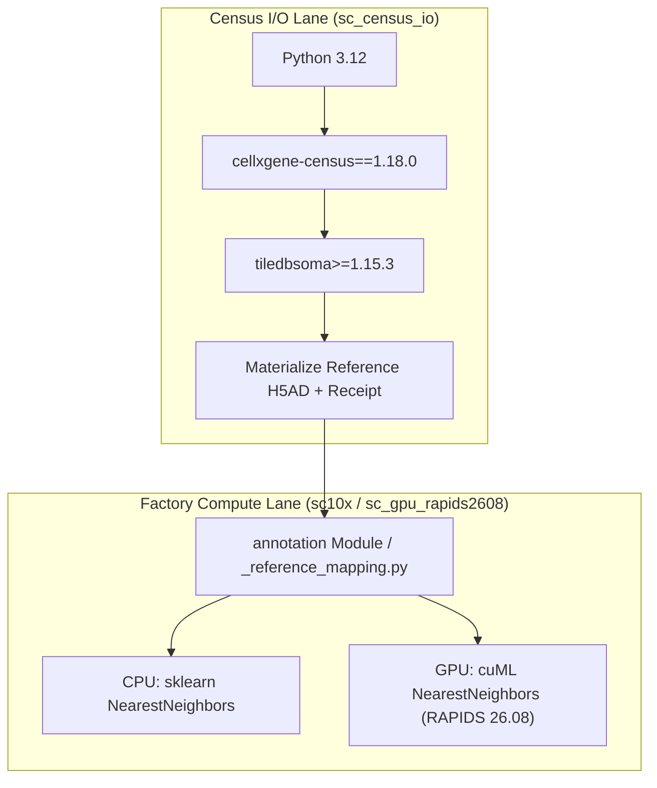

# Reference Atlas Materialization and Out-of-Distribution (OOD) Mapping Protocol

## 1. Executive Summary & Goal Restatement

This document defines the architecture, contracts, environment boundaries, and validation protocols for reference atlas integration and Out-of-Distribution (OOD) cell-type transfer within `singlecell_factory`.

### Bounded Scope (P0 Technical Milestone)
1. **CELLxGENE Census Materialization**: Governed, version-pinned reference extraction using the official `cellxgene-census` and TileDB-SOMA APIs, producing local H5AD files with hash-linked provenance receipts.
2. **Fail-Closed OOD/Unknown Contract**: Extension of the canonical `annotation` module KNN label transfer with deterministic distance calculation, reference-only distance threshold calibration, and explicit status rejection semantics that strictly protect against improper label overwrites.
3. **Real-Data Technical Validation & Benchmark**: Falsifiability evaluation using a held-out biological partition on Trevino fetal brain data (with Microglia excluded as a held-out negative control) and an exact-input CPU/GPU KNN analytical-parity benchmark.

> [!IMPORTANT]
> This milestone establishes technical mapping correctness, provenance integrity, and rejection safety. Trevino annotations are pipeline-derived proxy targets; this work does not claim biological ground-truth validation or release promotion.

---

## 2. Upstream-Fit & Architectural Decision

### Capability Gap Analysis
The existing `singlecell_factory` annotation module provided marker-based cluster voting and a basic sklearn KNN label transfer. However, it lacked:
- Governed Census reference queries with reproducible build pinning.
- Provenance tracking (Census build date, dataset IDs, SOMA join IDs, filter hashes).
- Explicit accelerator device selection (CPU vs GPU) with fail-fast guarantees.
- Per-cell mean neighbor cosine distance and calibrated Out-of-Distribution (OOD) detection.
- Fail-closed semantics for requested references (previous implementation silently fell back on read errors or missing files).
- Rejection safety: rejected cells were not systematically labeled `Unknown` and could still pollute downstream results.
- Exact-input CPU/GPU analytical parity validation.

### Upstream Component Evaluation

| Component | Upstream Source & Version | License | Decision & Rationale |
|---|---|---|---|
| **CELLxGENE Census Client** | `cellxgene-census` v1.18.0 (commit `11fb30e`) | MIT (Code), CC-BY 4.0 (Data) | **Adopted for I/O**: Official CZI client wrapping TileDB-SOMA. Provides official version directories, `get_obs`, and `get_anndata` SOMA-coordinate queries. No custom HTTP/S3 client is justified. |
| **TileDB-SOMA Storage** | `tiledbsoma>=1.15.3` | MIT | **Adopted for I/O**: Core storage backend required by Census. Pinned in isolated Python 3.12 environment. |
| **CPU KNN Classifier** | `scikit-learn` `NearestNeighbors(metric="cosine", algorithm="brute")` | BSD-3-Clause | **Preserved Baseline**: Deterministic brute-force cosine distance search on sparse/dense L2-normalized gene matrices. |
| **GPU KNN Classifier** | `cuml.neighbors.NearestNeighbors(metric="cosine", algorithm="brute")` | Apache-2.0 | **Adopted for Explicit GPU Lane**: RAPIDS 26.08 cuML exact brute-force cosine KNN for sparse CSR inputs. |
| **Deep Reference Model (SCANVI)** | `scvi-tools` 1.5.0.post1 | BSD-3-Clause | **Deferred / External Dependency**: scvi-tools provides official `prepare_query_anndata` and scArches surgery APIs. However, because no validated, compatible pre-trained SCANVI model artifact exists in the repository, SCANVI is marked as `not_run_missing_real_compatible_model_artifact` to prevent false readiness. |

---

## 3. Environment Isolation Boundary

To protect the validated Python 3.13 RAPIDS environment (`sc_gpu_rapids2608`), Census I/O is strictly isolated:

1. **Census I/O Lane (`sc_census_io`)**: Python 3.12, `cellxgene-census==1.18.0`, `tiledbsoma`, `anndata`. Used exclusively by `scripts/materialize_cellxgene_reference.py`.
2. **GPU Compute Lane (`sc_gpu_rapids2608`)**: Python 3.13.15, cuML 26.8.0, PyTorch CUDA 12.8, scvi-tools 1.5.0.post1. Census is **not** installed here to avoid package conflicts with RAPIDS.
3. **CPU Baseline Lane (`sc10x` / system Python)**: Python 3.11 / 3.12, scikit-learn, scanpy.

---

## 4. Reference Materialization Specification

Materialization is executed via `scripts/materialize_cellxgene_reference.py` into a project-owned run directory (`--project-root <path> --run-id <id>`).

### Contract Requirements
1. **Explicit Date-Form Build**: Requires `YYYY-MM-DD` format (e.g. `2025-11-08`). Dynamic aliases such as `latest` or `stable` are rejected locally before network calls.
2. **Version Verification**: Re-queries `cellxgene_census.get_census_version_description(census_build)` and verifies that the official `release_build` exactly matches.
3. **Deterministic Coordinate Selection**:
   - Queries observation metadata via `get_obs()`.
   - Filters by user criteria (e.g. `is_primary_data == True and tissue_general == 'central nervous system'`).
   - Stratifies by `--label-key` with deterministic cap per label (`--max-cells-per-label`) and total cap (`--max-cells`), sorted by `soma_joinid` with `--seed`.
4. **Coordinate-Exact Matrix Retrieval**: Retrieves only selected `soma_joinid` rows using `get_anndata(X_name="raw")` to maintain raw counts and sparse storage.
5. **Atomic Serialization**: Writes to a temporary H5AD file, re-opens for verification, computes SHA-256, and atomically moves to `census_reference.h5ad`.
6. **Provenance Receipt**: Emits `census_reference_receipt.json` containing:
   - Schema version, Census build date, source URI, filters.
   - Selected `soma_joinid` SHA-256 and count.
   - Materialized file SHA-256, shape, sparsity, gene namespace.
   - Software versions (Python, cellxgene_census, tiledbsoma, anndata).
   - Factory git commit SHA and dirty state.
   - Licensing (MIT code, CC-BY 4.0 data attribution).

---

## 5. Out-of-Distribution (OOD) & Unknown Mapping Contract

Reference transfer is executed in `workflow/modular/_reference_mapping.py` and called from `AnnotationModule`.

### One-to-One Gene Alignment
1. **Route 1 (`var_names`)**: Exact case-sensitive matching on unique feature identifiers.
2. **Route 2 (`stable_ids`)**: Query `gene_id`/`ensembl_id` mapped to reference `feature_id`/`gene_id`/`ensembl_id`.
3. **Route 3 (`symbol_upper`)**: Case-insensitive `var_names` matching when the uppercased names are unique on both sides.
- Positional alignment is forbidden. Duplicate stable IDs, duplicate names, and ambiguous case-insensitive names are rejected rather than routed through another fallback.
- Requires shared gene count $\ge \text{min\_shared\_genes}$ (default 50).
- Calibration and query mapping use the same aligned reference-feature list; thresholds calibrated in a different feature space are invalid.

### L2 Normalization
Both query and reference sub-matrices on shared genes are L2-normalized:
$$x_{\text{norm}} = \frac{x}{\|x\|_2}$$
Sparse matrix format (CSR) is preserved throughout.

### Calibration Modes
1. **`reference_quantile` (Default)**:
   - Deterministically reserves approximately 20% of reference groups for calibration; the realized cell fraction depends on group sizes.
   - A valid `--reference-calibration-group-key` (e.g. `sample` or `donor_id`) is required; splitting occurs strictly at whole-group boundaries to prevent intra-sample data leakage. Random cell partitioning is forbidden.
   - KNN is fit on the fit partition. Mean neighbor cosine distances are evaluated on the calibration partition.
   - Distance threshold $D_{\text{thresh}}$ is set to the configured upper quantile (default $0.95$) of calibration distances.
   - **Leakage Guard**: Query cells and held-out test labels never participate in calibration.
   - Missing requested group columns, one-group references, undersized partitions, or `k` larger than the fit partition fail closed. The implementation does not substitute a heuristic threshold or silently reduce `k`.
2. **`fixed`**:
   - Explicit user threshold $D_{\text{thresh}} \in [0.0, 2.0]$.

### Assignment Status Vocabulary
For each cell $i$, KNN voting computes:
- $\hat{y}_i$: Winning label among $k$ neighbors (ties broken stably by label sort order).
- $C_i$: Confidence (fraction of neighbors voting for $\hat{y}_i$).
- $D_i$: Mean cosine distance to the $k$ neighbors.

Status is assigned using a closed vocabulary:

$$\text{status}(i) = \begin{cases}
\text{accepted} & C_i \ge C_{\text{min}} \land D_i \le D_{\text{thresh}} \\
\text{rejected\_low\_confidence} & C_i < C_{\text{min}} \land D_i \le D_{\text{thresh}} \\
\text{rejected\_ood\_distance} & C_i \ge C_{\text{min}} \land D_i > D_{\text{thresh}} \\
\text{rejected\_low\_confidence\_and\_ood\_distance} & C_i < C_{\text{min}} \land D_i > D_{\text{thresh}}
\end{cases}$$

### Rejection Safety Contract
- `reference_cell_type`: Set to $\hat{y}_i$ if `accepted`, else `"Unknown"`.
- `reference_ood`: Boolean flag, `True` if $D_i > D_{\text{thresh}}$, else `False`.
- `reference_predicted_label`: Diagnostic candidate label $\hat{y}_i$ (recorded for audit, never written to `cell_type` if rejected).
- **Label Override Rule**:
  $$\text{cell\_type} \leftarrow \hat{y}_i \iff \text{status}(i) == \text{"accepted"} \land (\text{mode} == \text{"all"} \lor \text{marker is low confidence})$$
  **Under no circumstances may a rejected cell override `cell_type`.**

---

## 6. Real-Data Technical Validation & Benchmark Protocol

### Trevino Falsifiability Experiment Design
- **Source**: Public Trevino fetal brain RNA H5AD (55,653 cells, 25,519 genes, SHA-256: `44b3cf6f...`).
- **Disjoint Biological Partition**:
  - **Query source**: `Tissue.ID == 'HFT3'`; the frozen bounded run contains 4,143 cells from `hft_w20_p3_r1` and `hft_w20_p3_r2`.
  - **Reference source**: `Tissue.ID \in {'HFT7', 'HFT5', 'HFT6'}`; the frozen bounded run contains 9,496 cells from six non-HFT3 samples.
- **OOD Negative Control (`Microglia`)**:
  - All Microglia cells are strictly purged from the reference dataset (fit and calibration) before indexing.
  - Microglia cells in the query dataset serve as a positive OOD test case.
- **Predeclared Technical Pass Criteria**:
  1. Known-label acceptance coverage $\ge 80\%$.
  2. Known-label macro-F1 $\ge 0.70$ (against pipeline-derived proxy labels).
  3. Held-out Microglia rejection recall $\ge 80\%$.
  4. Microglia rejection rate exceeds known-label rejection rate by $\ge 30\%$.

### CPU vs GPU Analytical Parity Gates
Using identical input matrices, genes, cell order, and threshold receipts:
- Candidate label agreement: $\ge 99.5\%$.
- Assignment status agreement: $\ge 99.5\%$.
- Rejection rate absolute delta: $\le 0.5\%$.
- Known-label Macro-F1 absolute delta: $\le 0.01$.
- Held-out OOD recall absolute delta: $\le 0.02$.
- Per-cell mean-neighbor distance comparison: `rtol=1e-4`, `atol=1e-4`, alongside exact candidate-label and assignment-status checks.

---

## 7. SCANVI Posture & Non-Promotion Record

While `scvi-tools` 1.5.0.post1 is installed in `sc_gpu_rapids2608`:
- No compatible, pre-trained, validated SCANVI / scArches model checkpoint exists in the repository.
- Therefore, SCANVI mapping is recorded as `not_run_missing_real_compatible_model_artifact`.
- No placeholder or simulated model is permitted. Any future SCANVI integration must provide a concrete model artifact, model SHA-256, feature namespace registry, and independent calibration receipt.

---

## 8. Evidence Status and Certificate-Gated Routing Policy (2026-08-23)

The 2026-08-22 materialization and 9.42x timing record are historical technical evidence only. Its benchmark used cumulative-process timing/RSS and is not process-isolated; it is therefore superseded for attributable performance or GPU-routing claims. Preserve it at `/home/zerlinshen/projects/reference-atlas-ood-validation/runs/2026-08-22T1313Z-26f9123/`, but do not quote it as a current speed result.

The amended benchmark freezes the source hash, sample-disjoint split, upstream retained `highly_variable` feature order (deterministically capped at 3,000), matrices, cell IDs, parameters, and full-precision calibration threshold before launching either lane. CPU and GPU then run in independent processes under the same `sc_gpu_rapids2608` interpreter, each records three measured repetitions, child-process `ru_maxrss`, output hashes, helper transfer/fit/query timing, and GPU VRAM by child PID when available. A GPU error publishes a failure receipt and returns `FAIL_NOT_PROMOTED`; it is never converted to sklearn execution.

Fresh Census materialization completed at `/home/zerlinshen/projects/reference-atlas-ood-validation/runs/2026-08-22T1510Z-7a2a0e6/`: the 600-cell CSR H5AD is `600 x 61,497`, its H5AD SHA-256 is `f3ae9fe89f93726e9ce431150f29226beabb4c8c3eb55c734bb330468e9f4307`, and its selected join-ID SHA-256 is `50c7fdcceccd2c29cd672183d13dace5aabcec725892657e656a92fd0c92c93e`. `--verify-only` reopened the H5AD and verified its receipt, sparse layout, artifact hashes, and coordinate order.

The first isolated CUDA-resident run at `/home/zerlinshen/projects/reference-atlas-ood-validation/runs/2026-08-22T1534Z-3749a2d/` is retained as superseded diagnostic evidence. It rejected different raw CSV hashes even though the varying field was a sub-micro-unit floating-point distance. The verifier was amended before the clean rerun to require exact label, confidence, assignment-status, final-type, and OOD columns while applying a predeclared `rtol=atol=1e-6` contract only to mean-neighbor distance. Each repetition remains a separately persisted and SHA-verified artifact; raw-byte differences remain visible.

The clean committed-SHA replacement at `/home/zerlinshen/projects/reference-atlas-ood-validation/runs/2026-08-22T1558Z-c38053d/` used hash-identical frozen input manifest `d5a8d21f872a734ab4d2821e79809cb14ba4355e7b8a6055598a1d8212220d89` in independent child processes. All exact scientific columns shared SHA-256 `a24437b8da0c99b0af2179c9caf49ada80de01f29c744864a93b6ce4d5202a83`; maximum GPU within-lane distance drift was `4.7684e-7`, and CPU/GPU maximum distance difference was `9.2e-7`. Candidate labels, assignment status, final mapped type, OOD metrics, and rejection rates agreed exactly. Held-out Microglia rejection recall was `0.9564`, known acceptance coverage `0.9319`, and known all-cell macro-F1 with rejected cells treated as unknown `0.8243`. CPU/GPU medians were `0.9080`/`0.08227` seconds, an isolated `11.04x` speedup; CUDA residency and 522 MiB peak PID-scoped VRAM were observed.

The policy certificate is therefore `promoted` only for `trevino-fetal-cortex-v1` with cuML `26.08.00`. This is authorization to choose the validated implementation for that exact technical domain, not biological promotion. Trevino labels remain pipeline-derived proxy labels, the retained feature set is not independently query-blind, and no result generalizes the GPU certificate to another dataset or module.

### Prospective Query-Blind Feature Fitting (`reference_only_sparse_variance_v1`)

To address the historical limitation where the benchmark inherited a source-wide `highly_variable` feature mask, the benchmark coordinator has been updated with route `reference_only_sparse_variance_v1`.

Under this contract:
1. **Strict Reference-Only Fitting**: The feature selector (`select_reference_features`) receives only the frozen reference split (`ref_adata`). Query cells, query expression, query labels, and source `var['highly_variable']` masks are completely excluded from the fitting step.
2. **Deterministic & Sparse-Safe Computation**: Operates directly on sparse CSR/CSC column statistics (sample variance) without densifying the full matrix. Ties are broken deterministically by lexicographical feature symbol order (`tie_break_rule: lexicographical_gene_symbol_ascending`), capped at $\min(\text{max\_genes}, 3000)$.
3. **Structured Provenance Receipt & Gate**: Emits a verifiable `feature_selection_receipt.json` (schema v1.0) with fit cell count, cell ID SHA-256, storage class, requested/effective caps, and ordered gene SHA-256. The receipt is bound into `input_manifest.json` and `benchmark_contract.json` (schema v3.0). Any missing, false, or hash-inconsistent proof fails closed before OOD calibration or child execution.
4. **Validation Posture**: The new route currently possesses local synthetic correctness and unit regression evidence. It will require a fresh, project-owned Trevino benchmark run under `/home/zerlinshen/projects/reference-atlas-ood-validation/` to establish real-data GPU parity and promotion evidence under the new receipt contract.

### Backend Device Contract

`auto` is the CLI and programmatic default and selects one backend before execution; it never compares CPU and GPU on production data. An exact promoted domain and cuML version route to GPU after CUDA preflight. Missing/unknown certificates, `gpu_mode=off`, unavailable CUDA/cuML, and backend-version drift route `auto` directly to CPU. Explicit `gpu` requires the same certificate and fails loud on any mismatch with no sklearn fallback. The complete JSON-safe mapping summary is mirrored into both run metadata and `adata.uns["annotation"]["reference_mapping"]`, including the selection receipt, source identity, alignment, calibration receipt, backend/residency, thresholds, accepted/rejected counts, override counts, timing, claim class, and SCANVI status.

---

## 9. Failure Modes & Recovery Summary

| Failure Condition | System Response | Recovery Procedure |
|---|---|---|
| Invalid Census build date (e.g. `latest`) | Hard error before network call | Provide explicit date `YYYY-MM-DD`. |
| Census network/API timeout | Current invocation fails and emits a failure receipt | Inspect internet connectivity / Census status, verify the Python 3.12 environment, then launch a new bounded run with a new run ID. |
| Census build metadata mismatch | Hard error with requested/resolved build receipt | Select a date exposed as the official `release_build`; do not accept an alias or substitute release. |
| Missing requested reference H5AD | Annotation stage fails loud (`FileNotFoundError`) | Verify `--reference-adata` path. Note: stage does not silently skip. |
| Missing reference label column | Annotation stage fails loud (`ValueError`) | Check `--reference-label-key` matches reference `.obs`. |
| Insufficient gene overlap ($< 50$) | Annotation stage fails loud (`ValueError`) | Verify gene identifier namespace between query and reference. |
| Calibration group/partition or `k` invalid | Annotation stage fails loud (`ValueError`) | Supply a valid whole-group column and adequate reference, or use an explicitly governed fixed threshold. |
| Feature selection receipt missing, false query-blind, or hash mismatch | Hard error before calibration/child launch (`ValueError`/`FileNotFoundError`) | Re-run split preparation using `reference_only_sparse_variance_v1`; do not bypass or tamper with frozen input receipts. |
| `--reference-device auto` with absent/unpromoted domain, disabled GPU, unavailable backend, or version drift | Select CPU before mapping | Supply a promoted `--reference-validation-domain` only when the input satisfies that certificate; otherwise retain CPU. |
| `--reference-device gpu` requested without an exact promoted certificate or CUDA/cuML preflight | Hard error (`ValueError`/`RuntimeError`) | Run in `sc_gpu_rapids2608` with the exact validated domain/version, or select CPU explicitly. Never silently falls back. |
