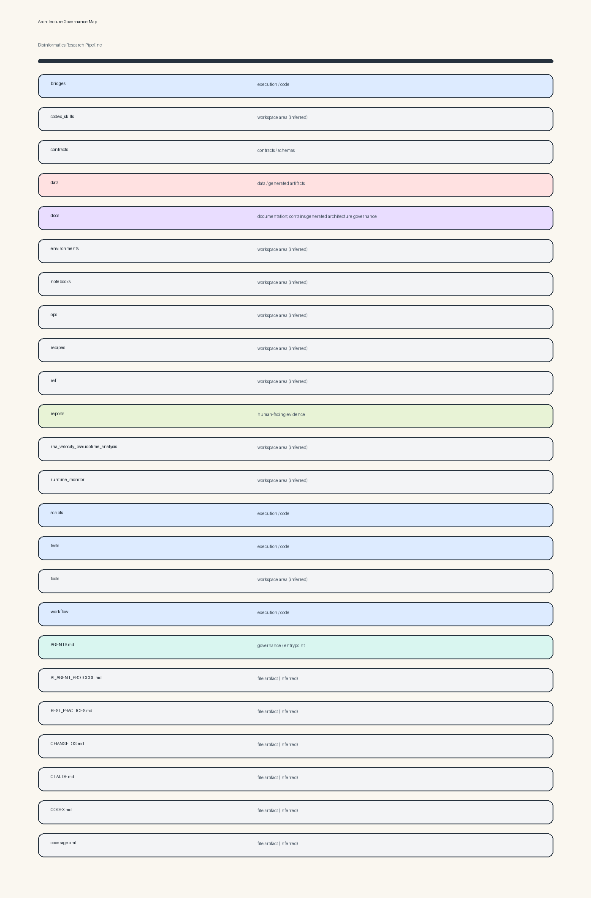

# Architecture Governance Snapshot

<!-- ARCHITECTURE-GOVERNANCE:START -->
## Architecture Governance

Last refreshed: `2026-08-22T13:10:42Z`

### Operating Map

| Surface | Type | Governance role |
| --- | --- | --- |
| `bridges` | `dir` | execution / code |
| `codex_skills` | `dir` | workspace area (inferred) |
| `contracts` | `dir` | contracts / schemas |
| `data` | `dir` | data / generated artifacts |
| `docs` | `dir` | documentation; contains generated architecture governance |
| `environments` | `dir` | workspace area (inferred) |
| `notebooks` | `dir` | workspace area (inferred) |
| `ops` | `dir` | workspace area (inferred) |
| `recipes` | `dir` | workspace area (inferred) |
| `ref` | `dir` | workspace area (inferred) |
| `reports` | `dir` | human-facing evidence |
| `rna_velocity_pseudotime_analysis` | `dir` | workspace area (inferred) |
| `runtime_monitor` | `dir` | workspace area (inferred) |
| `scripts` | `dir` | execution / code |
| `tests` | `dir` | execution / code |
| `tools` | `dir` | workspace area (inferred) |
| `workflow` | `dir` | execution / code |
| `AGENTS.md` | `file` | governance / entrypoint |
| `AI_AGENT_PROTOCOL.md` | `file` | file artifact (inferred) |
| `BEST_PRACTICES.md` | `file` | file artifact (inferred) |
| `CHANGELOG.md` | `file` | file artifact (inferred) |
| `CLAUDE.md` | `file` | file artifact (inferred) |
| `CODEX.md` | `file` | file artifact (inferred) |
| `coverage.xml` | `file` | file artifact (inferred) |

### Required Update Habit

- Refresh this block and `docs/architecture/structure.png` whenever folders, workflow boundaries, run lanes, artifact locations, or remote/local contracts change.
- Keep human-facing deliverables easy to find before agent-facing logs.
- Keep run parameters, commands, source paths, outcomes, and residual risks in agent-facing run memory.
- If remote behavior changes, update the remote README or before-every-run memory in the same workstream.

<!-- ARCHITECTURE-GOVERNANCE:END -->
